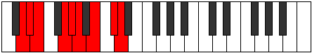

# Mode Ionyptyllic

## Links

- [Documentation](README.md)
- [Scales Index](Scales.md)
- [Modes Index](Modes.md)
- [Chords Index](Chords.md)

## Parent Scale

[Aeracryllic](ScaleAeracryllic.md)

## Number

[2791](https://ianring.com/musictheory/scales/2791)

## Interval Pattern

1, 1, 3, 1, 1, 2, 2, 1

## Chord Pattern

III, v⁰

## Perfection

- 6 Perfect notes
- 2 Perfect notes

## Perfection Profile

[true false true true true true false true]

## Permutations

| Tonic | Notes | Signature | Illustration | Audio |
|-------|-------|-----------|--------------|-------|
| [C](ModeCNaturalIonyptyllic.md) | C, **C#**, D, F, F#, G, **A**, B, C | C |  | [midi](https://github.com/edipermadi/music/blob/main/docs/ModeCNaturalIonyptyllic.mid?raw=true) |
| [C#](ModeCSharpIonyptyllic.md) | C#, **D**, D#, F#, G, G#, **A#**, C, C# | C |  | [midi](https://github.com/edipermadi/music/blob/main/docs/ModeCSharpIonyptyllic.mid?raw=true) |
| [Db](ModeDFlatIonyptyllic.md) | Db, **D**, Eb, Gb, G, Ab, **Bb**, C, Db | C |  | [midi](https://github.com/edipermadi/music/blob/main/docs/ModeDFlatIonyptyllic.mid?raw=true) |
| [D](ModeDNaturalIonyptyllic.md) | D, **D#**, E, G, G#, A, **B**, C#, D | C |  | [midi](https://github.com/edipermadi/music/blob/main/docs/ModeDNaturalIonyptyllic.mid?raw=true) |
| [D#](ModeDSharpIonyptyllic.md) | D#, **E**, F, G#, A, A#, **C**, D, D# | C |  | [midi](https://github.com/edipermadi/music/blob/main/docs/ModeDSharpIonyptyllic.mid?raw=true) |
| [Eb](ModeEFlatIonyptyllic.md) | Eb, **E**, F, Ab, A, Bb, **C**, D, Eb | C |  | [midi](https://github.com/edipermadi/music/blob/main/docs/ModeEFlatIonyptyllic.mid?raw=true) |
| [E](ModeENaturalIonyptyllic.md) | E, **F**, F#, A, A#, B, **C#**, D#, E | C |  | [midi](https://github.com/edipermadi/music/blob/main/docs/ModeENaturalIonyptyllic.mid?raw=true) |
| [F](ModeFNaturalIonyptyllic.md) | F, **F#**, G, A#, B, C, **D**, E, F | C |  | [midi](https://github.com/edipermadi/music/blob/main/docs/ModeFNaturalIonyptyllic.mid?raw=true) |
| [F#](ModeFSharpIonyptyllic.md) | F#, **G**, G#, B, C, C#, **D#**, F, F# | C |  | [midi](https://github.com/edipermadi/music/blob/main/docs/ModeFSharpIonyptyllic.mid?raw=true) |
| [Gb](ModeGFlatIonyptyllic.md) | Gb, **G**, Ab, B, C, Db, **Eb**, F, Gb | C |  | [midi](https://github.com/edipermadi/music/blob/main/docs/ModeGFlatIonyptyllic.mid?raw=true) |
| [G](ModeGNaturalIonyptyllic.md) | G, **G#**, A, C, C#, D, **E**, F#, G | C |  | [midi](https://github.com/edipermadi/music/blob/main/docs/ModeGNaturalIonyptyllic.mid?raw=true) |
| [G#](ModeGSharpIonyptyllic.md) | G#, **A**, A#, C#, D, D#, **F**, G, G# | C |  | [midi](https://github.com/edipermadi/music/blob/main/docs/ModeGSharpIonyptyllic.mid?raw=true) |
| [Ab](ModeAFlatIonyptyllic.md) | Ab, **A**, Bb, Db, D, Eb, **F**, G, Ab | C |  | [midi](https://github.com/edipermadi/music/blob/main/docs/ModeAFlatIonyptyllic.mid?raw=true) |
| [A](ModeANaturalIonyptyllic.md) | A, **A#**, B, D, D#, E, **F#**, G#, A | C |  | [midi](https://github.com/edipermadi/music/blob/main/docs/ModeANaturalIonyptyllic.mid?raw=true) |
| [A#](ModeASharpIonyptyllic.md) | A#, **B**, C, D#, E, F, **G**, A, A# | C |  | [midi](https://github.com/edipermadi/music/blob/main/docs/ModeASharpIonyptyllic.mid?raw=true) |
| [Bb](ModeBFlatIonyptyllic.md) | Bb, **B**, C, Eb, E, F, **G**, A, Bb | C |  | [midi](https://github.com/edipermadi/music/blob/main/docs/ModeBFlatIonyptyllic.mid?raw=true) |
| [B](ModeBNaturalIonyptyllic.md) | B, **C**, C#, E, F, F#, **G#**, A#, B | C |  | [midi](https://github.com/edipermadi/music/blob/main/docs/ModeBNaturalIonyptyllic.mid?raw=true) |
