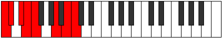
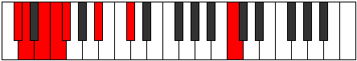
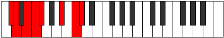
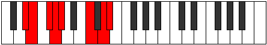
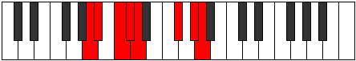

# Mode Ionyrian

## Links

- [Documentation](index.md)
- [Scales Index](Scales.md)
- [Modes Index](Modes.md)
- [Chords Index](Chords.md)

## Parent Scale

[Katogian](ScaleKatogian.md)

## Number

[2619](https://ianring.com/musictheory/scales/2619)

## Interval Pattern

1, 2, 1, 1, 4, 2, 1

## Chord Pattern

II⁺, V, V⁺, vi⁰, vi, VI, VI⁺

## Perfection

- 3 Perfect notes
- 4 Perfect notes

## Perfection Profile

[false false false true true true false]

## Permutations

| Tonic | Notes | Signature | Illustration | Audio |
|-------|-------|-----------|--------------|-------|
| [C](ModeCNaturalIonyrian.md) | **C**, **Db**, **Eb**, Fb, Gbb, A, **B**, **C** | C |  | [midi](https://github.com/edipermadi/music/blob/main/docs/ModeCNaturalIonyrian.mid?raw=true) |
| [C#](ModeCSharpIonyrian.md) | **C#**, **D**, **E**, F, Gb, A#, **B#**, **C#** | C |  | [midi](https://github.com/edipermadi/music/blob/main/docs/ModeCSharpIonyrian.mid?raw=true) |
| [Db](ModeDFlatIonyrian.md) | **Db**, **Ebb**, **Fb**, Gbb, Abbb, Bb, **C**, **Db** | C |  | [midi](https://github.com/edipermadi/music/blob/main/docs/ModeDFlatIonyrian.mid?raw=true) |
| [D](ModeDNaturalIonyrian.md) | **D**, **Eb**, **F**, Gb, Abb, B, **C#**, **D** | C |  | [midi](https://github.com/edipermadi/music/blob/main/docs/ModeDNaturalIonyrian.mid?raw=true) |
| [D#](ModeDSharpIonyrian.md) | **D#**, **E**, **F#**, G, Ab, B#, **C##**, **D#** | C |  | [midi](https://github.com/edipermadi/music/blob/main/docs/ModeDSharpIonyrian.mid?raw=true) |
| [Eb](ModeEFlatIonyrian.md) | **Eb**, **Fb**, **Gb**, Abb, Bbbb, C, **D**, **Eb** | C |  | [midi](https://github.com/edipermadi/music/blob/main/docs/ModeEFlatIonyrian.mid?raw=true) |
| [E](ModeENaturalIonyrian.md) | **E**, **F**, **G**, Ab, Bbb, C#, **D#**, **E** | C |  | [midi](https://github.com/edipermadi/music/blob/main/docs/ModeENaturalIonyrian.mid?raw=true) |
| [F](ModeFNaturalIonyrian.md) | **F**, **Gb**, **Ab**, Bbb, Cbb, D, **E**, **F** | C |  | [midi](https://github.com/edipermadi/music/blob/main/docs/ModeFNaturalIonyrian.mid?raw=true) |
| [F#](ModeFSharpIonyrian.md) | **F#**, **G**, **A**, Bb, Cb, D#, **E#**, **F#** | C |  | [midi](https://github.com/edipermadi/music/blob/main/docs/ModeFSharpIonyrian.mid?raw=true) |
| [Gb](ModeGFlatIonyrian.md) | **Gb**, **Abb**, **Bbb**, Cbb, Dbbb, Eb, **F**, **Gb** | C |  | [midi](https://github.com/edipermadi/music/blob/main/docs/ModeGFlatIonyrian.mid?raw=true) |
| [G](ModeGNaturalIonyrian.md) | **G**, **Ab**, **Bb**, Cb, Dbb, E, **F#**, **G** | C |  | [midi](https://github.com/edipermadi/music/blob/main/docs/ModeGNaturalIonyrian.mid?raw=true) |
| [G#](ModeGSharpIonyrian.md) | **G#**, **A**, **B**, C, Db, E#, **F##**, **G#** | C |  | [midi](https://github.com/edipermadi/music/blob/main/docs/ModeGSharpIonyrian.mid?raw=true) |
| [Ab](ModeAFlatIonyrian.md) | **Ab**, **Bbb**, **Cb**, Dbb, Ebbb, F, **G**, **Ab** | C |  | [midi](https://github.com/edipermadi/music/blob/main/docs/ModeAFlatIonyrian.mid?raw=true) |
| [A](ModeANaturalIonyrian.md) | **A**, **Bb**, **C**, Db, Ebb, F#, **G#**, **A** | C |  | [midi](https://github.com/edipermadi/music/blob/main/docs/ModeANaturalIonyrian.mid?raw=true) |
| [A#](ModeASharpIonyrian.md) | **A#**, **B**, **C#**, D, Eb, F##, **G##**, **A#** | C |  | [midi](https://github.com/edipermadi/music/blob/main/docs/ModeASharpIonyrian.mid?raw=true) |
| [Bb](ModeBFlatIonyrian.md) | **Bb**, **Cb**, **Db**, Ebb, Fbb, G, **A**, **Bb** | C |  | [midi](https://github.com/edipermadi/music/blob/main/docs/ModeBFlatIonyrian.mid?raw=true) |
| [B](ModeBNaturalIonyrian.md) | **B**, **C**, **D**, Eb, Fb, G#, **A#**, **B** | C |  | [midi](https://github.com/edipermadi/music/blob/main/docs/ModeBNaturalIonyrian.mid?raw=true) |
