# Mode Ionyryllic

## Links

- [Documentation](index.md)
- [Scales Index](Scales.md)
- [Modes Index](Modes.md)
- [Chords Index](Chords.md)

## Parent Scale

[Aeolothyllic](ScaleAeolothyllic.md)

## Number

[1003](https://ianring.com/musictheory/scales/1003)

## Perfection

- 5 Perfect notes
- 3 Perfect notes

## Interval Pattern

1, 2, 2, 1, 1, 1, 1, 3

## Perfection Profile

[true true false true true false true false]

## Permutations

| Tonic | Notes | Signature | Illustration | Audio |
|-------|-------|-----------|--------------|-------|
| [C](ModeCNaturalIonyryllic.md) | C, C#, **D#**, F, F#, **G**, G#, **A**, C | C | 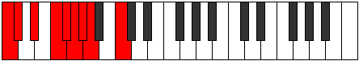 | [midi](https://github.com/edipermadi/music/blob/main/docs/ModeCNaturalIonyryllic.mid?raw=true) |
| [C#](ModeCSharpIonyryllic.md) | C#, D, **E**, F#, G, **G#**, A, **A#**, C# | C | 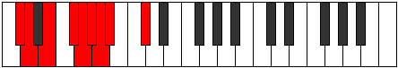 | [midi](https://github.com/edipermadi/music/blob/main/docs/ModeCSharpIonyryllic.mid?raw=true) |
| [Db](ModeDFlatIonyryllic.md) | Db, D, **E**, Gb, G, **Ab**, A, **Bb**, Db | C |  | [midi](https://github.com/edipermadi/music/blob/main/docs/ModeDFlatIonyryllic.mid?raw=true) |
| [D](ModeDNaturalIonyryllic.md) | D, D#, **F**, G, G#, **A**, A#, **B**, D | C | 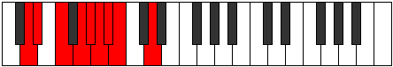 | [midi](https://github.com/edipermadi/music/blob/main/docs/ModeDNaturalIonyryllic.mid?raw=true) |
| [D#](ModeDSharpIonyryllic.md) | D#, E, **F#**, G#, A, **A#**, B, **C**, D# | C | 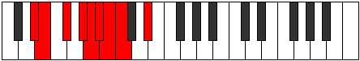 | [midi](https://github.com/edipermadi/music/blob/main/docs/ModeDSharpIonyryllic.mid?raw=true) |
| [Eb](ModeEFlatIonyryllic.md) | Eb, E, **Gb**, Ab, A, **Bb**, B, **C**, Eb | C |  | [midi](https://github.com/edipermadi/music/blob/main/docs/ModeEFlatIonyryllic.mid?raw=true) |
| [E](ModeENaturalIonyryllic.md) | E, F, **G**, A, A#, **B**, C, **C#**, E | C | 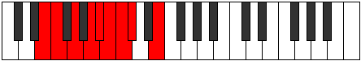 | [midi](https://github.com/edipermadi/music/blob/main/docs/ModeENaturalIonyryllic.mid?raw=true) |
| [F](ModeFNaturalIonyryllic.md) | F, F#, **G#**, A#, B, **C**, C#, **D**, F | C | 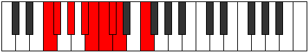 | [midi](https://github.com/edipermadi/music/blob/main/docs/ModeFNaturalIonyryllic.mid?raw=true) |
| [F#](ModeFSharpIonyryllic.md) | F#, G, **A**, B, C, **C#**, D, **D#**, F# | C | 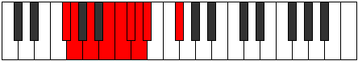 | [midi](https://github.com/edipermadi/music/blob/main/docs/ModeFSharpIonyryllic.mid?raw=true) |
| [Gb](ModeGFlatIonyryllic.md) | Gb, G, **A**, B, C, **Db**, D, **Eb**, Gb | C |  | [midi](https://github.com/edipermadi/music/blob/main/docs/ModeGFlatIonyryllic.mid?raw=true) |
| [G](ModeGNaturalIonyryllic.md) | G, G#, **A#**, C, C#, **D**, D#, **E**, G | C | 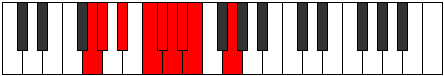 | [midi](https://github.com/edipermadi/music/blob/main/docs/ModeGNaturalIonyryllic.mid?raw=true) |
| [G#](ModeGSharpIonyryllic.md) | G#, A, **B**, C#, D, **D#**, E, **F**, G# | C | 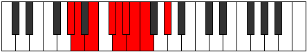 | [midi](https://github.com/edipermadi/music/blob/main/docs/ModeGSharpIonyryllic.mid?raw=true) |
| [Ab](ModeAFlatIonyryllic.md) | Ab, A, **B**, Db, D, **Eb**, E, **F**, Ab | C |  | [midi](https://github.com/edipermadi/music/blob/main/docs/ModeAFlatIonyryllic.mid?raw=true) |
| [A](ModeANaturalIonyryllic.md) | A, A#, **C**, D, D#, **E**, F, **F#**, A | C | 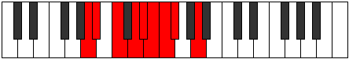 | [midi](https://github.com/edipermadi/music/blob/main/docs/ModeANaturalIonyryllic.mid?raw=true) |
| [A#](ModeASharpIonyryllic.md) | A#, B, **C#**, D#, E, **F**, F#, **G**, A# | C |  | [midi](https://github.com/edipermadi/music/blob/main/docs/ModeASharpIonyryllic.mid?raw=true) |
| [Bb](ModeBFlatIonyryllic.md) | Bb, B, **Db**, Eb, E, **F**, Gb, **G**, Bb | C |  | [midi](https://github.com/edipermadi/music/blob/main/docs/ModeBFlatIonyryllic.mid?raw=true) |
| [B](ModeBNaturalIonyryllic.md) | B, C, **D**, E, F, **F#**, G, **G#**, B | C | 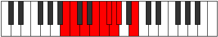 | [midi](https://github.com/edipermadi/music/blob/main/docs/ModeBNaturalIonyryllic.mid?raw=true) |
