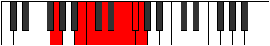

# Mode Ionythian

## Links

- [Documentation](index.md)
- [Scales Index](Scales.md)
- [Modes Index](Modes.md)
- [Chords Index](Chords.md)

## Parent Scale

[Ionythian](ScaleIonythian.md)

## Number

[3761](https://ianring.com/musictheory/scales/3761)

## Perfection

- 5 Perfect notes
- 2 Perfect notes

## Perfection Profile

[true true true false true true false]

## Permutations

| Tonic | Notes | Signature | Illustration | Audio |
|-------|-------|-----------|--------------|-------|
| [C](ModeCNaturalIonythian.md) | C, D##, E#, **F##**, G##, A#, **B**, C | C |  | [midi](ModeCNaturalIonythian.mid) [ogg](ModeCNaturalIonythian.ogg) |
| [C#](ModeCSharpIonythian.md) | C#, D###, E##, **F###**, G###, A##, **B#**, C# | C |  | [midi](ModeCSharpIonythian.mid) [ogg](ModeCSharpIonythian.ogg) |
| [Db](ModeDFlatIonythian.md) | Db, E#, F#, **G#**, A#, B, **C**, Db | C |  | [midi](ModeDFlatIonythian.mid) [ogg](ModeDFlatIonythian.ogg) |
| [D](ModeDNaturalIonythian.md) | D, E##, F##, **G##**, A##, B#, **C#**, D | C |  | [midi](ModeDNaturalIonythian.mid) [ogg](ModeDNaturalIonythian.ogg) |
| [D#](ModeDSharpIonythian.md) | D#, E###, F###, **G###**, A###, B##, **C##**, D# | C |  | [midi](ModeDSharpIonythian.mid) [ogg](ModeDSharpIonythian.ogg) |
| [Eb](ModeEFlatIonythian.md) | Eb, F##, G#, **A#**, B#, C#, **D**, Eb | C |  | [midi](ModeEFlatIonythian.mid) [ogg](ModeEFlatIonythian.ogg) |
| [E](ModeENaturalIonythian.md) | E, F###, G##, **A##**, B##, C##, **D#**, E | C |  | [midi](ModeENaturalIonythian.mid) [ogg](ModeENaturalIonythian.ogg) |
| [F](ModeFNaturalIonythian.md) | F, G##, A#, **B#**, C##, D#, **E**, F | C |  | [midi](ModeFNaturalIonythian.mid) [ogg](ModeFNaturalIonythian.ogg) |
| [F#](ModeFSharpIonythian.md) | F#, G###, A##, **B##**, C###, D##, **E#**, F# | C |  | [midi](ModeFSharpIonythian.mid) [ogg](ModeFSharpIonythian.ogg) |
| [Gb](ModeGFlatIonythian.md) | Gb, A#, B, **C#**, D#, E, **F**, Gb | C |  | [midi](ModeGFlatIonythian.mid) [ogg](ModeGFlatIonythian.ogg) |
| [G](ModeGNaturalIonythian.md) | G, A##, B#, **C##**, D##, E#, **F#**, G | C |  | [midi](ModeGNaturalIonythian.mid) [ogg](ModeGNaturalIonythian.ogg) |
| [G#](ModeGSharpIonythian.md) | G#, A###, B##, **C###**, D###, E##, **F##**, G# | C |  | [midi](ModeGSharpIonythian.mid) [ogg](ModeGSharpIonythian.ogg) |
| [Ab](ModeAFlatIonythian.md) | Ab, B#, C#, **D#**, E#, F#, **G**, Ab | C |  | [midi](ModeAFlatIonythian.mid) [ogg](ModeAFlatIonythian.ogg) |
| [A](ModeANaturalIonythian.md) | A, B##, C##, **D##**, E##, F##, **G#**, A | C |  | [midi](ModeANaturalIonythian.mid) [ogg](ModeANaturalIonythian.ogg) |
| [A#](ModeASharpIonythian.md) | A#, B###, C###, **D###**, E###, F###, **G##**, A# | C |  | [midi](ModeASharpIonythian.mid) [ogg](ModeASharpIonythian.ogg) |
| [Bb](ModeBFlatIonythian.md) | Bb, C##, D#, **E#**, F##, G#, **A**, Bb | C |  | [midi](ModeBFlatIonythian.mid) [ogg](ModeBFlatIonythian.ogg) |
| [B](ModeBNaturalIonythian.md) | B, C###, D##, **E##**, F###, G##, **A#**, B | C |  | [midi](ModeBNaturalIonythian.mid) [ogg](ModeBNaturalIonythian.ogg) |
