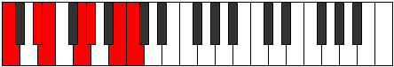

# Mode Ionythimic

## Links

- [Documentation](README.md)
- [Scales Index](Scales.md)
- [Modes Index](Modes.md)
- [Chords Index](Chords.md)

## Parent Scale

[Ionythimic](ScaleIonythimic.md)

## Number

[2457](https://ianring.com/musictheory/scales/2457)

## Transposition

3, 1, 3, 1, 3, 1

## Chord Pattern

I⁺, II⁺, III⁺, IV⁺, V⁺, VI⁺

## Perfection

- 3 Perfect notes
- 3 Perfect notes

## Perfection Profile

true, false, true, false, true, false

## Permutations

| Tonic | Notes | Signature | Illustration | Audio |
|-------|-------|-----------|--------------|-------|
| [C](ModeCNaturalIonythimic.md) | C, **D#**, E, **F##**, G#, **A##**, C | C |  | [midi](https://github.com/edipermadi/music/blob/main/docs/ModeCNaturalIonythimic.mid?raw=true) |
| [C#](ModeCSharpIonythimic.md) | C#, **D##**, E#, **F###**, G##, **A###**, C# | C |  | [midi](https://github.com/edipermadi/music/blob/main/docs/ModeCSharpIonythimic.mid?raw=true) |
| [Db](ModeDFlatIonythimic.md) | Db, **E**, F, **G#**, A, **B#**, Db | C |  | [midi](https://github.com/edipermadi/music/blob/main/docs/ModeDFlatIonythimic.mid?raw=true) |
| [D](ModeDNaturalIonythimic.md) | D, **E#**, F#, **G##**, A#, **B##**, D | C |  | [midi](https://github.com/edipermadi/music/blob/main/docs/ModeDNaturalIonythimic.mid?raw=true) |
| [D#](ModeDSharpIonythimic.md) | D#, **E##**, F##, **G###**, A##, **B###**, D# | C |  | [midi](https://github.com/edipermadi/music/blob/main/docs/ModeDSharpIonythimic.mid?raw=true) |
| [Eb](ModeEFlatIonythimic.md) | Eb, **F#**, G, **A#**, B, **C##**, Eb | C |  | [midi](https://github.com/edipermadi/music/blob/main/docs/ModeEFlatIonythimic.mid?raw=true) |
| [E](ModeENaturalIonythimic.md) | E, **F##**, G#, **A##**, B#, **C###**, E | C |  | [midi](https://github.com/edipermadi/music/blob/main/docs/ModeENaturalIonythimic.mid?raw=true) |
| [F](ModeFNaturalIonythimic.md) | F, **G#**, A, **B#**, C#, **D##**, F | C |  | [midi](https://github.com/edipermadi/music/blob/main/docs/ModeFNaturalIonythimic.mid?raw=true) |
| [F#](ModeFSharpIonythimic.md) | F#, **G##**, A#, **B##**, C##, **D###**, F# | C |  | [midi](https://github.com/edipermadi/music/blob/main/docs/ModeFSharpIonythimic.mid?raw=true) |
| [Gb](ModeGFlatIonythimic.md) | Gb, **A**, Bb, **C#**, D, **E#**, Gb | C |  | [midi](https://github.com/edipermadi/music/blob/main/docs/ModeGFlatIonythimic.mid?raw=true) |
| [G](ModeGNaturalIonythimic.md) | G, **A#**, B, **C##**, D#, **E##**, G | C |  | [midi](https://github.com/edipermadi/music/blob/main/docs/ModeGNaturalIonythimic.mid?raw=true) |
| [G#](ModeGSharpIonythimic.md) | G#, **A##**, B#, **C###**, D##, **E###**, G# | C |  | [midi](https://github.com/edipermadi/music/blob/main/docs/ModeGSharpIonythimic.mid?raw=true) |
| [Ab](ModeAFlatIonythimic.md) | Ab, **B**, C, **D#**, E, **F##**, Ab | C |  | [midi](https://github.com/edipermadi/music/blob/main/docs/ModeAFlatIonythimic.mid?raw=true) |
| [A](ModeANaturalIonythimic.md) | A, **B#**, C#, **D##**, E#, **F###**, A | C |  | [midi](https://github.com/edipermadi/music/blob/main/docs/ModeANaturalIonythimic.mid?raw=true) |
| [A#](ModeASharpIonythimic.md) | A#, **B##**, C##, **D###**, E##, **Cbbb**, A# | C |  | [midi](https://github.com/edipermadi/music/blob/main/docs/ModeASharpIonythimic.mid?raw=true) |
| [Bb](ModeBFlatIonythimic.md) | Bb, **C#**, D, **E#**, F#, **G##**, Bb | C |  | [midi](https://github.com/edipermadi/music/blob/main/docs/ModeBFlatIonythimic.mid?raw=true) |
| [B](ModeBNaturalIonythimic.md) | B, **C##**, D#, **E##**, F##, **G###**, B | C |  | [midi](https://github.com/edipermadi/music/blob/main/docs/ModeBNaturalIonythimic.mid?raw=true) |
