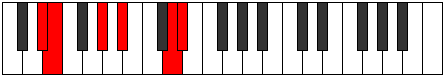
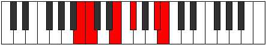

# Mode Ionythitonic

## Links

- [Documentation](index.md)
- [Scales Index](Scales.md)
- [Modes Index](Modes.md)
- [Chords Index](Chords.md)

## Parent Scale

[Zathitonic](ScaleZathitonic.md)

## Number

[2211](https://ianring.com/musictheory/scales/2211)

## Perfection

- 2 Perfect notes
- 3 Perfect notes

## Perfection Profile

[true false true false false]

## Permutations

| Tonic | Notes | Signature | Illustration | Audio |
|-------|-------|-----------|--------------|-------|
| [C](ModeCNaturalIonythitonic.md) | C, **C#**, F, **G**, **B**, C | C |  | [midi](https://github.com/edipermadi/music/blob/main/docs/ModeCNaturalIonythitonic.mid?raw=true) |
| [C#](ModeCSharpIonythitonic.md) | C#, **D**, F#, **G#**, **C**, C# | C |  | [midi](https://github.com/edipermadi/music/blob/main/docs/ModeCSharpIonythitonic.mid?raw=true) |
| [Db](ModeDFlatIonythitonic.md) | Db, **D**, Gb, **Ab**, **C**, Db | C |  | [midi](https://github.com/edipermadi/music/blob/main/docs/ModeDFlatIonythitonic.mid?raw=true) |
| [D](ModeDNaturalIonythitonic.md) | D, **D#**, G, **A**, **C#**, D | C |  | [midi](https://github.com/edipermadi/music/blob/main/docs/ModeDNaturalIonythitonic.mid?raw=true) |
| [D#](ModeDSharpIonythitonic.md) | D#, **E**, G#, **A#**, **D**, D# | C |  | [midi](https://github.com/edipermadi/music/blob/main/docs/ModeDSharpIonythitonic.mid?raw=true) |
| [Eb](ModeEFlatIonythitonic.md) | Eb, **E**, Ab, **Bb**, **D**, Eb | C |  | [midi](https://github.com/edipermadi/music/blob/main/docs/ModeEFlatIonythitonic.mid?raw=true) |
| [E](ModeENaturalIonythitonic.md) | E, **F**, A, **B**, **D#**, E | C |  | [midi](https://github.com/edipermadi/music/blob/main/docs/ModeENaturalIonythitonic.mid?raw=true) |
| [F](ModeFNaturalIonythitonic.md) | F, **F#**, A#, **C**, **E**, F | C |  | [midi](https://github.com/edipermadi/music/blob/main/docs/ModeFNaturalIonythitonic.mid?raw=true) |
| [F#](ModeFSharpIonythitonic.md) | F#, **G**, B, **C#**, **F**, F# | C |  | [midi](https://github.com/edipermadi/music/blob/main/docs/ModeFSharpIonythitonic.mid?raw=true) |
| [Gb](ModeGFlatIonythitonic.md) | Gb, **G**, B, **Db**, **F**, Gb | C |  | [midi](https://github.com/edipermadi/music/blob/main/docs/ModeGFlatIonythitonic.mid?raw=true) |
| [G](ModeGNaturalIonythitonic.md) | G, **G#**, C, **D**, **F#**, G | C |  | [midi](https://github.com/edipermadi/music/blob/main/docs/ModeGNaturalIonythitonic.mid?raw=true) |
| [G#](ModeGSharpIonythitonic.md) | G#, **A**, C#, **D#**, **G**, G# | C |  | [midi](https://github.com/edipermadi/music/blob/main/docs/ModeGSharpIonythitonic.mid?raw=true) |
| [Ab](ModeAFlatIonythitonic.md) | Ab, **A**, Db, **Eb**, **G**, Ab | C |  | [midi](https://github.com/edipermadi/music/blob/main/docs/ModeAFlatIonythitonic.mid?raw=true) |
| [A](ModeANaturalIonythitonic.md) | A, **A#**, D, **E**, **G#**, A | C |  | [midi](https://github.com/edipermadi/music/blob/main/docs/ModeANaturalIonythitonic.mid?raw=true) |
| [A#](ModeASharpIonythitonic.md) | A#, **B**, D#, **F**, **A**, A# | C |  | [midi](https://github.com/edipermadi/music/blob/main/docs/ModeASharpIonythitonic.mid?raw=true) |
| [Bb](ModeBFlatIonythitonic.md) | Bb, **B**, Eb, **F**, **A**, Bb | C |  | [midi](https://github.com/edipermadi/music/blob/main/docs/ModeBFlatIonythitonic.mid?raw=true) |
| [B](ModeBNaturalIonythitonic.md) | B, **C**, E, **F#**, **A#**, B | C |  | [midi](https://github.com/edipermadi/music/blob/main/docs/ModeBNaturalIonythitonic.mid?raw=true) |
