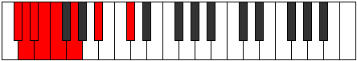
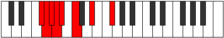
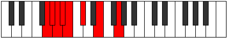

# Mode Kadian

## Links

- [Documentation](index.md)
- [Scales Index](Scales.md)
- [Modes Index](Modes.md)
- [Chords Index](Chords.md)

## Parent Scale

[Katoptian](ScaleKatoptian.md)

## Number

[607](https://ianring.com/musictheory/scales/607)

## Perfection

- 3 Perfect notes
- 4 Perfect notes

## Interval Pattern

1, 1, 1, 1, 2, 3, 3

## Perfection Profile

[false false true false false true true]

## Permutations

| Tonic | Notes | Signature | Illustration | Audio |
|-------|-------|-----------|--------------|-------|
| [C](ModeCNaturalKadian.md) | **C**, **Db**, Ebb, **Fbb**, **Gbbb**, Abbb, Bbb, **C** | C |  | [midi](https://github.com/edipermadi/music/blob/main/docs/ModeCNaturalKadian.mid?raw=true) |
| [C#](ModeCSharpKadian.md) | **C#**, **D**, Eb, **Fb**, **Gbb**, Abb, Bb, **C#** | C |  | [midi](https://github.com/edipermadi/music/blob/main/docs/ModeCSharpKadian.mid?raw=true) |
| [Db](ModeDFlatKadian.md) | **Db**, **Ebb**, Fbb, **Gbbb**, **D###**, E###, Cbb, **Db** | C |  | [midi](https://github.com/edipermadi/music/blob/main/docs/ModeDFlatKadian.mid?raw=true) |
| [D](ModeDNaturalKadian.md) | **D**, **Eb**, Fb, **Gbb**, **Abbb**, Bbbb, Cb, **D** | C |  | [midi](https://github.com/edipermadi/music/blob/main/docs/ModeDNaturalKadian.mid?raw=true) |
| [D#](ModeDSharpKadian.md) | **D#**, **E**, F, **Gb**, **Abb**, Bbb, C, **D#** | C |  | [midi](https://github.com/edipermadi/music/blob/main/docs/ModeDSharpKadian.mid?raw=true) |
| [Eb](ModeEFlatKadian.md) | **Eb**, **Fb**, Gbb, **Abbb**, **E###**, Cbbb, Dbb, **Eb** | C |  | [midi](https://github.com/edipermadi/music/blob/main/docs/ModeEFlatKadian.mid?raw=true) |
| [E](ModeENaturalKadian.md) | **E**, **F**, Gb, **Abb**, **Bbbb**, Cbb, Db, **E** | C |  | [midi](https://github.com/edipermadi/music/blob/main/docs/ModeENaturalKadian.mid?raw=true) |
| [F](ModeFNaturalKadian.md) | **F**, **Gb**, Abb, **Bbbb**, **Cbbb**, Dbbb, Ebb, **F** | C |  | [midi](https://github.com/edipermadi/music/blob/main/docs/ModeFNaturalKadian.mid?raw=true) |
| [F#](ModeFSharpKadian.md) | **F#**, **G**, Ab, **Bbb**, **Cbb**, Dbb, Eb, **F#** | C |  | [midi](https://github.com/edipermadi/music/blob/main/docs/ModeFSharpKadian.mid?raw=true) |
| [Gb](ModeGFlatKadian.md) | **Gb**, **Abb**, Bbbb, **Cbbb**, **Cbb**, Dbb, Eb, **Gb** | C |  | [midi](https://github.com/edipermadi/music/blob/main/docs/ModeGFlatKadian.mid?raw=true) |
| [G](ModeGNaturalKadian.md) | **G**, **Ab**, Bbb, **Cbb**, **Dbbb**, Ebbb, Fb, **G** | C |  | [midi](https://github.com/edipermadi/music/blob/main/docs/ModeGNaturalKadian.mid?raw=true) |
| [G#](ModeGSharpKadian.md) | **G#**, **A**, Bb, **Cb**, **Dbb**, Ebb, F, **G#** | C |  | [midi](https://github.com/edipermadi/music/blob/main/docs/ModeGSharpKadian.mid?raw=true) |
| [Ab](ModeAFlatKadian.md) | **Ab**, **Bbb**, Cbb, **Dbbb**, **Dbb**, Ebb, F, **Ab** | C |  | [midi](https://github.com/edipermadi/music/blob/main/docs/ModeAFlatKadian.mid?raw=true) |
| [A](ModeANaturalKadian.md) | **A**, **Bb**, Cb, **Dbb**, **Ebbb**, Fbb, Gb, **A** | C |  | [midi](https://github.com/edipermadi/music/blob/main/docs/ModeANaturalKadian.mid?raw=true) |
| [A#](ModeASharpKadian.md) | **A#**, **B**, C, **Db**, **Ebb**, Fb, G, **A#** | C |  | [midi](https://github.com/edipermadi/music/blob/main/docs/ModeASharpKadian.mid?raw=true) |
| [Bb](ModeBFlatKadian.md) | **Bb**, **Cb**, Dbb, **Ebbb**, **Fbbb**, Gbbb, Abb, **Bb** | C |  | [midi](https://github.com/edipermadi/music/blob/main/docs/ModeBFlatKadian.mid?raw=true) |
| [B](ModeBNaturalKadian.md) | **B**, **C**, Db, **Ebb**, **Fbb**, Gbb, Ab, **B** | C |  | [midi](https://github.com/edipermadi/music/blob/main/docs/ModeBNaturalKadian.mid?raw=true) |
