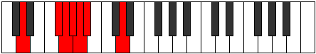

# Mode Kadimic

## Links

- [Documentation](index.md)
- [Scales Index](Scales.md)
- [Modes Index](Modes.md)
- [Chords Index](Chords.md)

## Parent Scale

[Ponimic](ScalePonimic.md)

## Number

[497](https://ianring.com/musictheory/scales/497)

## Interval Pattern

4, 1, 1, 1, 1, 4

## Chord Pattern

## Perfection

- 2 Perfect notes
- 4 Perfect notes

## Perfection Profile

[true false true false false false]

## Permutations

| Tonic | Notes | Signature | Illustration | Audio |
|-------|-------|-----------|--------------|-------|
| [C](ModeCNaturalKadimic.md) | C, **D##**, E#, **F#**, **G**, **Ab**, C | C |  | [midi](https://github.com/edipermadi/music/blob/main/docs/ModeCNaturalKadimic.mid?raw=true) |
| [C#](ModeCSharpKadimic.md) | C#, **D###**, E##, **F##**, **G#**, **A**, C# | C |  | [midi](https://github.com/edipermadi/music/blob/main/docs/ModeCSharpKadimic.mid?raw=true) |
| [Db](ModeDFlatKadimic.md) | Db, **E#**, F#, **G**, **Ab**, **Bbb**, Db | C |  | [midi](https://github.com/edipermadi/music/blob/main/docs/ModeDFlatKadimic.mid?raw=true) |
| [D](ModeDNaturalKadimic.md) | D, **E##**, F##, **G#**, **A**, **Bb**, D | C |  | [midi](https://github.com/edipermadi/music/blob/main/docs/ModeDNaturalKadimic.mid?raw=true) |
| [D#](ModeDSharpKadimic.md) | D#, **E###**, F###, **G##**, **A#**, **B**, D# | C |  | [midi](https://github.com/edipermadi/music/blob/main/docs/ModeDSharpKadimic.mid?raw=true) |
| [Eb](ModeEFlatKadimic.md) | Eb, **F##**, G#, **A**, **Bb**, **Cb**, Eb | C |  | [midi](https://github.com/edipermadi/music/blob/main/docs/ModeEFlatKadimic.mid?raw=true) |
| [E](ModeENaturalKadimic.md) | E, **F###**, G##, **A#**, **B**, **C**, E | C |  | [midi](https://github.com/edipermadi/music/blob/main/docs/ModeENaturalKadimic.mid?raw=true) |
| [F](ModeFNaturalKadimic.md) | F, **G##**, A#, **B**, **C**, **Db**, F | C |  | [midi](https://github.com/edipermadi/music/blob/main/docs/ModeFNaturalKadimic.mid?raw=true) |
| [F#](ModeFSharpKadimic.md) | F#, **G###**, A##, **B#**, **C#**, **D**, F# | C |  | [midi](https://github.com/edipermadi/music/blob/main/docs/ModeFSharpKadimic.mid?raw=true) |
| [Gb](ModeGFlatKadimic.md) | Gb, **A#**, B, **C**, **Db**, **Ebb**, Gb | C |  | [midi](https://github.com/edipermadi/music/blob/main/docs/ModeGFlatKadimic.mid?raw=true) |
| [G](ModeGNaturalKadimic.md) | G, **A##**, B#, **C#**, **D**, **Eb**, G | C |  | [midi](https://github.com/edipermadi/music/blob/main/docs/ModeGNaturalKadimic.mid?raw=true) |
| [G#](ModeGSharpKadimic.md) | G#, **A###**, B##, **C##**, **D#**, **E**, G# | C |  | [midi](https://github.com/edipermadi/music/blob/main/docs/ModeGSharpKadimic.mid?raw=true) |
| [Ab](ModeAFlatKadimic.md) | Ab, **B#**, C#, **D**, **Eb**, **Fb**, Ab | C |  | [midi](https://github.com/edipermadi/music/blob/main/docs/ModeAFlatKadimic.mid?raw=true) |
| [A](ModeANaturalKadimic.md) | A, **B##**, C##, **D#**, **E**, **F**, A | C |  | [midi](https://github.com/edipermadi/music/blob/main/docs/ModeANaturalKadimic.mid?raw=true) |
| [A#](ModeASharpKadimic.md) | A#, **B###**, C###, **D##**, **E#**, **F#**, A# | C |  | [midi](https://github.com/edipermadi/music/blob/main/docs/ModeASharpKadimic.mid?raw=true) |
| [Bb](ModeBFlatKadimic.md) | Bb, **C##**, D#, **E**, **F**, **Gb**, Bb | C |  | [midi](https://github.com/edipermadi/music/blob/main/docs/ModeBFlatKadimic.mid?raw=true) |
| [B](ModeBNaturalKadimic.md) | B, **C###**, D##, **E#**, **F#**, **G**, B | C |  | [midi](https://github.com/edipermadi/music/blob/main/docs/ModeBNaturalKadimic.mid?raw=true) |
