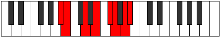
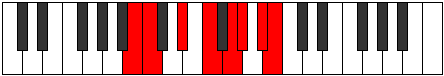

# Mode Kagian

## Links

- [Documentation](README.md)
- [Scales Index](Scales.md)
- [Modes Index](Modes.md)
- [Chords Index](Chords.md)

## Parent Scale

[Phrolian](ScalePhrolian.md)

## Number

[2899](https://ianring.com/musictheory/scales/2899)

## Interval Pattern

1, 3, 2, 2, 1, 2, 1

## Chord Pattern

I⁺, III, iv⁰, vi

## Perfection

- 5 Perfect notes
- 2 Perfect notes

## Perfection Profile

[false true true true false true true]

## Permutations

| Tonic | Notes | Signature | Illustration | Audio |
|-------|-------|-----------|--------------|-------|
| [C](ModeCNaturalKagian.md) | **C**, Db, E, F#, **G#**, A, B, **C** | C |  | [midi](https://github.com/edipermadi/music/blob/main/docs/ModeCNaturalKagian.mid?raw=true) |
| [C#](ModeCSharpKagian.md) | **C#**, D, E#, F##, **G##**, A#, B#, **C#** | C |  | [midi](https://github.com/edipermadi/music/blob/main/docs/ModeCSharpKagian.mid?raw=true) |
| [Db](ModeDFlatKagian.md) | **Db**, Ebb, F, G, **A**, Bb, C, **Db** | C |  | [midi](https://github.com/edipermadi/music/blob/main/docs/ModeDFlatKagian.mid?raw=true) |
| [D](ModeDNaturalKagian.md) | **D**, Eb, F#, G#, **A#**, B, C#, **D** | C |  | [midi](https://github.com/edipermadi/music/blob/main/docs/ModeDNaturalKagian.mid?raw=true) |
| [D#](ModeDSharpKagian.md) | **D#**, E, F##, G##, **A##**, B#, C##, **D#** | C |  | [midi](https://github.com/edipermadi/music/blob/main/docs/ModeDSharpKagian.mid?raw=true) |
| [Eb](ModeEFlatKagian.md) | **Eb**, Fb, G, A, **B**, C, D, **Eb** | C |  | [midi](https://github.com/edipermadi/music/blob/main/docs/ModeEFlatKagian.mid?raw=true) |
| [E](ModeENaturalKagian.md) | **E**, F, G#, A#, **B#**, C#, D#, **E** | C |  | [midi](https://github.com/edipermadi/music/blob/main/docs/ModeENaturalKagian.mid?raw=true) |
| [F](ModeFNaturalKagian.md) | **F**, Gb, A, B, **C#**, D, E, **F** | C |  | [midi](https://github.com/edipermadi/music/blob/main/docs/ModeFNaturalKagian.mid?raw=true) |
| [F#](ModeFSharpKagian.md) | **F#**, G, A#, B#, **C##**, D#, E#, **F#** | C |  | [midi](https://github.com/edipermadi/music/blob/main/docs/ModeFSharpKagian.mid?raw=true) |
| [Gb](ModeGFlatKagian.md) | **Gb**, Abb, Bb, C, **D**, Eb, F, **Gb** | C |  | [midi](https://github.com/edipermadi/music/blob/main/docs/ModeGFlatKagian.mid?raw=true) |
| [G](ModeGNaturalKagian.md) | **G**, Ab, B, C#, **D#**, E, F#, **G** | C |  | [midi](https://github.com/edipermadi/music/blob/main/docs/ModeGNaturalKagian.mid?raw=true) |
| [G#](ModeGSharpKagian.md) | **G#**, A, B#, C##, **D##**, E#, F##, **G#** | C |  | [midi](https://github.com/edipermadi/music/blob/main/docs/ModeGSharpKagian.mid?raw=true) |
| [Ab](ModeAFlatKagian.md) | **Ab**, Bbb, C, D, **E**, F, G, **Ab** | C |  | [midi](https://github.com/edipermadi/music/blob/main/docs/ModeAFlatKagian.mid?raw=true) |
| [A](ModeANaturalKagian.md) | **A**, Bb, C#, D#, **E#**, F#, G#, **A** | C |  | [midi](https://github.com/edipermadi/music/blob/main/docs/ModeANaturalKagian.mid?raw=true) |
| [A#](ModeASharpKagian.md) | **A#**, B, C##, D##, **E##**, F##, G##, **A#** | C |  | [midi](https://github.com/edipermadi/music/blob/main/docs/ModeASharpKagian.mid?raw=true) |
| [Bb](ModeBFlatKagian.md) | **Bb**, Cb, D, E, **F#**, G, A, **Bb** | C |  | [midi](https://github.com/edipermadi/music/blob/main/docs/ModeBFlatKagian.mid?raw=true) |
| [B](ModeBNaturalKagian.md) | **B**, C, D#, E#, **F##**, G#, A#, **B** | C |  | [midi](https://github.com/edipermadi/music/blob/main/docs/ModeBNaturalKagian.mid?raw=true) |
