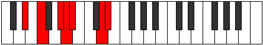

# Mode Kagimic

## Links

- [Documentation](index.md)
- [Scales Index](Scales.md)
- [Modes Index](Modes.md)
- [Chords Index](Chords.md)

## Parent Scale

[Epygimic](ScaleEpygimic.md)

## Number

[2277](https://ianring.com/musictheory/scales/2277)

## Perfection

- 4 Perfect notes
- 2 Perfect notes

## Perfection Profile

[true false true false true true]

## Permutations

| Tonic | Notes | Signature | Illustration | Audio |
|-------|-------|-----------|--------------|-------|
| [C](ModeCNaturalKagimic.md) | C, **D**, E#, **F#**, G, A##, C | C |  | [midi](ModeCNaturalKagimic.mid) [ogg](ModeCNaturalKagimic.ogg) |
| [C#](ModeCSharpKagimic.md) | C#, **D#**, E##, **F##**, G#, A###, C# | C |  | [midi](ModeCSharpKagimic.mid) [ogg](ModeCSharpKagimic.ogg) |
| [Db](ModeDFlatKagimic.md) | Db, **Eb**, F#, **G**, Ab, B#, Db | C |  | [midi](ModeDFlatKagimic.mid) [ogg](ModeDFlatKagimic.ogg) |
| [D](ModeDNaturalKagimic.md) | D, **E**, F##, **G#**, A, B##, D | C |  | [midi](ModeDNaturalKagimic.mid) [ogg](ModeDNaturalKagimic.ogg) |
| [D#](ModeDSharpKagimic.md) | D#, **E#**, F###, **G##**, A#, B###, D# | C |  | [midi](ModeDSharpKagimic.mid) [ogg](ModeDSharpKagimic.ogg) |
| [Eb](ModeEFlatKagimic.md) | Eb, **F**, G#, **A**, Bb, C##, Eb | C |  | [midi](ModeEFlatKagimic.mid) [ogg](ModeEFlatKagimic.ogg) |
| [E](ModeENaturalKagimic.md) | E, **F#**, G##, **A#**, B, C###, E | C |  | [midi](ModeENaturalKagimic.mid) [ogg](ModeENaturalKagimic.ogg) |
| [F](ModeFNaturalKagimic.md) | F, **G**, A#, **B**, C, D##, F | C |  | [midi](ModeFNaturalKagimic.mid) [ogg](ModeFNaturalKagimic.ogg) |
| [F#](ModeFSharpKagimic.md) | F#, **G#**, A##, **B#**, C#, D###, F# | C |  | [midi](ModeFSharpKagimic.mid) [ogg](ModeFSharpKagimic.ogg) |
| [Gb](ModeGFlatKagimic.md) | Gb, **Ab**, B, **C**, Db, E#, Gb | C |  | [midi](ModeGFlatKagimic.mid) [ogg](ModeGFlatKagimic.ogg) |
| [G](ModeGNaturalKagimic.md) | G, **A**, B#, **C#**, D, E##, G | C |  | [midi](ModeGNaturalKagimic.mid) [ogg](ModeGNaturalKagimic.ogg) |
| [G#](ModeGSharpKagimic.md) | G#, **A#**, B##, **C##**, D#, E###, G# | C |  | [midi](ModeGSharpKagimic.mid) [ogg](ModeGSharpKagimic.ogg) |
| [Ab](ModeAFlatKagimic.md) | Ab, **Bb**, C#, **D**, Eb, F##, Ab | C |  | [midi](ModeAFlatKagimic.mid) [ogg](ModeAFlatKagimic.ogg) |
| [A](ModeANaturalKagimic.md) | A, **B**, C##, **D#**, E, F###, A | C |  | [midi](ModeANaturalKagimic.mid) [ogg](ModeANaturalKagimic.ogg) |
| [A#](ModeASharpKagimic.md) | A#, **B#**, C###, **D##**, E#, Cbbb, A# | C |  | [midi](ModeASharpKagimic.mid) [ogg](ModeASharpKagimic.ogg) |
| [Bb](ModeBFlatKagimic.md) | Bb, **C**, D#, **E**, F, G##, Bb | C |  | [midi](ModeBFlatKagimic.mid) [ogg](ModeBFlatKagimic.ogg) |
| [B](ModeBNaturalKagimic.md) | B, **C#**, D##, **E#**, F#, G###, B | C |  | [midi](ModeBNaturalKagimic.mid) [ogg](ModeBNaturalKagimic.ogg) |
