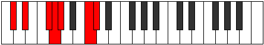

# Mode Kagimic

## Links

- [Documentation](README.md)
- [Scales Index](Scales.md)
- [Modes Index](Modes.md)
- [Chords Index](Chords.md)

## Parent Scale

[Epygimic](ScaleEpygimic.md)

## Number

[2277](https://ianring.com/musictheory/scales/2277)

## Luminosity

5

## Transposition

2, 3, 1, 1, 4, 1

## Chord Pattern

vi

## Perfection

- 4 Perfect notes
- 2 Perfect notes

## Perfection Profile

true, false, true, false, true, true

## Permutations

| Tonic | Notes | Signature | Illustration | Audio |
|-------|-------|-----------|--------------|-------|
| [C](ModeCNaturalKagimic.md) | C, **D**, E#, **F#**, G, A##, C | C |  | [midi](https://github.com/edipermadi/music/blob/main/docs/ModeCNaturalKagimic.mid?raw=true) |
| [C#](ModeCSharpKagimic.md) | C#, **D#**, E##, **F##**, G#, A###, C# | C |  | [midi](https://github.com/edipermadi/music/blob/main/docs/ModeCSharpKagimic.mid?raw=true) |
| [Db](ModeDFlatKagimic.md) | Db, **Eb**, F#, **G**, Ab, B#, Db | C |  | [midi](https://github.com/edipermadi/music/blob/main/docs/ModeDFlatKagimic.mid?raw=true) |
| [D](ModeDNaturalKagimic.md) | D, **E**, F##, **G#**, A, B##, D | C |  | [midi](https://github.com/edipermadi/music/blob/main/docs/ModeDNaturalKagimic.mid?raw=true) |
| [D#](ModeDSharpKagimic.md) | D#, **E#**, F###, **G##**, A#, B###, D# | C |  | [midi](https://github.com/edipermadi/music/blob/main/docs/ModeDSharpKagimic.mid?raw=true) |
| [Eb](ModeEFlatKagimic.md) | Eb, **F**, G#, **A**, Bb, C##, Eb | C |  | [midi](https://github.com/edipermadi/music/blob/main/docs/ModeEFlatKagimic.mid?raw=true) |
| [E](ModeENaturalKagimic.md) | E, **F#**, G##, **A#**, B, C###, E | C |  | [midi](https://github.com/edipermadi/music/blob/main/docs/ModeENaturalKagimic.mid?raw=true) |
| [F](ModeFNaturalKagimic.md) | F, **G**, A#, **B**, C, D##, F | C |  | [midi](https://github.com/edipermadi/music/blob/main/docs/ModeFNaturalKagimic.mid?raw=true) |
| [F#](ModeFSharpKagimic.md) | F#, **G#**, A##, **B#**, C#, D###, F# | C |  | [midi](https://github.com/edipermadi/music/blob/main/docs/ModeFSharpKagimic.mid?raw=true) |
| [Gb](ModeGFlatKagimic.md) | Gb, **Ab**, B, **C**, Db, E#, Gb | C |  | [midi](https://github.com/edipermadi/music/blob/main/docs/ModeGFlatKagimic.mid?raw=true) |
| [G](ModeGNaturalKagimic.md) | G, **A**, B#, **C#**, D, E##, G | C |  | [midi](https://github.com/edipermadi/music/blob/main/docs/ModeGNaturalKagimic.mid?raw=true) |
| [G#](ModeGSharpKagimic.md) | G#, **A#**, B##, **C##**, D#, E###, G# | C |  | [midi](https://github.com/edipermadi/music/blob/main/docs/ModeGSharpKagimic.mid?raw=true) |
| [Ab](ModeAFlatKagimic.md) | Ab, **Bb**, C#, **D**, Eb, F##, Ab | C |  | [midi](https://github.com/edipermadi/music/blob/main/docs/ModeAFlatKagimic.mid?raw=true) |
| [A](ModeANaturalKagimic.md) | A, **B**, C##, **D#**, E, F###, A | C |  | [midi](https://github.com/edipermadi/music/blob/main/docs/ModeANaturalKagimic.mid?raw=true) |
| [A#](ModeASharpKagimic.md) | A#, **B#**, C###, **D##**, E#, Cbbb, A# | C |  | [midi](https://github.com/edipermadi/music/blob/main/docs/ModeASharpKagimic.mid?raw=true) |
| [Bb](ModeBFlatKagimic.md) | Bb, **C**, D#, **E**, F, G##, Bb | C |  | [midi](https://github.com/edipermadi/music/blob/main/docs/ModeBFlatKagimic.mid?raw=true) |
| [B](ModeBNaturalKagimic.md) | B, **C#**, D##, **E#**, F#, G###, B | C |  | [midi](https://github.com/edipermadi/music/blob/main/docs/ModeBNaturalKagimic.mid?raw=true) |
