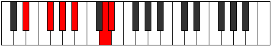
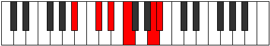

# Mode Kagitonic

## Links

- [Documentation](index.md)
- [Scales Index](Scales.md)
- [Modes Index](Modes.md)
- [Chords Index](Chords.md)

## Parent Scale

[Epygitonic](ScaleEpygitonic.md)

## Number

[2217](https://ianring.com/musictheory/scales/2217)

## Interval Pattern

3, 2, 2, 4, 1

## Chord Pattern

V⁺

## Perfection

- 2 Perfect notes
- 3 Perfect notes

## Perfection Profile

[true false true false false]

## Permutations

| Tonic | Notes | Signature | Illustration | Audio |
|-------|-------|-----------|--------------|-------|
| [C](ModeCNaturalKagitonic.md) | C, **D#**, F, **G**, **B**, C | C |  | [midi](https://github.com/edipermadi/music/blob/main/docs/ModeCNaturalKagitonic.mid?raw=true) |
| [C#](ModeCSharpKagitonic.md) | C#, **E**, F#, **G#**, **C**, C# | C |  | [midi](https://github.com/edipermadi/music/blob/main/docs/ModeCSharpKagitonic.mid?raw=true) |
| [Db](ModeDFlatKagitonic.md) | Db, **E**, Gb, **Ab**, **C**, Db | C |  | [midi](https://github.com/edipermadi/music/blob/main/docs/ModeDFlatKagitonic.mid?raw=true) |
| [D](ModeDNaturalKagitonic.md) | D, **F**, G, **A**, **C#**, D | C |  | [midi](https://github.com/edipermadi/music/blob/main/docs/ModeDNaturalKagitonic.mid?raw=true) |
| [D#](ModeDSharpKagitonic.md) | D#, **F#**, G#, **A#**, **D**, D# | C |  | [midi](https://github.com/edipermadi/music/blob/main/docs/ModeDSharpKagitonic.mid?raw=true) |
| [Eb](ModeEFlatKagitonic.md) | Eb, **Gb**, Ab, **Bb**, **D**, Eb | C |  | [midi](https://github.com/edipermadi/music/blob/main/docs/ModeEFlatKagitonic.mid?raw=true) |
| [E](ModeENaturalKagitonic.md) | E, **G**, A, **B**, **D#**, E | C |  | [midi](https://github.com/edipermadi/music/blob/main/docs/ModeENaturalKagitonic.mid?raw=true) |
| [F](ModeFNaturalKagitonic.md) | F, **G#**, A#, **C**, **E**, F | C |  | [midi](https://github.com/edipermadi/music/blob/main/docs/ModeFNaturalKagitonic.mid?raw=true) |
| [F#](ModeFSharpKagitonic.md) | F#, **A**, B, **C#**, **F**, F# | C |  | [midi](https://github.com/edipermadi/music/blob/main/docs/ModeFSharpKagitonic.mid?raw=true) |
| [Gb](ModeGFlatKagitonic.md) | Gb, **A**, B, **Db**, **F**, Gb | C |  | [midi](https://github.com/edipermadi/music/blob/main/docs/ModeGFlatKagitonic.mid?raw=true) |
| [G](ModeGNaturalKagitonic.md) | G, **A#**, C, **D**, **F#**, G | C |  | [midi](https://github.com/edipermadi/music/blob/main/docs/ModeGNaturalKagitonic.mid?raw=true) |
| [G#](ModeGSharpKagitonic.md) | G#, **B**, C#, **D#**, **G**, G# | C |  | [midi](https://github.com/edipermadi/music/blob/main/docs/ModeGSharpKagitonic.mid?raw=true) |
| [Ab](ModeAFlatKagitonic.md) | Ab, **B**, Db, **Eb**, **G**, Ab | C |  | [midi](https://github.com/edipermadi/music/blob/main/docs/ModeAFlatKagitonic.mid?raw=true) |
| [A](ModeANaturalKagitonic.md) | A, **C**, D, **E**, **G#**, A | C |  | [midi](https://github.com/edipermadi/music/blob/main/docs/ModeANaturalKagitonic.mid?raw=true) |
| [A#](ModeASharpKagitonic.md) | A#, **C#**, D#, **F**, **A**, A# | C |  | [midi](https://github.com/edipermadi/music/blob/main/docs/ModeASharpKagitonic.mid?raw=true) |
| [Bb](ModeBFlatKagitonic.md) | Bb, **Db**, Eb, **F**, **A**, Bb | C |  | [midi](https://github.com/edipermadi/music/blob/main/docs/ModeBFlatKagitonic.mid?raw=true) |
| [B](ModeBNaturalKagitonic.md) | B, **D**, E, **F#**, **A#**, B | C |  | [midi](https://github.com/edipermadi/music/blob/main/docs/ModeBNaturalKagitonic.mid?raw=true) |
