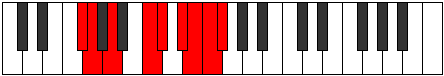

# Mode Kagyllic

## Links

- [Documentation](README.md)
- [Scales Index](Scales.md)
- [Modes Index](Modes.md)
- [Chords Index](Chords.md)

## Parent Scale

[Stacryllic](ScaleStacryllic.md)

## Number

[3787](https://ianring.com/musictheory/scales/3787)

## Transposition

1, 2, 3, 1, 2, 1, 1, 1

## Chord Pattern

i, III

## Perfection

- 4 Perfect notes
- 4 Perfect notes

## Perfection Profile

true, false, true, true, false, false, false, true

## Permutations

| Tonic | Notes | Signature | Illustration | Audio |
|-------|-------|-----------|--------------|-------|
| [C](ModeCNaturalKagyllic.md) | C, **C#**, D#, F#, **G**, **A**, **A#**, B, C | C |  | [midi](https://github.com/edipermadi/music/blob/main/docs/ModeCNaturalKagyllic.mid?raw=true) |
| [C#](ModeCSharpKagyllic.md) | C#, **D**, E, G, **G#**, **A#**, **B**, C, C# | C |  | [midi](https://github.com/edipermadi/music/blob/main/docs/ModeCSharpKagyllic.mid?raw=true) |
| [Db](ModeDFlatKagyllic.md) | Db, **D**, E, G, **Ab**, **Bb**, **B**, C, Db | C |  | [midi](https://github.com/edipermadi/music/blob/main/docs/ModeDFlatKagyllic.mid?raw=true) |
| [D](ModeDNaturalKagyllic.md) | D, **D#**, F, G#, **A**, **B**, **C**, C#, D | C |  | [midi](https://github.com/edipermadi/music/blob/main/docs/ModeDNaturalKagyllic.mid?raw=true) |
| [D#](ModeDSharpKagyllic.md) | D#, **E**, F#, A, **A#**, **C**, **C#**, D, D# | C |  | [midi](https://github.com/edipermadi/music/blob/main/docs/ModeDSharpKagyllic.mid?raw=true) |
| [Eb](ModeEFlatKagyllic.md) | Eb, **E**, Gb, A, **Bb**, **C**, **Db**, D, Eb | C |  | [midi](https://github.com/edipermadi/music/blob/main/docs/ModeEFlatKagyllic.mid?raw=true) |
| [E](ModeENaturalKagyllic.md) | E, **F**, G, A#, **B**, **C#**, **D**, D#, E | C |  | [midi](https://github.com/edipermadi/music/blob/main/docs/ModeENaturalKagyllic.mid?raw=true) |
| [F](ModeFNaturalKagyllic.md) | F, **F#**, G#, B, **C**, **D**, **D#**, E, F | C |  | [midi](https://github.com/edipermadi/music/blob/main/docs/ModeFNaturalKagyllic.mid?raw=true) |
| [F#](ModeFSharpKagyllic.md) | F#, **G**, A, C, **C#**, **D#**, **E**, F, F# | C |  | [midi](https://github.com/edipermadi/music/blob/main/docs/ModeFSharpKagyllic.mid?raw=true) |
| [Gb](ModeGFlatKagyllic.md) | Gb, **G**, A, C, **Db**, **Eb**, **E**, F, Gb | C |  | [midi](https://github.com/edipermadi/music/blob/main/docs/ModeGFlatKagyllic.mid?raw=true) |
| [G](ModeGNaturalKagyllic.md) | G, **G#**, A#, C#, **D**, **E**, **F**, F#, G | C |  | [midi](https://github.com/edipermadi/music/blob/main/docs/ModeGNaturalKagyllic.mid?raw=true) |
| [G#](ModeGSharpKagyllic.md) | G#, **A**, B, D, **D#**, **F**, **F#**, G, G# | C |  | [midi](https://github.com/edipermadi/music/blob/main/docs/ModeGSharpKagyllic.mid?raw=true) |
| [Ab](ModeAFlatKagyllic.md) | Ab, **A**, B, D, **Eb**, **F**, **Gb**, G, Ab | C |  | [midi](https://github.com/edipermadi/music/blob/main/docs/ModeAFlatKagyllic.mid?raw=true) |
| [A](ModeANaturalKagyllic.md) | A, **A#**, C, D#, **E**, **F#**, **G**, G#, A | C |  | [midi](https://github.com/edipermadi/music/blob/main/docs/ModeANaturalKagyllic.mid?raw=true) |
| [A#](ModeASharpKagyllic.md) | A#, **B**, C#, E, **F**, **G**, **G#**, A, A# | C |  | [midi](https://github.com/edipermadi/music/blob/main/docs/ModeASharpKagyllic.mid?raw=true) |
| [Bb](ModeBFlatKagyllic.md) | Bb, **B**, Db, E, **F**, **G**, **Ab**, A, Bb | C |  | [midi](https://github.com/edipermadi/music/blob/main/docs/ModeBFlatKagyllic.mid?raw=true) |
| [B](ModeBNaturalKagyllic.md) | B, **C**, D, F, **F#**, **G#**, **A**, A#, B | C |  | [midi](https://github.com/edipermadi/music/blob/main/docs/ModeBNaturalKagyllic.mid?raw=true) |
