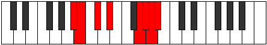

# Mode Kalian

## Links

- [Documentation](index.md)
- [Scales Index](Scales.md)
- [Modes Index](Modes.md)
- [Chords Index](Chords.md)

## Parent Scale

[Stanian](ScaleStanian.md)

## Number

[3627](https://ianring.com/musictheory/scales/3627)

## Perfection

- 3 Perfect notes
- 4 Perfect notes

## Perfection Profile

[false false true true false true false]

## Permutations

| Tonic | Notes | Signature | Illustration | Audio |
|-------|-------|-----------|--------------|-------|
| [C](ModeCNaturalKalian.md) | **C**, **Db**, Eb, F, **G##**, A#, **B**, **C** | C |  | [midi](ModeCNaturalKalian.mid) [ogg](ModeCNaturalKalian.ogg) |
| [C#](ModeCSharpKalian.md) | **C#**, **D**, E, F#, **G###**, A##, **B#**, **C#** | C |  | [midi](ModeCSharpKalian.mid) [ogg](ModeCSharpKalian.ogg) |
| [Db](ModeDFlatKalian.md) | **Db**, **Ebb**, Fb, Gb, **A#**, B, **C**, **Db** | C |  | [midi](ModeDFlatKalian.mid) [ogg](ModeDFlatKalian.ogg) |
| [D](ModeDNaturalKalian.md) | **D**, **Eb**, F, G, **A##**, B#, **C#**, **D** | C |  | [midi](ModeDNaturalKalian.mid) [ogg](ModeDNaturalKalian.ogg) |
| [D#](ModeDSharpKalian.md) | **D#**, **E**, F#, G#, **A###**, B##, **C##**, **D#** | C |  | [midi](ModeDSharpKalian.mid) [ogg](ModeDSharpKalian.ogg) |
| [Eb](ModeEFlatKalian.md) | **Eb**, **Fb**, Gb, Ab, **B#**, C#, **D**, **Eb** | C |  | [midi](ModeEFlatKalian.mid) [ogg](ModeEFlatKalian.ogg) |
| [E](ModeENaturalKalian.md) | **E**, **F**, G, A, **B##**, C##, **D#**, **E** | C |  | [midi](ModeENaturalKalian.mid) [ogg](ModeENaturalKalian.ogg) |
| [F](ModeFNaturalKalian.md) | **F**, **Gb**, Ab, Bb, **C##**, D#, **E**, **F** | C |  | [midi](ModeFNaturalKalian.mid) [ogg](ModeFNaturalKalian.ogg) |
| [F#](ModeFSharpKalian.md) | **F#**, **G**, A, B, **C###**, D##, **E#**, **F#** | C |  | [midi](ModeFSharpKalian.mid) [ogg](ModeFSharpKalian.ogg) |
| [Gb](ModeGFlatKalian.md) | **Gb**, **Abb**, Bbb, Cb, **D#**, E, **F**, **Gb** | C |  | [midi](ModeGFlatKalian.mid) [ogg](ModeGFlatKalian.ogg) |
| [G](ModeGNaturalKalian.md) | **G**, **Ab**, Bb, C, **D##**, E#, **F#**, **G** | C |  | [midi](ModeGNaturalKalian.mid) [ogg](ModeGNaturalKalian.ogg) |
| [G#](ModeGSharpKalian.md) | **G#**, **A**, B, C#, **D###**, E##, **F##**, **G#** | C |  | [midi](ModeGSharpKalian.mid) [ogg](ModeGSharpKalian.ogg) |
| [Ab](ModeAFlatKalian.md) | **Ab**, **Bbb**, Cb, Db, **E#**, F#, **G**, **Ab** | C |  | [midi](ModeAFlatKalian.mid) [ogg](ModeAFlatKalian.ogg) |
| [A](ModeANaturalKalian.md) | **A**, **Bb**, C, D, **E##**, F##, **G#**, **A** | C |  | [midi](ModeANaturalKalian.mid) [ogg](ModeANaturalKalian.ogg) |
| [A#](ModeASharpKalian.md) | **A#**, **B**, C#, D#, **E###**, F###, **G##**, **A#** | C |  | [midi](ModeASharpKalian.mid) [ogg](ModeASharpKalian.ogg) |
| [Bb](ModeBFlatKalian.md) | **Bb**, **Cb**, Db, Eb, **F##**, G#, **A**, **Bb** | C |  | [midi](ModeBFlatKalian.mid) [ogg](ModeBFlatKalian.ogg) |
| [B](ModeBNaturalKalian.md) | **B**, **C**, D, E, **F###**, G##, **A#**, **B** | C |  | [midi](ModeBNaturalKalian.mid) [ogg](ModeBNaturalKalian.ogg) |
