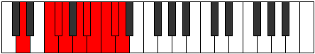

# Mode Kalygic

## Links

- [Documentation](index.md)
- [Scales Index](Scales.md)
- [Modes Index](Modes.md)
- [Chords Index](Chords.md)

## Parent Scale

[Kalygic](ScaleKalygic.md)

## Number

[4025](https://ianring.com/musictheory/scales/4025)

## Perfection

- 7 Perfect notes
- 2 Perfect notes

## Perfection Profile

[true true true true false true true true false]

## Permutations

| Tonic | Notes | Signature | Illustration | Audio |
|-------|-------|-----------|--------------|-------|
| [C](ModeCNaturalKalygic.md) | C, D#, E, F, **G**, G#, A, A#, **B**, C | C |  | [midi](ModeCNaturalKalygic.mid) [ogg](ModeCNaturalKalygic.ogg) |
| [C#](ModeCSharpKalygic.md) | C#, E, F, F#, **G#**, A, A#, B, **C**, C# | C |  | [midi](ModeCSharpKalygic.mid) [ogg](ModeCSharpKalygic.ogg) |
| [Db](ModeDFlatKalygic.md) | Db, E, F, Gb, **Ab**, A, Bb, B, **C**, Db | C |  | [midi](ModeDFlatKalygic.mid) [ogg](ModeDFlatKalygic.ogg) |
| [D](ModeDNaturalKalygic.md) | D, F, F#, G, **A**, A#, B, C, **C#**, D | C |  | [midi](ModeDNaturalKalygic.mid) [ogg](ModeDNaturalKalygic.ogg) |
| [D#](ModeDSharpKalygic.md) | D#, F#, G, G#, **A#**, B, C, C#, **D**, D# | C |  | [midi](ModeDSharpKalygic.mid) [ogg](ModeDSharpKalygic.ogg) |
| [Eb](ModeEFlatKalygic.md) | Eb, Gb, G, Ab, **Bb**, B, C, Db, **D**, Eb | C |  | [midi](ModeEFlatKalygic.mid) [ogg](ModeEFlatKalygic.ogg) |
| [E](ModeENaturalKalygic.md) | E, G, G#, A, **B**, C, C#, D, **D#**, E | C |  | [midi](ModeENaturalKalygic.mid) [ogg](ModeENaturalKalygic.ogg) |
| [F](ModeFNaturalKalygic.md) | F, G#, A, A#, **C**, C#, D, D#, **E**, F | C |  | [midi](ModeFNaturalKalygic.mid) [ogg](ModeFNaturalKalygic.ogg) |
| [F#](ModeFSharpKalygic.md) | F#, A, A#, B, **C#**, D, D#, E, **F**, F# | C |  | [midi](ModeFSharpKalygic.mid) [ogg](ModeFSharpKalygic.ogg) |
| [Gb](ModeGFlatKalygic.md) | Gb, A, Bb, B, **Db**, D, Eb, E, **F**, Gb | C |  | [midi](ModeGFlatKalygic.mid) [ogg](ModeGFlatKalygic.ogg) |
| [G](ModeGNaturalKalygic.md) | G, A#, B, C, **D**, D#, E, F, **F#**, G | C |  | [midi](ModeGNaturalKalygic.mid) [ogg](ModeGNaturalKalygic.ogg) |
| [G#](ModeGSharpKalygic.md) | G#, B, C, C#, **D#**, E, F, F#, **G**, G# | C |  | [midi](ModeGSharpKalygic.mid) [ogg](ModeGSharpKalygic.ogg) |
| [Ab](ModeAFlatKalygic.md) | Ab, B, C, Db, **Eb**, E, F, Gb, **G**, Ab | C |  | [midi](ModeAFlatKalygic.mid) [ogg](ModeAFlatKalygic.ogg) |
| [A](ModeANaturalKalygic.md) | A, C, C#, D, **E**, F, F#, G, **G#**, A | C |  | [midi](ModeANaturalKalygic.mid) [ogg](ModeANaturalKalygic.ogg) |
| [A#](ModeASharpKalygic.md) | A#, C#, D, D#, **F**, F#, G, G#, **A**, A# | C |  | [midi](ModeASharpKalygic.mid) [ogg](ModeASharpKalygic.ogg) |
| [Bb](ModeBFlatKalygic.md) | Bb, Db, D, Eb, **F**, Gb, G, Ab, **A**, Bb | C |  | [midi](ModeBFlatKalygic.mid) [ogg](ModeBFlatKalygic.ogg) |
| [B](ModeBNaturalKalygic.md) | B, D, D#, E, **F#**, G, G#, A, **A#**, B | C |  | [midi](ModeBNaturalKalygic.mid) [ogg](ModeBNaturalKalygic.ogg) |
