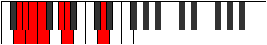
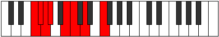
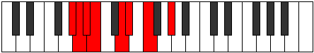
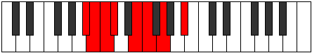
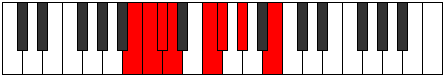

# Mode Kanian

## Links

- [Documentation](README.md)
- [Scales Index](Scales.md)
- [Modes Index](Modes.md)
- [Chords Index](Chords.md)

## Parent Scale

[Ranian](ScaleRanian.md)

## Number

[719](https://ianring.com/musictheory/scales/719)

## Interval Pattern

1, 1, 1, 3, 1, 2, 3

## Chord Pattern

III, v

## Perfection

- 4 Perfect notes
- 3 Perfect notes

## Perfection Profile

[true false true false true true false]

## Permutations

| Tonic | Notes | Signature | Illustration | Audio |
|-------|-------|-----------|--------------|-------|
| [C](ModeCNaturalKanian.md) | C, **Db**, Ebb, **Fbb**, Gb, Abb, **Bbb**, C | C |  | [midi](https://github.com/edipermadi/music/blob/main/docs/ModeCNaturalKanian.mid?raw=true) |
| [C#](ModeCSharpKanian.md) | C#, **D**, Eb, **Fb**, G, Ab, **Bb**, C# | C |  | [midi](https://github.com/edipermadi/music/blob/main/docs/ModeCSharpKanian.mid?raw=true) |
| [Db](ModeDFlatKanian.md) | Db, **Ebb**, Fbb, **Gbbb**, Abb, Bbbb, **Cbb**, Db | C |  | [midi](https://github.com/edipermadi/music/blob/main/docs/ModeDFlatKanian.mid?raw=true) |
| [D](ModeDNaturalKanian.md) | D, **Eb**, Fb, **Gbb**, Ab, Bbb, **Cb**, D | C |  | [midi](https://github.com/edipermadi/music/blob/main/docs/ModeDNaturalKanian.mid?raw=true) |
| [D#](ModeDSharpKanian.md) | D#, **E**, F, **Gb**, A, Bb, **C**, D# | C |  | [midi](https://github.com/edipermadi/music/blob/main/docs/ModeDSharpKanian.mid?raw=true) |
| [Eb](ModeEFlatKanian.md) | Eb, **Fb**, Gbb, **Abbb**, Bbb, Cbb, **Dbb**, Eb | C |  | [midi](https://github.com/edipermadi/music/blob/main/docs/ModeEFlatKanian.mid?raw=true) |
| [E](ModeENaturalKanian.md) | E, **F**, Gb, **Abb**, Bb, Cb, **Db**, E | C |  | [midi](https://github.com/edipermadi/music/blob/main/docs/ModeENaturalKanian.mid?raw=true) |
| [F](ModeFNaturalKanian.md) | F, **Gb**, Abb, **Bbbb**, Cb, Dbb, **Ebb**, F | C |  | [midi](https://github.com/edipermadi/music/blob/main/docs/ModeFNaturalKanian.mid?raw=true) |
| [F#](ModeFSharpKanian.md) | F#, **G**, Ab, **Bbb**, C, Db, **Eb**, F# | C |  | [midi](https://github.com/edipermadi/music/blob/main/docs/ModeFSharpKanian.mid?raw=true) |
| [Gb](ModeGFlatKanian.md) | Gb, **Abb**, Bbbb, **Cbbb**, Dbb, Ebbb, **Fbb**, Gb | C |  | [midi](https://github.com/edipermadi/music/blob/main/docs/ModeGFlatKanian.mid?raw=true) |
| [G](ModeGNaturalKanian.md) | G, **Ab**, Bbb, **Cbb**, Db, Ebb, **Fb**, G | C |  | [midi](https://github.com/edipermadi/music/blob/main/docs/ModeGNaturalKanian.mid?raw=true) |
| [G#](ModeGSharpKanian.md) | G#, **A**, Bb, **Cb**, D, Eb, **F**, G# | C |  | [midi](https://github.com/edipermadi/music/blob/main/docs/ModeGSharpKanian.mid?raw=true) |
| [Ab](ModeAFlatKanian.md) | Ab, **Bbb**, Cbb, **Dbbb**, Ebb, Fbb, **Gbb**, Ab | C |  | [midi](https://github.com/edipermadi/music/blob/main/docs/ModeAFlatKanian.mid?raw=true) |
| [A](ModeANaturalKanian.md) | A, **Bb**, Cb, **Dbb**, Eb, Fb, **Gb**, A | C |  | [midi](https://github.com/edipermadi/music/blob/main/docs/ModeANaturalKanian.mid?raw=true) |
| [A#](ModeASharpKanian.md) | A#, **B**, C, **Db**, E, F, **G**, A# | C |  | [midi](https://github.com/edipermadi/music/blob/main/docs/ModeASharpKanian.mid?raw=true) |
| [Bb](ModeBFlatKanian.md) | Bb, **Cb**, Dbb, **Ebbb**, Fb, Gbb, **Abb**, Bb | C |  | [midi](https://github.com/edipermadi/music/blob/main/docs/ModeBFlatKanian.mid?raw=true) |
| [B](ModeBNaturalKanian.md) | B, **C**, Db, **Ebb**, F, Gb, **Ab**, B | C |  | [midi](https://github.com/edipermadi/music/blob/main/docs/ModeBNaturalKanian.mid?raw=true) |
