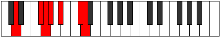
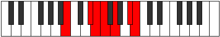

# Mode Kanimic

## Links

- [Documentation](index.md)
- [Scales Index](Scales.md)
- [Modes Index](Modes.md)
- [Chords Index](Chords.md)

## Parent Scale

[Kanimic](ScaleKanimic.md)

## Number

[2417](https://ianring.com/musictheory/scales/2417)

## Perfection

- 3 Perfect notes
- 3 Perfect notes

## Perfection Profile

[false true true false false true]

## Permutations

| Tonic | Notes | Signature | Illustration | Audio |
|-------|-------|-----------|--------------|-------|
| [C](ModeCNaturalKanimic.md) | **C**, D##, E#, **F#**, **G#**, A##, **C** | C |  | [midi](ModeCNaturalKanimic.mid) [ogg](ModeCNaturalKanimic.ogg) |
| [C#](ModeCSharpKanimic.md) | **C#**, D###, E##, **F##**, **G##**, A###, **C#** | C |  | [midi](ModeCSharpKanimic.mid) [ogg](ModeCSharpKanimic.ogg) |
| [Db](ModeDFlatKanimic.md) | **Db**, E#, F#, **G**, **A**, B#, **Db** | C |  | [midi](ModeDFlatKanimic.mid) [ogg](ModeDFlatKanimic.ogg) |
| [D](ModeDNaturalKanimic.md) | **D**, E##, F##, **G#**, **A#**, B##, **D** | C |  | [midi](ModeDNaturalKanimic.mid) [ogg](ModeDNaturalKanimic.ogg) |
| [D#](ModeDSharpKanimic.md) | **D#**, E###, F###, **G##**, **A##**, B###, **D#** | C |  | [midi](ModeDSharpKanimic.mid) [ogg](ModeDSharpKanimic.ogg) |
| [Eb](ModeEFlatKanimic.md) | **Eb**, F##, G#, **A**, **B**, C##, **Eb** | C |  | [midi](ModeEFlatKanimic.mid) [ogg](ModeEFlatKanimic.ogg) |
| [E](ModeENaturalKanimic.md) | **E**, F###, G##, **A#**, **B#**, C###, **E** | C |  | [midi](ModeENaturalKanimic.mid) [ogg](ModeENaturalKanimic.ogg) |
| [F](ModeFNaturalKanimic.md) | **F**, G##, A#, **B**, **C#**, D##, **F** | C |  | [midi](ModeFNaturalKanimic.mid) [ogg](ModeFNaturalKanimic.ogg) |
| [F#](ModeFSharpKanimic.md) | **F#**, G###, A##, **B#**, **C##**, D###, **F#** | C |  | [midi](ModeFSharpKanimic.mid) [ogg](ModeFSharpKanimic.ogg) |
| [Gb](ModeGFlatKanimic.md) | **Gb**, A#, B, **C**, **D**, E#, **Gb** | C |  | [midi](ModeGFlatKanimic.mid) [ogg](ModeGFlatKanimic.ogg) |
| [G](ModeGNaturalKanimic.md) | **G**, A##, B#, **C#**, **D#**, E##, **G** | C |  | [midi](ModeGNaturalKanimic.mid) [ogg](ModeGNaturalKanimic.ogg) |
| [G#](ModeGSharpKanimic.md) | **G#**, A###, B##, **C##**, **D##**, E###, **G#** | C |  | [midi](ModeGSharpKanimic.mid) [ogg](ModeGSharpKanimic.ogg) |
| [Ab](ModeAFlatKanimic.md) | **Ab**, B#, C#, **D**, **E**, F##, **Ab** | C |  | [midi](ModeAFlatKanimic.mid) [ogg](ModeAFlatKanimic.ogg) |
| [A](ModeANaturalKanimic.md) | **A**, B##, C##, **D#**, **E#**, F###, **A** | C |  | [midi](ModeANaturalKanimic.mid) [ogg](ModeANaturalKanimic.ogg) |
| [A#](ModeASharpKanimic.md) | **A#**, B###, C###, **D##**, **E##**, Cbbb, **A#** | C |  | [midi](ModeASharpKanimic.mid) [ogg](ModeASharpKanimic.ogg) |
| [Bb](ModeBFlatKanimic.md) | **Bb**, C##, D#, **E**, **F#**, G##, **Bb** | C |  | [midi](ModeBFlatKanimic.mid) [ogg](ModeBFlatKanimic.ogg) |
| [B](ModeBNaturalKanimic.md) | **B**, C###, D##, **E#**, **F##**, G###, **B** | C |  | [midi](ModeBNaturalKanimic.mid) [ogg](ModeBNaturalKanimic.ogg) |
