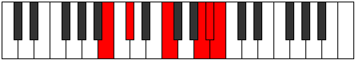

# Mode Kanitonic

## Links

- [Documentation](index.md)
- [Scales Index](Scales.md)
- [Modes Index](Modes.md)
- [Chords Index](Chords.md)

## Parent Scale

[Ranitonic](ScaleRanitonic.md)

## Number

[3141](https://ianring.com/musictheory/scales/3141)

## Perfection

- 1 Perfect notes
- 4 Perfect notes

## Perfection Profile

[false false false false true]

## Permutations

| Tonic | Notes | Signature | Illustration | Audio |
|-------|-------|-----------|--------------|-------|
| [C](ModeCNaturalKanitonic.md) | **C**, **D**, **F#**, **A#**, B, **C** | C |  | [midi](https://github.com/edipermadi/music/blob/main/docs/ModeCNaturalKanitonic.mid?raw=true) |
| [C#](ModeCSharpKanitonic.md) | **C#**, **D#**, **G**, **B**, C, **C#** | C |  | [midi](https://github.com/edipermadi/music/blob/main/docs/ModeCSharpKanitonic.mid?raw=true) |
| [Db](ModeDFlatKanitonic.md) | **Db**, **Eb**, **G**, **B**, C, **Db** | C |  | [midi](https://github.com/edipermadi/music/blob/main/docs/ModeDFlatKanitonic.mid?raw=true) |
| [D](ModeDNaturalKanitonic.md) | **D**, **E**, **G#**, **C**, C#, **D** | C |  | [midi](https://github.com/edipermadi/music/blob/main/docs/ModeDNaturalKanitonic.mid?raw=true) |
| [D#](ModeDSharpKanitonic.md) | **D#**, **F**, **A**, **C#**, D, **D#** | C |  | [midi](https://github.com/edipermadi/music/blob/main/docs/ModeDSharpKanitonic.mid?raw=true) |
| [Eb](ModeEFlatKanitonic.md) | **Eb**, **F**, **A**, **Db**, D, **Eb** | C |  | [midi](https://github.com/edipermadi/music/blob/main/docs/ModeEFlatKanitonic.mid?raw=true) |
| [E](ModeENaturalKanitonic.md) | **E**, **F#**, **A#**, **D**, D#, **E** | C |  | [midi](https://github.com/edipermadi/music/blob/main/docs/ModeENaturalKanitonic.mid?raw=true) |
| [F](ModeFNaturalKanitonic.md) | **F**, **G**, **B**, **D#**, E, **F** | C |  | [midi](https://github.com/edipermadi/music/blob/main/docs/ModeFNaturalKanitonic.mid?raw=true) |
| [F#](ModeFSharpKanitonic.md) | **F#**, **G#**, **C**, **E**, F, **F#** | C |  | [midi](https://github.com/edipermadi/music/blob/main/docs/ModeFSharpKanitonic.mid?raw=true) |
| [Gb](ModeGFlatKanitonic.md) | **Gb**, **Ab**, **C**, **E**, F, **Gb** | C |  | [midi](https://github.com/edipermadi/music/blob/main/docs/ModeGFlatKanitonic.mid?raw=true) |
| [G](ModeGNaturalKanitonic.md) | **G**, **A**, **C#**, **F**, F#, **G** | C |  | [midi](https://github.com/edipermadi/music/blob/main/docs/ModeGNaturalKanitonic.mid?raw=true) |
| [G#](ModeGSharpKanitonic.md) | **G#**, **A#**, **D**, **F#**, G, **G#** | C |  | [midi](https://github.com/edipermadi/music/blob/main/docs/ModeGSharpKanitonic.mid?raw=true) |
| [Ab](ModeAFlatKanitonic.md) | **Ab**, **Bb**, **D**, **Gb**, G, **Ab** | C |  | [midi](https://github.com/edipermadi/music/blob/main/docs/ModeAFlatKanitonic.mid?raw=true) |
| [A](ModeANaturalKanitonic.md) | **A**, **B**, **D#**, **G**, G#, **A** | C |  | [midi](https://github.com/edipermadi/music/blob/main/docs/ModeANaturalKanitonic.mid?raw=true) |
| [A#](ModeASharpKanitonic.md) | **A#**, **C**, **E**, **G#**, A, **A#** | C |  | [midi](https://github.com/edipermadi/music/blob/main/docs/ModeASharpKanitonic.mid?raw=true) |
| [Bb](ModeBFlatKanitonic.md) | **Bb**, **C**, **E**, **Ab**, A, **Bb** | C |  | [midi](https://github.com/edipermadi/music/blob/main/docs/ModeBFlatKanitonic.mid?raw=true) |
| [B](ModeBNaturalKanitonic.md) | **B**, **C#**, **F**, **A**, A#, **B** | C |  | [midi](https://github.com/edipermadi/music/blob/main/docs/ModeBNaturalKanitonic.mid?raw=true) |
