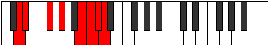

# Mode Kaptian

## Links

- [Documentation](README.md)
- [Scales Index](Scales.md)
- [Modes Index](Modes.md)
- [Chords Index](Chords.md)

## Parent Scale

[Morian](ScaleMorian.md)

## Number

[3667](https://ianring.com/musictheory/scales/3667)

## Interval Pattern

1, 3, 2, 3, 1, 1, 1

## Chord Pattern

IVb5, vi⁰b3

## Perfection

- 4 Perfect notes
- 3 Perfect notes

## Perfection Profile

[false false true true true false true]

## Permutations

| Tonic | Notes | Signature | Illustration | Audio |
|-------|-------|-----------|--------------|-------|
| [C](ModeCNaturalKaptian.md) | **C**, **Db**, E, F#, G##, **A#**, B, **C** | C |  | [midi](https://github.com/edipermadi/music/blob/main/docs/ModeCNaturalKaptian.mid?raw=true) |
| [C#](ModeCSharpKaptian.md) | **C#**, **D**, E#, F##, G###, **A##**, B#, **C#** | C |  | [midi](https://github.com/edipermadi/music/blob/main/docs/ModeCSharpKaptian.mid?raw=true) |
| [Db](ModeDFlatKaptian.md) | **Db**, **Ebb**, F, G, A#, **B**, C, **Db** | C |  | [midi](https://github.com/edipermadi/music/blob/main/docs/ModeDFlatKaptian.mid?raw=true) |
| [D](ModeDNaturalKaptian.md) | **D**, **Eb**, F#, G#, A##, **B#**, C#, **D** | C |  | [midi](https://github.com/edipermadi/music/blob/main/docs/ModeDNaturalKaptian.mid?raw=true) |
| [D#](ModeDSharpKaptian.md) | **D#**, **E**, F##, G##, A###, **B##**, C##, **D#** | C |  | [midi](https://github.com/edipermadi/music/blob/main/docs/ModeDSharpKaptian.mid?raw=true) |
| [Eb](ModeEFlatKaptian.md) | **Eb**, **Fb**, G, A, B#, **C#**, D, **Eb** | C |  | [midi](https://github.com/edipermadi/music/blob/main/docs/ModeEFlatKaptian.mid?raw=true) |
| [E](ModeENaturalKaptian.md) | **E**, **F**, G#, A#, B##, **C##**, D#, **E** | C |  | [midi](https://github.com/edipermadi/music/blob/main/docs/ModeENaturalKaptian.mid?raw=true) |
| [F](ModeFNaturalKaptian.md) | **F**, **Gb**, A, B, C##, **D#**, E, **F** | C |  | [midi](https://github.com/edipermadi/music/blob/main/docs/ModeFNaturalKaptian.mid?raw=true) |
| [F#](ModeFSharpKaptian.md) | **F#**, **G**, A#, B#, C###, **D##**, E#, **F#** | C |  | [midi](https://github.com/edipermadi/music/blob/main/docs/ModeFSharpKaptian.mid?raw=true) |
| [Gb](ModeGFlatKaptian.md) | **Gb**, **Abb**, Bb, C, D#, **E**, F, **Gb** | C |  | [midi](https://github.com/edipermadi/music/blob/main/docs/ModeGFlatKaptian.mid?raw=true) |
| [G](ModeGNaturalKaptian.md) | **G**, **Ab**, B, C#, D##, **E#**, F#, **G** | C |  | [midi](https://github.com/edipermadi/music/blob/main/docs/ModeGNaturalKaptian.mid?raw=true) |
| [G#](ModeGSharpKaptian.md) | **G#**, **A**, B#, C##, D###, **E##**, F##, **G#** | C |  | [midi](https://github.com/edipermadi/music/blob/main/docs/ModeGSharpKaptian.mid?raw=true) |
| [Ab](ModeAFlatKaptian.md) | **Ab**, **Bbb**, C, D, E#, **F#**, G, **Ab** | C |  | [midi](https://github.com/edipermadi/music/blob/main/docs/ModeAFlatKaptian.mid?raw=true) |
| [A](ModeANaturalKaptian.md) | **A**, **Bb**, C#, D#, E##, **F##**, G#, **A** | C |  | [midi](https://github.com/edipermadi/music/blob/main/docs/ModeANaturalKaptian.mid?raw=true) |
| [A#](ModeASharpKaptian.md) | **A#**, **B**, C##, D##, E###, **F###**, G##, **A#** | C |  | [midi](https://github.com/edipermadi/music/blob/main/docs/ModeASharpKaptian.mid?raw=true) |
| [Bb](ModeBFlatKaptian.md) | **Bb**, **Cb**, D, E, F##, **G#**, A, **Bb** | C |  | [midi](https://github.com/edipermadi/music/blob/main/docs/ModeBFlatKaptian.mid?raw=true) |
| [B](ModeBNaturalKaptian.md) | **B**, **C**, D#, E#, F###, **G##**, A#, **B** | C |  | [midi](https://github.com/edipermadi/music/blob/main/docs/ModeBNaturalKaptian.mid?raw=true) |
