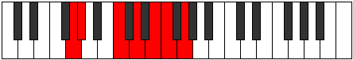

# Mode Kaptimic

## Links

- [Documentation](README.md)
- [Scales Index](Scales.md)
- [Modes Index](Modes.md)
- [Chords Index](Chords.md)

## Parent Scale

[Rycrimic](ScaleRycrimic.md)

## Number

[1699](https://ianring.com/musictheory/scales/1699)

## Interval Pattern

1, 4, 2, 2, 1, 2

## Chord Pattern

III, iv⁰

## Perfection

- 3 Perfect notes
- 3 Perfect notes

## Perfection Profile

[true false true false false true]

## Permutations

| Tonic | Notes | Signature | Illustration | Audio |
|-------|-------|-----------|--------------|-------|
| [C](ModeCNaturalKaptimic.md) | C, **Db**, E#, **F##**, **G##**, A#, C | C |  | [midi](https://github.com/edipermadi/music/blob/main/docs/ModeCNaturalKaptimic.mid?raw=true) |
| [C#](ModeCSharpKaptimic.md) | C#, **D**, E##, **F###**, **G###**, A##, C# | C |  | [midi](https://github.com/edipermadi/music/blob/main/docs/ModeCSharpKaptimic.mid?raw=true) |
| [Db](ModeDFlatKaptimic.md) | Db, **Ebb**, F#, **G#**, **A#**, B, Db | C |  | [midi](https://github.com/edipermadi/music/blob/main/docs/ModeDFlatKaptimic.mid?raw=true) |
| [D](ModeDNaturalKaptimic.md) | D, **Eb**, F##, **G##**, **A##**, B#, D | C |  | [midi](https://github.com/edipermadi/music/blob/main/docs/ModeDNaturalKaptimic.mid?raw=true) |
| [D#](ModeDSharpKaptimic.md) | D#, **E**, F###, **G###**, **A###**, B##, D# | C |  | [midi](https://github.com/edipermadi/music/blob/main/docs/ModeDSharpKaptimic.mid?raw=true) |
| [Eb](ModeEFlatKaptimic.md) | Eb, **Fb**, G#, **A#**, **B#**, C#, Eb | C |  | [midi](https://github.com/edipermadi/music/blob/main/docs/ModeEFlatKaptimic.mid?raw=true) |
| [E](ModeENaturalKaptimic.md) | E, **F**, G##, **A##**, **B##**, C##, E | C |  | [midi](https://github.com/edipermadi/music/blob/main/docs/ModeENaturalKaptimic.mid?raw=true) |
| [F](ModeFNaturalKaptimic.md) | F, **Gb**, A#, **B#**, **C##**, D#, F | C |  | [midi](https://github.com/edipermadi/music/blob/main/docs/ModeFNaturalKaptimic.mid?raw=true) |
| [F#](ModeFSharpKaptimic.md) | F#, **G**, A##, **B##**, **C###**, D##, F# | C |  | [midi](https://github.com/edipermadi/music/blob/main/docs/ModeFSharpKaptimic.mid?raw=true) |
| [Gb](ModeGFlatKaptimic.md) | Gb, **Abb**, B, **C#**, **D#**, E, Gb | C |  | [midi](https://github.com/edipermadi/music/blob/main/docs/ModeGFlatKaptimic.mid?raw=true) |
| [G](ModeGNaturalKaptimic.md) | G, **Ab**, B#, **C##**, **D##**, E#, G | C |  | [midi](https://github.com/edipermadi/music/blob/main/docs/ModeGNaturalKaptimic.mid?raw=true) |
| [G#](ModeGSharpKaptimic.md) | G#, **A**, B##, **C###**, **D###**, E##, G# | C |  | [midi](https://github.com/edipermadi/music/blob/main/docs/ModeGSharpKaptimic.mid?raw=true) |
| [Ab](ModeAFlatKaptimic.md) | Ab, **Bbb**, C#, **D#**, **E#**, F#, Ab | C |  | [midi](https://github.com/edipermadi/music/blob/main/docs/ModeAFlatKaptimic.mid?raw=true) |
| [A](ModeANaturalKaptimic.md) | A, **Bb**, C##, **D##**, **E##**, F##, A | C |  | [midi](https://github.com/edipermadi/music/blob/main/docs/ModeANaturalKaptimic.mid?raw=true) |
| [A#](ModeASharpKaptimic.md) | A#, **B**, C###, **D###**, **E###**, F###, A# | C |  | [midi](https://github.com/edipermadi/music/blob/main/docs/ModeASharpKaptimic.mid?raw=true) |
| [Bb](ModeBFlatKaptimic.md) | Bb, **Cb**, D#, **E#**, **F##**, G#, Bb | C |  | [midi](https://github.com/edipermadi/music/blob/main/docs/ModeBFlatKaptimic.mid?raw=true) |
| [B](ModeBNaturalKaptimic.md) | B, **C**, D##, **E##**, **F###**, G##, B | C |  | [midi](https://github.com/edipermadi/music/blob/main/docs/ModeBNaturalKaptimic.mid?raw=true) |
