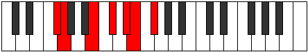

# Mode Kaptimic

## Links

- [Documentation](index.md)
- [Scales Index](Scales.md)
- [Modes Index](Modes.md)
- [Chords Index](Chords.md)

## Parent Scale

[Rycrimic](ScaleRycrimic.md)

## Number

[1699](https://ianring.com/musictheory/scales/1699)

## Perfection

- 3 Perfect notes
- 3 Perfect notes

## Perfection Profile

[true false true false false true]

## Permutations

| Tonic | Notes | Signature | Illustration | Audio |
|-------|-------|-----------|--------------|-------|
| [C](ModeCNaturalKaptimic.md) | C, **Db**, E#, **F##**, **G##**, A#, C | C |  | [midi](ModeCNaturalKaptimic.mid) [ogg](ModeCNaturalKaptimic.ogg) |
| [C#](ModeCSharpKaptimic.md) | C#, **D**, E##, **F###**, **G###**, A##, C# | C |  | [midi](ModeCSharpKaptimic.mid) [ogg](ModeCSharpKaptimic.ogg) |
| [Db](ModeDFlatKaptimic.md) | Db, **Ebb**, F#, **G#**, **A#**, B, Db | C |  | [midi](ModeDFlatKaptimic.mid) [ogg](ModeDFlatKaptimic.ogg) |
| [D](ModeDNaturalKaptimic.md) | D, **Eb**, F##, **G##**, **A##**, B#, D | C |  | [midi](ModeDNaturalKaptimic.mid) [ogg](ModeDNaturalKaptimic.ogg) |
| [D#](ModeDSharpKaptimic.md) | D#, **E**, F###, **G###**, **A###**, B##, D# | C |  | [midi](ModeDSharpKaptimic.mid) [ogg](ModeDSharpKaptimic.ogg) |
| [Eb](ModeEFlatKaptimic.md) | Eb, **Fb**, G#, **A#**, **B#**, C#, Eb | C |  | [midi](ModeEFlatKaptimic.mid) [ogg](ModeEFlatKaptimic.ogg) |
| [E](ModeENaturalKaptimic.md) | E, **F**, G##, **A##**, **B##**, C##, E | C |  | [midi](ModeENaturalKaptimic.mid) [ogg](ModeENaturalKaptimic.ogg) |
| [F](ModeFNaturalKaptimic.md) | F, **Gb**, A#, **B#**, **C##**, D#, F | C |  | [midi](ModeFNaturalKaptimic.mid) [ogg](ModeFNaturalKaptimic.ogg) |
| [F#](ModeFSharpKaptimic.md) | F#, **G**, A##, **B##**, **C###**, D##, F# | C |  | [midi](ModeFSharpKaptimic.mid) [ogg](ModeFSharpKaptimic.ogg) |
| [Gb](ModeGFlatKaptimic.md) | Gb, **Abb**, B, **C#**, **D#**, E, Gb | C |  | [midi](ModeGFlatKaptimic.mid) [ogg](ModeGFlatKaptimic.ogg) |
| [G](ModeGNaturalKaptimic.md) | G, **Ab**, B#, **C##**, **D##**, E#, G | C |  | [midi](ModeGNaturalKaptimic.mid) [ogg](ModeGNaturalKaptimic.ogg) |
| [G#](ModeGSharpKaptimic.md) | G#, **A**, B##, **C###**, **D###**, E##, G# | C |  | [midi](ModeGSharpKaptimic.mid) [ogg](ModeGSharpKaptimic.ogg) |
| [Ab](ModeAFlatKaptimic.md) | Ab, **Bbb**, C#, **D#**, **E#**, F#, Ab | C |  | [midi](ModeAFlatKaptimic.mid) [ogg](ModeAFlatKaptimic.ogg) |
| [A](ModeANaturalKaptimic.md) | A, **Bb**, C##, **D##**, **E##**, F##, A | C |  | [midi](ModeANaturalKaptimic.mid) [ogg](ModeANaturalKaptimic.ogg) |
| [A#](ModeASharpKaptimic.md) | A#, **B**, C###, **D###**, **E###**, F###, A# | C |  | [midi](ModeASharpKaptimic.mid) [ogg](ModeASharpKaptimic.ogg) |
| [Bb](ModeBFlatKaptimic.md) | Bb, **Cb**, D#, **E#**, **F##**, G#, Bb | C |  | [midi](ModeBFlatKaptimic.mid) [ogg](ModeBFlatKaptimic.ogg) |
| [B](ModeBNaturalKaptimic.md) | B, **C**, D##, **E##**, **F###**, G##, B | C |  | [midi](ModeBNaturalKaptimic.mid) [ogg](ModeBNaturalKaptimic.ogg) |
