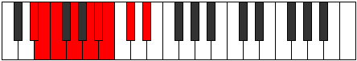

# Mode Kaptyllic

## Links

- [Documentation](README.md)
- [Scales Index](Scales.md)
- [Modes Index](Modes.md)
- [Chords Index](Chords.md)

## Parent Scale

[Epotyllic](ScaleEpotyllic.md)

## Number

[1495](https://ianring.com/musictheory/scales/1495)

## Transposition

1, 1, 2, 2, 1, 1, 2, 2

## Chord Pattern

i⁰b3, ii⁰, ii⁰, IIIb5, iv⁰, v⁰b3, v⁰b3, vi⁰, VIIb5, VIIb5, viii⁰, viii⁰

## Perfection

- 4 Perfect notes
- 4 Perfect notes

## Perfection Profile

[true true false false true true false false]

## Permutations

| Tonic | Notes | Signature | Illustration | Audio |
|-------|-------|-----------|--------------|-------|
| [C](ModeCNaturalKaptyllic.md) | C, C#, **D**, **E**, F#, G, **G#**, **A#**, C | C |  | [midi](https://github.com/edipermadi/music/blob/main/docs/ModeCNaturalKaptyllic.mid?raw=true) |
| [C#](ModeCSharpKaptyllic.md) | C#, D, **D#**, **F**, G, G#, **A**, **B**, C# | C |  | [midi](https://github.com/edipermadi/music/blob/main/docs/ModeCSharpKaptyllic.mid?raw=true) |
| [Db](ModeDFlatKaptyllic.md) | Db, D, **Eb**, **F**, G, Ab, **A**, **B**, Db | C |  | [midi](https://github.com/edipermadi/music/blob/main/docs/ModeDFlatKaptyllic.mid?raw=true) |
| [D](ModeDNaturalKaptyllic.md) | D, D#, **E**, **F#**, G#, A, **A#**, **C**, D | C |  | [midi](https://github.com/edipermadi/music/blob/main/docs/ModeDNaturalKaptyllic.mid?raw=true) |
| [D#](ModeDSharpKaptyllic.md) | D#, E, **F**, **G**, A, A#, **B**, **C#**, D# | C |  | [midi](https://github.com/edipermadi/music/blob/main/docs/ModeDSharpKaptyllic.mid?raw=true) |
| [Eb](ModeEFlatKaptyllic.md) | Eb, E, **F**, **G**, A, Bb, **B**, **Db**, Eb | C |  | [midi](https://github.com/edipermadi/music/blob/main/docs/ModeEFlatKaptyllic.mid?raw=true) |
| [E](ModeENaturalKaptyllic.md) | E, F, **F#**, **G#**, A#, B, **C**, **D**, E | C |  | [midi](https://github.com/edipermadi/music/blob/main/docs/ModeENaturalKaptyllic.mid?raw=true) |
| [F](ModeFNaturalKaptyllic.md) | F, F#, **G**, **A**, B, C, **C#**, **D#**, F | C |  | [midi](https://github.com/edipermadi/music/blob/main/docs/ModeFNaturalKaptyllic.mid?raw=true) |
| [F#](ModeFSharpKaptyllic.md) | F#, G, **G#**, **A#**, C, C#, **D**, **E**, F# | C |  | [midi](https://github.com/edipermadi/music/blob/main/docs/ModeFSharpKaptyllic.mid?raw=true) |
| [Gb](ModeGFlatKaptyllic.md) | Gb, G, **Ab**, **Bb**, C, Db, **D**, **E**, Gb | C |  | [midi](https://github.com/edipermadi/music/blob/main/docs/ModeGFlatKaptyllic.mid?raw=true) |
| [G](ModeGNaturalKaptyllic.md) | G, G#, **A**, **B**, C#, D, **D#**, **F**, G | C |  | [midi](https://github.com/edipermadi/music/blob/main/docs/ModeGNaturalKaptyllic.mid?raw=true) |
| [G#](ModeGSharpKaptyllic.md) | G#, A, **A#**, **C**, D, D#, **E**, **F#**, G# | C |  | [midi](https://github.com/edipermadi/music/blob/main/docs/ModeGSharpKaptyllic.mid?raw=true) |
| [Ab](ModeAFlatKaptyllic.md) | Ab, A, **Bb**, **C**, D, Eb, **E**, **Gb**, Ab | C |  | [midi](https://github.com/edipermadi/music/blob/main/docs/ModeAFlatKaptyllic.mid?raw=true) |
| [A](ModeANaturalKaptyllic.md) | A, A#, **B**, **C#**, D#, E, **F**, **G**, A | C |  | [midi](https://github.com/edipermadi/music/blob/main/docs/ModeANaturalKaptyllic.mid?raw=true) |
| [A#](ModeASharpKaptyllic.md) | A#, B, **C**, **D**, E, F, **F#**, **G#**, A# | C |  | [midi](https://github.com/edipermadi/music/blob/main/docs/ModeASharpKaptyllic.mid?raw=true) |
| [Bb](ModeBFlatKaptyllic.md) | Bb, B, **C**, **D**, E, F, **Gb**, **Ab**, Bb | C |  | [midi](https://github.com/edipermadi/music/blob/main/docs/ModeBFlatKaptyllic.mid?raw=true) |
| [B](ModeBNaturalKaptyllic.md) | B, C, **C#**, **D#**, F, F#, **G**, **A**, B | C |  | [midi](https://github.com/edipermadi/music/blob/main/docs/ModeBNaturalKaptyllic.mid?raw=true) |
