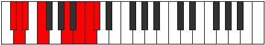
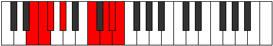
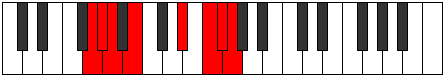

# Mode Karian

## Links

- [Documentation](README.md)
- [Scales Index](Scales.md)
- [Modes Index](Modes.md)
- [Chords Index](Chords.md)

## Parent Scale

[Gydian](ScaleGydian.md)

## Number

[3351](https://ianring.com/musictheory/scales/3351)

## Interval Pattern

1, 1, 2, 4, 2, 1, 1

## Chord Pattern

## Perfection

- 2 Perfect notes
- 5 Perfect notes

## Perfection Profile

[false true false true false false false]

## Permutations

| Tonic | Notes | Signature | Illustration | Audio |
|-------|-------|-----------|--------------|-------|
| [C](ModeCNaturalKarian.md) | **C**, Db, **Ebb**, Fb, **G#**, **A#**, **B**, **C** | C |  | [midi](https://github.com/edipermadi/music/blob/main/docs/ModeCNaturalKarian.mid?raw=true) |
| [C#](ModeCSharpKarian.md) | **C#**, D, **Eb**, F, **G##**, **A##**, **B#**, **C#** | C |  | [midi](https://github.com/edipermadi/music/blob/main/docs/ModeCSharpKarian.mid?raw=true) |
| [Db](ModeDFlatKarian.md) | **Db**, Ebb, **Fbb**, Gbb, **A**, **B**, **C**, **Db** | C |  | [midi](https://github.com/edipermadi/music/blob/main/docs/ModeDFlatKarian.mid?raw=true) |
| [D](ModeDNaturalKarian.md) | **D**, Eb, **Fb**, Gb, **A#**, **B#**, **C#**, **D** | C |  | [midi](https://github.com/edipermadi/music/blob/main/docs/ModeDNaturalKarian.mid?raw=true) |
| [D#](ModeDSharpKarian.md) | **D#**, E, **F**, G, **A##**, **B##**, **C##**, **D#** | C |  | [midi](https://github.com/edipermadi/music/blob/main/docs/ModeDSharpKarian.mid?raw=true) |
| [Eb](ModeEFlatKarian.md) | **Eb**, Fb, **Gbb**, Abb, **B**, **C#**, **D**, **Eb** | C |  | [midi](https://github.com/edipermadi/music/blob/main/docs/ModeEFlatKarian.mid?raw=true) |
| [E](ModeENaturalKarian.md) | **E**, F, **Gb**, Ab, **B#**, **C##**, **D#**, **E** | C |  | [midi](https://github.com/edipermadi/music/blob/main/docs/ModeENaturalKarian.mid?raw=true) |
| [F](ModeFNaturalKarian.md) | **F**, Gb, **Abb**, Bbb, **C#**, **D#**, **E**, **F** | C |  | [midi](https://github.com/edipermadi/music/blob/main/docs/ModeFNaturalKarian.mid?raw=true) |
| [F#](ModeFSharpKarian.md) | **F#**, G, **Ab**, Bb, **C##**, **D##**, **E#**, **F#** | C |  | [midi](https://github.com/edipermadi/music/blob/main/docs/ModeFSharpKarian.mid?raw=true) |
| [Gb](ModeGFlatKarian.md) | **Gb**, Abb, **Bbbb**, Cbb, **D**, **E**, **F**, **Gb** | C |  | [midi](https://github.com/edipermadi/music/blob/main/docs/ModeGFlatKarian.mid?raw=true) |
| [G](ModeGNaturalKarian.md) | **G**, Ab, **Bbb**, Cb, **D#**, **E#**, **F#**, **G** | C |  | [midi](https://github.com/edipermadi/music/blob/main/docs/ModeGNaturalKarian.mid?raw=true) |
| [G#](ModeGSharpKarian.md) | **G#**, A, **Bb**, C, **D##**, **E##**, **F##**, **G#** | C |  | [midi](https://github.com/edipermadi/music/blob/main/docs/ModeGSharpKarian.mid?raw=true) |
| [Ab](ModeAFlatKarian.md) | **Ab**, Bbb, **Cbb**, Dbb, **E**, **F#**, **G**, **Ab** | C |  | [midi](https://github.com/edipermadi/music/blob/main/docs/ModeAFlatKarian.mid?raw=true) |
| [A](ModeANaturalKarian.md) | **A**, Bb, **Cb**, Db, **E#**, **F##**, **G#**, **A** | C |  | [midi](https://github.com/edipermadi/music/blob/main/docs/ModeANaturalKarian.mid?raw=true) |
| [A#](ModeASharpKarian.md) | **A#**, B, **C**, D, **E##**, **F###**, **G##**, **A#** | C |  | [midi](https://github.com/edipermadi/music/blob/main/docs/ModeASharpKarian.mid?raw=true) |
| [Bb](ModeBFlatKarian.md) | **Bb**, Cb, **Dbb**, Ebb, **F#**, **G#**, **A**, **Bb** | C |  | [midi](https://github.com/edipermadi/music/blob/main/docs/ModeBFlatKarian.mid?raw=true) |
| [B](ModeBNaturalKarian.md) | **B**, C, **Db**, Eb, **F##**, **G##**, **A#**, **B** | C |  | [midi](https://github.com/edipermadi/music/blob/main/docs/ModeBNaturalKarian.mid?raw=true) |
