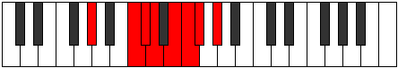

# Mode Katacrian

## Links

- [Documentation](index.md)
- [Scales Index](Scales.md)
- [Modes Index](Modes.md)
- [Chords Index](Chords.md)

## Parent Scale

[Katacrian](ScaleKatacrian.md)

## Number

[1905](https://ianring.com/musictheory/scales/1905)

## Perfection

- 3 Perfect notes
- 4 Perfect notes

## Perfection Profile

[false false true false false true true]

## Permutations

| Tonic | Notes | Signature | Illustration | Audio |
|-------|-------|-----------|--------------|-------|
| [C](ModeCNaturalKatacrian.md) | **C**, **D##**, E#, **F#**, **G#**, A, Bb, **C** | C |  | [midi](ModeCNaturalKatacrian.mid) [ogg](ModeCNaturalKatacrian.ogg) |
| [C#](ModeCSharpKatacrian.md) | **C#**, **D###**, E##, **F##**, **G##**, A#, B, **C#** | C |  | [midi](ModeCSharpKatacrian.mid) [ogg](ModeCSharpKatacrian.ogg) |
| [Db](ModeDFlatKatacrian.md) | **Db**, **E#**, F#, **G**, **A**, Bb, Cb, **Db** | C |  | [midi](ModeDFlatKatacrian.mid) [ogg](ModeDFlatKatacrian.ogg) |
| [D](ModeDNaturalKatacrian.md) | **D**, **E##**, F##, **G#**, **A#**, B, C, **D** | C |  | [midi](ModeDNaturalKatacrian.mid) [ogg](ModeDNaturalKatacrian.ogg) |
| [D#](ModeDSharpKatacrian.md) | **D#**, **E###**, F###, **G##**, **A##**, B#, C#, **D#** | C |  | [midi](ModeDSharpKatacrian.mid) [ogg](ModeDSharpKatacrian.ogg) |
| [Eb](ModeEFlatKatacrian.md) | **Eb**, **F##**, G#, **A**, **B**, C, Db, **Eb** | C |  | [midi](ModeEFlatKatacrian.mid) [ogg](ModeEFlatKatacrian.ogg) |
| [E](ModeENaturalKatacrian.md) | **E**, **F###**, G##, **A#**, **B#**, C#, D, **E** | C |  | [midi](ModeENaturalKatacrian.mid) [ogg](ModeENaturalKatacrian.ogg) |
| [F](ModeFNaturalKatacrian.md) | **F**, **G##**, A#, **B**, **C#**, D, Eb, **F** | C |  | [midi](ModeFNaturalKatacrian.mid) [ogg](ModeFNaturalKatacrian.ogg) |
| [F#](ModeFSharpKatacrian.md) | **F#**, **G###**, A##, **B#**, **C##**, D#, E, **F#** | C |  | [midi](ModeFSharpKatacrian.mid) [ogg](ModeFSharpKatacrian.ogg) |
| [Gb](ModeGFlatKatacrian.md) | **Gb**, **A#**, B, **C**, **D**, Eb, Fb, **Gb** | C |  | [midi](ModeGFlatKatacrian.mid) [ogg](ModeGFlatKatacrian.ogg) |
| [G](ModeGNaturalKatacrian.md) | **G**, **A##**, B#, **C#**, **D#**, E, F, **G** | C |  | [midi](ModeGNaturalKatacrian.mid) [ogg](ModeGNaturalKatacrian.ogg) |
| [G#](ModeGSharpKatacrian.md) | **G#**, **A###**, B##, **C##**, **D##**, E#, F#, **G#** | C |  | [midi](ModeGSharpKatacrian.mid) [ogg](ModeGSharpKatacrian.ogg) |
| [Ab](ModeAFlatKatacrian.md) | **Ab**, **B#**, C#, **D**, **E**, F, Gb, **Ab** | C |  | [midi](ModeAFlatKatacrian.mid) [ogg](ModeAFlatKatacrian.ogg) |
| [A](ModeANaturalKatacrian.md) | **A**, **B##**, C##, **D#**, **E#**, F#, G, **A** | C |  | [midi](ModeANaturalKatacrian.mid) [ogg](ModeANaturalKatacrian.ogg) |
| [A#](ModeASharpKatacrian.md) | **A#**, **B###**, C###, **D##**, **E##**, F##, G#, **A#** | C |  | [midi](ModeASharpKatacrian.mid) [ogg](ModeASharpKatacrian.ogg) |
| [Bb](ModeBFlatKatacrian.md) | **Bb**, **C##**, D#, **E**, **F#**, G, Ab, **Bb** | C |  | [midi](ModeBFlatKatacrian.mid) [ogg](ModeBFlatKatacrian.ogg) |
| [B](ModeBNaturalKatacrian.md) | **B**, **C###**, D##, **E#**, **F##**, G#, A, **B** | C |  | [midi](ModeBNaturalKatacrian.mid) [ogg](ModeBNaturalKatacrian.ogg) |
