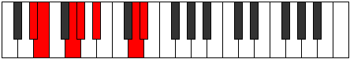
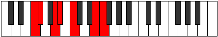
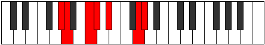

# Mode Katadimic

## Links

- [Documentation](index.md)
- [Scales Index](Scales.md)
- [Modes Index](Modes.md)
- [Chords Index](Chords.md)

## Parent Scale

[Bolimic](ScaleBolimic.md)

## Number

[2227](https://ianring.com/musictheory/scales/2227)

## Perfection

- 3 Perfect notes
- 3 Perfect notes

## Perfection Profile

[true false true true false false]

## Permutations

| Tonic | Notes | Signature | Illustration | Audio |
|-------|-------|-----------|--------------|-------|
| [C](ModeCNaturalKatadimic.md) | C, **Db**, E, F, **G**, **A##**, C | C |  | [midi](ModeCNaturalKatadimic.mid) [ogg](ModeCNaturalKatadimic.ogg) |
| [C#](ModeCSharpKatadimic.md) | C#, **D**, E#, F#, **G#**, **A###**, C# | C |  | [midi](ModeCSharpKatadimic.mid) [ogg](ModeCSharpKatadimic.ogg) |
| [Db](ModeDFlatKatadimic.md) | Db, **Ebb**, F, Gb, **Ab**, **B#**, Db | C |  | [midi](ModeDFlatKatadimic.mid) [ogg](ModeDFlatKatadimic.ogg) |
| [D](ModeDNaturalKatadimic.md) | D, **Eb**, F#, G, **A**, **B##**, D | C |  | [midi](ModeDNaturalKatadimic.mid) [ogg](ModeDNaturalKatadimic.ogg) |
| [D#](ModeDSharpKatadimic.md) | D#, **E**, F##, G#, **A#**, **B###**, D# | C |  | [midi](ModeDSharpKatadimic.mid) [ogg](ModeDSharpKatadimic.ogg) |
| [Eb](ModeEFlatKatadimic.md) | Eb, **Fb**, G, Ab, **Bb**, **C##**, Eb | C |  | [midi](ModeEFlatKatadimic.mid) [ogg](ModeEFlatKatadimic.ogg) |
| [E](ModeENaturalKatadimic.md) | E, **F**, G#, A, **B**, **C###**, E | C |  | [midi](ModeENaturalKatadimic.mid) [ogg](ModeENaturalKatadimic.ogg) |
| [F](ModeFNaturalKatadimic.md) | F, **Gb**, A, Bb, **C**, **D##**, F | C |  | [midi](ModeFNaturalKatadimic.mid) [ogg](ModeFNaturalKatadimic.ogg) |
| [F#](ModeFSharpKatadimic.md) | F#, **G**, A#, B, **C#**, **D###**, F# | C |  | [midi](ModeFSharpKatadimic.mid) [ogg](ModeFSharpKatadimic.ogg) |
| [Gb](ModeGFlatKatadimic.md) | Gb, **Abb**, Bb, Cb, **Db**, **E#**, Gb | C |  | [midi](ModeGFlatKatadimic.mid) [ogg](ModeGFlatKatadimic.ogg) |
| [G](ModeGNaturalKatadimic.md) | G, **Ab**, B, C, **D**, **E##**, G | C |  | [midi](ModeGNaturalKatadimic.mid) [ogg](ModeGNaturalKatadimic.ogg) |
| [G#](ModeGSharpKatadimic.md) | G#, **A**, B#, C#, **D#**, **E###**, G# | C |  | [midi](ModeGSharpKatadimic.mid) [ogg](ModeGSharpKatadimic.ogg) |
| [Ab](ModeAFlatKatadimic.md) | Ab, **Bbb**, C, Db, **Eb**, **F##**, Ab | C |  | [midi](ModeAFlatKatadimic.mid) [ogg](ModeAFlatKatadimic.ogg) |
| [A](ModeANaturalKatadimic.md) | A, **Bb**, C#, D, **E**, **F###**, A | C |  | [midi](ModeANaturalKatadimic.mid) [ogg](ModeANaturalKatadimic.ogg) |
| [A#](ModeASharpKatadimic.md) | A#, **B**, C##, D#, **E#**, **Cbbb**, A# | C |  | [midi](ModeASharpKatadimic.mid) [ogg](ModeASharpKatadimic.ogg) |
| [Bb](ModeBFlatKatadimic.md) | Bb, **Cb**, D, Eb, **F**, **G##**, Bb | C |  | [midi](ModeBFlatKatadimic.mid) [ogg](ModeBFlatKatadimic.ogg) |
| [B](ModeBNaturalKatadimic.md) | B, **C**, D#, E, **F#**, **G###**, B | C |  | [midi](ModeBNaturalKatadimic.mid) [ogg](ModeBNaturalKatadimic.ogg) |
