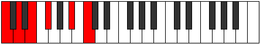
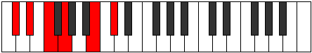
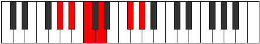

# Mode Kataditonic

## Links

- [Documentation](README.md)
- [Scales Index](Scales.md)
- [Modes Index](Modes.md)
- [Chords Index](Chords.md)

## Parent Scale

[Bolitonic](ScaleBolitonic.md)

## Number

[1109](https://ianring.com/musictheory/scales/1109)

## Transposition

2, 2, 2, 4, 2

## Chord Pattern

V⁺, V⁺

## Perfection

- 0 Perfect notes
- 5 Perfect notes

## Perfection Profile

[false false false false false]

## Permutations

| Tonic | Notes | Signature | Illustration | Audio |
|-------|-------|-----------|--------------|-------|
| [C](ModeCNaturalKataditonic.md) | **C**, **D**, **E**, **F#**, **A#**, **C** | C |  | [midi](https://github.com/edipermadi/music/blob/main/docs/ModeCNaturalKataditonic.mid?raw=true) |
| [C#](ModeCSharpKataditonic.md) | **C#**, **D#**, **F**, **G**, **B**, **C#** | C |  | [midi](https://github.com/edipermadi/music/blob/main/docs/ModeCSharpKataditonic.mid?raw=true) |
| [Db](ModeDFlatKataditonic.md) | **Db**, **Eb**, **F**, **G**, **B**, **Db** | C |  | [midi](https://github.com/edipermadi/music/blob/main/docs/ModeDFlatKataditonic.mid?raw=true) |
| [D](ModeDNaturalKataditonic.md) | **D**, **E**, **F#**, **G#**, **C**, **D** | C |  | [midi](https://github.com/edipermadi/music/blob/main/docs/ModeDNaturalKataditonic.mid?raw=true) |
| [D#](ModeDSharpKataditonic.md) | **D#**, **F**, **G**, **A**, **C#**, **D#** | C |  | [midi](https://github.com/edipermadi/music/blob/main/docs/ModeDSharpKataditonic.mid?raw=true) |
| [Eb](ModeEFlatKataditonic.md) | **Eb**, **F**, **G**, **A**, **Db**, **Eb** | C |  | [midi](https://github.com/edipermadi/music/blob/main/docs/ModeEFlatKataditonic.mid?raw=true) |
| [E](ModeENaturalKataditonic.md) | **E**, **F#**, **G#**, **A#**, **D**, **E** | C |  | [midi](https://github.com/edipermadi/music/blob/main/docs/ModeENaturalKataditonic.mid?raw=true) |
| [F](ModeFNaturalKataditonic.md) | **F**, **G**, **A**, **B**, **D#**, **F** | C |  | [midi](https://github.com/edipermadi/music/blob/main/docs/ModeFNaturalKataditonic.mid?raw=true) |
| [F#](ModeFSharpKataditonic.md) | **F#**, **G#**, **A#**, **C**, **E**, **F#** | C |  | [midi](https://github.com/edipermadi/music/blob/main/docs/ModeFSharpKataditonic.mid?raw=true) |
| [Gb](ModeGFlatKataditonic.md) | **Gb**, **Ab**, **Bb**, **C**, **E**, **Gb** | C |  | [midi](https://github.com/edipermadi/music/blob/main/docs/ModeGFlatKataditonic.mid?raw=true) |
| [G](ModeGNaturalKataditonic.md) | **G**, **A**, **B**, **C#**, **F**, **G** | C |  | [midi](https://github.com/edipermadi/music/blob/main/docs/ModeGNaturalKataditonic.mid?raw=true) |
| [G#](ModeGSharpKataditonic.md) | **G#**, **A#**, **C**, **D**, **F#**, **G#** | C |  | [midi](https://github.com/edipermadi/music/blob/main/docs/ModeGSharpKataditonic.mid?raw=true) |
| [Ab](ModeAFlatKataditonic.md) | **Ab**, **Bb**, **C**, **D**, **Gb**, **Ab** | C |  | [midi](https://github.com/edipermadi/music/blob/main/docs/ModeAFlatKataditonic.mid?raw=true) |
| [A](ModeANaturalKataditonic.md) | **A**, **B**, **C#**, **D#**, **G**, **A** | C |  | [midi](https://github.com/edipermadi/music/blob/main/docs/ModeANaturalKataditonic.mid?raw=true) |
| [A#](ModeASharpKataditonic.md) | **A#**, **C**, **D**, **E**, **G#**, **A#** | C |  | [midi](https://github.com/edipermadi/music/blob/main/docs/ModeASharpKataditonic.mid?raw=true) |
| [Bb](ModeBFlatKataditonic.md) | **Bb**, **C**, **D**, **E**, **Ab**, **Bb** | C |  | [midi](https://github.com/edipermadi/music/blob/main/docs/ModeBFlatKataditonic.mid?raw=true) |
| [B](ModeBNaturalKataditonic.md) | **B**, **C#**, **D#**, **F**, **A**, **B** | C |  | [midi](https://github.com/edipermadi/music/blob/main/docs/ModeBNaturalKataditonic.mid?raw=true) |
