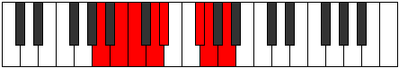

# Mode Katagian

## Links

- [Documentation](README.md)
- [Scales Index](Scales.md)
- [Modes Index](Modes.md)
- [Chords Index](Chords.md)

## Parent Scale

[Palian](ScalePalian.md)

## Number

[1645](https://ianring.com/musictheory/scales/1645)

## Transposition

2, 1, 2, 1, 3, 1, 2

## Chord Pattern

i⁰, ii, iii, iii, IV, V⁺, V⁺, vi⁰, VII, VII

## Perfection

- 4 Perfect notes
- 3 Perfect notes

## Perfection Profile

[false true true true false false true]

## Permutations

| Tonic | Notes | Signature | Illustration | Audio |
|-------|-------|-----------|--------------|-------|
| [C](ModeCNaturalKatagian.md) | **C**, D, Eb, F, **Gb**, **A**, Bb, **C** | C |  | [midi](https://github.com/edipermadi/music/blob/main/docs/ModeCNaturalKatagian.mid?raw=true) |
| [C#](ModeCSharpKatagian.md) | **C#**, D#, E, F#, **G**, **A#**, B, **C#** | C |  | [midi](https://github.com/edipermadi/music/blob/main/docs/ModeCSharpKatagian.mid?raw=true) |
| [Db](ModeDFlatKatagian.md) | **Db**, Eb, Fb, Gb, **Abb**, **Bb**, Cb, **Db** | C |  | [midi](https://github.com/edipermadi/music/blob/main/docs/ModeDFlatKatagian.mid?raw=true) |
| [D](ModeDNaturalKatagian.md) | **D**, E, F, G, **Ab**, **B**, C, **D** | C |  | [midi](https://github.com/edipermadi/music/blob/main/docs/ModeDNaturalKatagian.mid?raw=true) |
| [D#](ModeDSharpKatagian.md) | **D#**, E#, F#, G#, **A**, **B#**, C#, **D#** | C |  | [midi](https://github.com/edipermadi/music/blob/main/docs/ModeDSharpKatagian.mid?raw=true) |
| [Eb](ModeEFlatKatagian.md) | **Eb**, F, Gb, Ab, **Bbb**, **C**, Db, **Eb** | C |  | [midi](https://github.com/edipermadi/music/blob/main/docs/ModeEFlatKatagian.mid?raw=true) |
| [E](ModeENaturalKatagian.md) | **E**, F#, G, A, **Bb**, **C#**, D, **E** | C |  | [midi](https://github.com/edipermadi/music/blob/main/docs/ModeENaturalKatagian.mid?raw=true) |
| [F](ModeFNaturalKatagian.md) | **F**, G, Ab, Bb, **Cb**, **D**, Eb, **F** | C |  | [midi](https://github.com/edipermadi/music/blob/main/docs/ModeFNaturalKatagian.mid?raw=true) |
| [F#](ModeFSharpKatagian.md) | **F#**, G#, A, B, **C**, **D#**, E, **F#** | C |  | [midi](https://github.com/edipermadi/music/blob/main/docs/ModeFSharpKatagian.mid?raw=true) |
| [Gb](ModeGFlatKatagian.md) | **Gb**, Ab, Bbb, Cb, **Dbb**, **Eb**, Fb, **Gb** | C |  | [midi](https://github.com/edipermadi/music/blob/main/docs/ModeGFlatKatagian.mid?raw=true) |
| [G](ModeGNaturalKatagian.md) | **G**, A, Bb, C, **Db**, **E**, F, **G** | C |  | [midi](https://github.com/edipermadi/music/blob/main/docs/ModeGNaturalKatagian.mid?raw=true) |
| [G#](ModeGSharpKatagian.md) | **G#**, A#, B, C#, **D**, **E#**, F#, **G#** | C |  | [midi](https://github.com/edipermadi/music/blob/main/docs/ModeGSharpKatagian.mid?raw=true) |
| [Ab](ModeAFlatKatagian.md) | **Ab**, Bb, Cb, Db, **Ebb**, **F**, Gb, **Ab** | C |  | [midi](https://github.com/edipermadi/music/blob/main/docs/ModeAFlatKatagian.mid?raw=true) |
| [A](ModeANaturalKatagian.md) | **A**, B, C, D, **Eb**, **F#**, G, **A** | C |  | [midi](https://github.com/edipermadi/music/blob/main/docs/ModeANaturalKatagian.mid?raw=true) |
| [A#](ModeASharpKatagian.md) | **A#**, B#, C#, D#, **E**, **F##**, G#, **A#** | C |  | [midi](https://github.com/edipermadi/music/blob/main/docs/ModeASharpKatagian.mid?raw=true) |
| [Bb](ModeBFlatKatagian.md) | **Bb**, C, Db, Eb, **Fb**, **G**, Ab, **Bb** | C |  | [midi](https://github.com/edipermadi/music/blob/main/docs/ModeBFlatKatagian.mid?raw=true) |
| [B](ModeBNaturalKatagian.md) | **B**, C#, D, E, **F**, **G#**, A, **B** | C |  | [midi](https://github.com/edipermadi/music/blob/main/docs/ModeBNaturalKatagian.mid?raw=true) |
