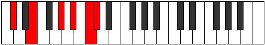
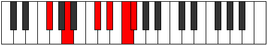

# Mode Katagitonic

## Links

- [Documentation](README.md)
- [Scales Index](Scales.md)
- [Modes Index](Modes.md)
- [Chords Index](Chords.md)

## Parent Scale

[Aerynitonic](ScaleAerynitonic.md)

## Number

[2697](https://ianring.com/musictheory/scales/2697)

## Transposition

3, 4, 2, 2, 1

## Chord Pattern

III⁺

## Perfection

- 1 Perfect notes
- 4 Perfect notes

## Perfection Profile

[true false false false false]

## Permutations

| Tonic | Notes | Signature | Illustration | Audio |
|-------|-------|-----------|--------------|-------|
| [C](ModeCNaturalKatagitonic.md) | C, **D#**, **G**, **A**, **B**, C | C |  | [midi](https://github.com/edipermadi/music/blob/main/docs/ModeCNaturalKatagitonic.mid?raw=true) |
| [C#](ModeCSharpKatagitonic.md) | C#, **E**, **G#**, **A#**, **C**, C# | C |  | [midi](https://github.com/edipermadi/music/blob/main/docs/ModeCSharpKatagitonic.mid?raw=true) |
| [Db](ModeDFlatKatagitonic.md) | Db, **E**, **Ab**, **Bb**, **C**, Db | C |  | [midi](https://github.com/edipermadi/music/blob/main/docs/ModeDFlatKatagitonic.mid?raw=true) |
| [D](ModeDNaturalKatagitonic.md) | D, **F**, **A**, **B**, **C#**, D | C |  | [midi](https://github.com/edipermadi/music/blob/main/docs/ModeDNaturalKatagitonic.mid?raw=true) |
| [D#](ModeDSharpKatagitonic.md) | D#, **F#**, **A#**, **C**, **D**, D# | C |  | [midi](https://github.com/edipermadi/music/blob/main/docs/ModeDSharpKatagitonic.mid?raw=true) |
| [Eb](ModeEFlatKatagitonic.md) | Eb, **Gb**, **Bb**, **C**, **D**, Eb | C |  | [midi](https://github.com/edipermadi/music/blob/main/docs/ModeEFlatKatagitonic.mid?raw=true) |
| [E](ModeENaturalKatagitonic.md) | E, **G**, **B**, **C#**, **D#**, E | C |  | [midi](https://github.com/edipermadi/music/blob/main/docs/ModeENaturalKatagitonic.mid?raw=true) |
| [F](ModeFNaturalKatagitonic.md) | F, **G#**, **C**, **D**, **E**, F | C |  | [midi](https://github.com/edipermadi/music/blob/main/docs/ModeFNaturalKatagitonic.mid?raw=true) |
| [F#](ModeFSharpKatagitonic.md) | F#, **A**, **C#**, **D#**, **F**, F# | C |  | [midi](https://github.com/edipermadi/music/blob/main/docs/ModeFSharpKatagitonic.mid?raw=true) |
| [Gb](ModeGFlatKatagitonic.md) | Gb, **A**, **Db**, **Eb**, **F**, Gb | C |  | [midi](https://github.com/edipermadi/music/blob/main/docs/ModeGFlatKatagitonic.mid?raw=true) |
| [G](ModeGNaturalKatagitonic.md) | G, **A#**, **D**, **E**, **F#**, G | C |  | [midi](https://github.com/edipermadi/music/blob/main/docs/ModeGNaturalKatagitonic.mid?raw=true) |
| [G#](ModeGSharpKatagitonic.md) | G#, **B**, **D#**, **F**, **G**, G# | C |  | [midi](https://github.com/edipermadi/music/blob/main/docs/ModeGSharpKatagitonic.mid?raw=true) |
| [Ab](ModeAFlatKatagitonic.md) | Ab, **B**, **Eb**, **F**, **G**, Ab | C |  | [midi](https://github.com/edipermadi/music/blob/main/docs/ModeAFlatKatagitonic.mid?raw=true) |
| [A](ModeANaturalKatagitonic.md) | A, **C**, **E**, **F#**, **G#**, A | C |  | [midi](https://github.com/edipermadi/music/blob/main/docs/ModeANaturalKatagitonic.mid?raw=true) |
| [A#](ModeASharpKatagitonic.md) | A#, **C#**, **F**, **G**, **A**, A# | C |  | [midi](https://github.com/edipermadi/music/blob/main/docs/ModeASharpKatagitonic.mid?raw=true) |
| [Bb](ModeBFlatKatagitonic.md) | Bb, **Db**, **F**, **G**, **A**, Bb | C |  | [midi](https://github.com/edipermadi/music/blob/main/docs/ModeBFlatKatagitonic.mid?raw=true) |
| [B](ModeBNaturalKatagitonic.md) | B, **D**, **F#**, **G#**, **A#**, B | C |  | [midi](https://github.com/edipermadi/music/blob/main/docs/ModeBNaturalKatagitonic.mid?raw=true) |
