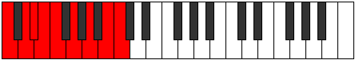
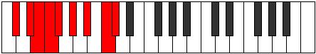
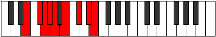
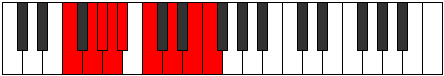
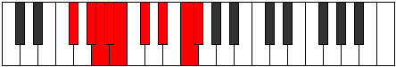
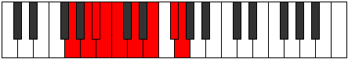
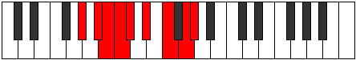
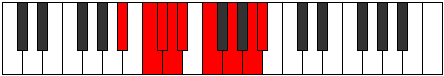
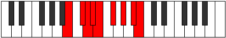

# Mode Katagyllic

## Links

- [Documentation](README.md)
- [Scales Index](Scales.md)
- [Modes Index](Modes.md)
- [Chords Index](Chords.md)

## Parent Scale

[Rocryllic](ScaleRocryllic.md)

## Number

[2749](https://ianring.com/musictheory/scales/2749)

## Transposition

2, 1, 1, 1, 2, 2, 2, 1

## Chord Pattern

iii⁰b3, iv, V, VI, vii⁰

## Perfection

- 6 Perfect notes
- 2 Perfect notes

## Perfection Profile

true, true, false, true, true, true, true, false

## Permutations

| Tonic | Notes | Signature | Illustration | Audio |
|-------|-------|-----------|--------------|-------|
| [C](ModeCNaturalKatagyllic.md) | C, D, **D#**, E, F, G, A, **B**, C | C |  | [midi](https://github.com/edipermadi/music/blob/main/docs/ModeCNaturalKatagyllic.mid?raw=true) |
| [C#](ModeCSharpKatagyllic.md) | C#, D#, **E**, F, F#, G#, A#, **C**, C# | C |  | [midi](https://github.com/edipermadi/music/blob/main/docs/ModeCSharpKatagyllic.mid?raw=true) |
| [Db](ModeDFlatKatagyllic.md) | Db, Eb, **E**, F, Gb, Ab, Bb, **C**, Db | C |  | [midi](https://github.com/edipermadi/music/blob/main/docs/ModeDFlatKatagyllic.mid?raw=true) |
| [D](ModeDNaturalKatagyllic.md) | D, E, **F**, F#, G, A, B, **C#**, D | C |  | [midi](https://github.com/edipermadi/music/blob/main/docs/ModeDNaturalKatagyllic.mid?raw=true) |
| [D#](ModeDSharpKatagyllic.md) | D#, F, **F#**, G, G#, A#, C, **D**, D# | C |  | [midi](https://github.com/edipermadi/music/blob/main/docs/ModeDSharpKatagyllic.mid?raw=true) |
| [Eb](ModeEFlatKatagyllic.md) | Eb, F, **Gb**, G, Ab, Bb, C, **D**, Eb | C |  | [midi](https://github.com/edipermadi/music/blob/main/docs/ModeEFlatKatagyllic.mid?raw=true) |
| [E](ModeENaturalKatagyllic.md) | E, F#, **G**, G#, A, B, C#, **D#**, E | C |  | [midi](https://github.com/edipermadi/music/blob/main/docs/ModeENaturalKatagyllic.mid?raw=true) |
| [F](ModeFNaturalKatagyllic.md) | F, G, **G#**, A, A#, C, D, **E**, F | C |  | [midi](https://github.com/edipermadi/music/blob/main/docs/ModeFNaturalKatagyllic.mid?raw=true) |
| [F#](ModeFSharpKatagyllic.md) | F#, G#, **A**, A#, B, C#, D#, **F**, F# | C |  | [midi](https://github.com/edipermadi/music/blob/main/docs/ModeFSharpKatagyllic.mid?raw=true) |
| [Gb](ModeGFlatKatagyllic.md) | Gb, Ab, **A**, Bb, B, Db, Eb, **F**, Gb | C |  | [midi](https://github.com/edipermadi/music/blob/main/docs/ModeGFlatKatagyllic.mid?raw=true) |
| [G](ModeGNaturalKatagyllic.md) | G, A, **A#**, B, C, D, E, **F#**, G | C |  | [midi](https://github.com/edipermadi/music/blob/main/docs/ModeGNaturalKatagyllic.mid?raw=true) |
| [G#](ModeGSharpKatagyllic.md) | G#, A#, **B**, C, C#, D#, F, **G**, G# | C |  | [midi](https://github.com/edipermadi/music/blob/main/docs/ModeGSharpKatagyllic.mid?raw=true) |
| [Ab](ModeAFlatKatagyllic.md) | Ab, Bb, **B**, C, Db, Eb, F, **G**, Ab | C |  | [midi](https://github.com/edipermadi/music/blob/main/docs/ModeAFlatKatagyllic.mid?raw=true) |
| [A](ModeANaturalKatagyllic.md) | A, B, **C**, C#, D, E, F#, **G#**, A | C |  | [midi](https://github.com/edipermadi/music/blob/main/docs/ModeANaturalKatagyllic.mid?raw=true) |
| [A#](ModeASharpKatagyllic.md) | A#, C, **C#**, D, D#, F, G, **A**, A# | C |  | [midi](https://github.com/edipermadi/music/blob/main/docs/ModeASharpKatagyllic.mid?raw=true) |
| [Bb](ModeBFlatKatagyllic.md) | Bb, C, **Db**, D, Eb, F, G, **A**, Bb | C |  | [midi](https://github.com/edipermadi/music/blob/main/docs/ModeBFlatKatagyllic.mid?raw=true) |
| [B](ModeBNaturalKatagyllic.md) | B, C#, **D**, D#, E, F#, G#, **A#**, B | C |  | [midi](https://github.com/edipermadi/music/blob/main/docs/ModeBNaturalKatagyllic.mid?raw=true) |
