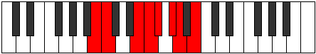

# Mode Katalian

## Links

- [Documentation](index.md)
- [Scales Index](Scales.md)
- [Modes Index](Modes.md)
- [Chords Index](Chords.md)

## Parent Scale

[Aeolathian](ScaleAeolathian.md)

## Number

[1763](https://ianring.com/musictheory/scales/1763)

## Interval Pattern

1, 4, 1, 1, 2, 1, 2

## Chord Pattern

iv⁰, v⁰

## Perfection

- 4 Perfect notes
- 3 Perfect notes

## Perfection Profile

[true false true true false false true]

## Permutations

| Tonic | Notes | Signature | Illustration | Audio |
|-------|-------|-----------|--------------|-------|
| [C](ModeCNaturalKatalian.md) | C, **Db**, E#, F#, **G**, **A**, Bb, C | C |  | [midi](https://github.com/edipermadi/music/blob/main/docs/ModeCNaturalKatalian.mid?raw=true) |
| [C#](ModeCSharpKatalian.md) | C#, **D**, E##, F##, **G#**, **A#**, B, C# | C |  | [midi](https://github.com/edipermadi/music/blob/main/docs/ModeCSharpKatalian.mid?raw=true) |
| [Db](ModeDFlatKatalian.md) | Db, **Ebb**, F#, G, **Ab**, **Bb**, Cb, Db | C |  | [midi](https://github.com/edipermadi/music/blob/main/docs/ModeDFlatKatalian.mid?raw=true) |
| [D](ModeDNaturalKatalian.md) | D, **Eb**, F##, G#, **A**, **B**, C, D | C |  | [midi](https://github.com/edipermadi/music/blob/main/docs/ModeDNaturalKatalian.mid?raw=true) |
| [D#](ModeDSharpKatalian.md) | D#, **E**, F###, G##, **A#**, **B#**, C#, D# | C |  | [midi](https://github.com/edipermadi/music/blob/main/docs/ModeDSharpKatalian.mid?raw=true) |
| [Eb](ModeEFlatKatalian.md) | Eb, **Fb**, G#, A, **Bb**, **C**, Db, Eb | C |  | [midi](https://github.com/edipermadi/music/blob/main/docs/ModeEFlatKatalian.mid?raw=true) |
| [E](ModeENaturalKatalian.md) | E, **F**, G##, A#, **B**, **C#**, D, E | C |  | [midi](https://github.com/edipermadi/music/blob/main/docs/ModeENaturalKatalian.mid?raw=true) |
| [F](ModeFNaturalKatalian.md) | F, **Gb**, A#, B, **C**, **D**, Eb, F | C |  | [midi](https://github.com/edipermadi/music/blob/main/docs/ModeFNaturalKatalian.mid?raw=true) |
| [F#](ModeFSharpKatalian.md) | F#, **G**, A##, B#, **C#**, **D#**, E, F# | C |  | [midi](https://github.com/edipermadi/music/blob/main/docs/ModeFSharpKatalian.mid?raw=true) |
| [Gb](ModeGFlatKatalian.md) | Gb, **Abb**, B, C, **Db**, **Eb**, Fb, Gb | C |  | [midi](https://github.com/edipermadi/music/blob/main/docs/ModeGFlatKatalian.mid?raw=true) |
| [G](ModeGNaturalKatalian.md) | G, **Ab**, B#, C#, **D**, **E**, F, G | C |  | [midi](https://github.com/edipermadi/music/blob/main/docs/ModeGNaturalKatalian.mid?raw=true) |
| [G#](ModeGSharpKatalian.md) | G#, **A**, B##, C##, **D#**, **E#**, F#, G# | C |  | [midi](https://github.com/edipermadi/music/blob/main/docs/ModeGSharpKatalian.mid?raw=true) |
| [Ab](ModeAFlatKatalian.md) | Ab, **Bbb**, C#, D, **Eb**, **F**, Gb, Ab | C |  | [midi](https://github.com/edipermadi/music/blob/main/docs/ModeAFlatKatalian.mid?raw=true) |
| [A](ModeANaturalKatalian.md) | A, **Bb**, C##, D#, **E**, **F#**, G, A | C |  | [midi](https://github.com/edipermadi/music/blob/main/docs/ModeANaturalKatalian.mid?raw=true) |
| [A#](ModeASharpKatalian.md) | A#, **B**, C###, D##, **E#**, **F##**, G#, A# | C |  | [midi](https://github.com/edipermadi/music/blob/main/docs/ModeASharpKatalian.mid?raw=true) |
| [Bb](ModeBFlatKatalian.md) | Bb, **Cb**, D#, E, **F**, **G**, Ab, Bb | C |  | [midi](https://github.com/edipermadi/music/blob/main/docs/ModeBFlatKatalian.mid?raw=true) |
| [B](ModeBNaturalKatalian.md) | B, **C**, D##, E#, **F#**, **G#**, A, B | C |  | [midi](https://github.com/edipermadi/music/blob/main/docs/ModeBNaturalKatalian.mid?raw=true) |
