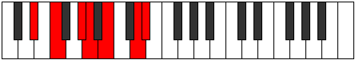

# Mode Katalimic

## Links

- [Documentation](index.md)
- [Scales Index](Scales.md)
- [Modes Index](Modes.md)
- [Chords Index](Chords.md)

## Parent Scale

[Lythimic](ScaleLythimic.md)

## Number

[2405](https://ianring.com/musictheory/scales/2405)

## Perfection

- 2 Perfect notes
- 4 Perfect notes

## Interval Pattern

2, 3, 1, 2, 3, 1

## Perfection Profile

[false false true false false true]

## Permutations

| Tonic | Notes | Signature | Illustration | Audio |
|-------|-------|-----------|--------------|-------|
| [C](ModeCNaturalKatalimic.md) | **C**, **D**, E#, **F#**, **G#**, A##, **C** | C |  | [midi](https://github.com/edipermadi/music/blob/main/docs/ModeCNaturalKatalimic.mid?raw=true) |
| [C#](ModeCSharpKatalimic.md) | **C#**, **D#**, E##, **F##**, **G##**, A###, **C#** | C |  | [midi](https://github.com/edipermadi/music/blob/main/docs/ModeCSharpKatalimic.mid?raw=true) |
| [Db](ModeDFlatKatalimic.md) | **Db**, **Eb**, F#, **G**, **A**, B#, **Db** | C |  | [midi](https://github.com/edipermadi/music/blob/main/docs/ModeDFlatKatalimic.mid?raw=true) |
| [D](ModeDNaturalKatalimic.md) | **D**, **E**, F##, **G#**, **A#**, B##, **D** | C |  | [midi](https://github.com/edipermadi/music/blob/main/docs/ModeDNaturalKatalimic.mid?raw=true) |
| [D#](ModeDSharpKatalimic.md) | **D#**, **E#**, F###, **G##**, **A##**, B###, **D#** | C |  | [midi](https://github.com/edipermadi/music/blob/main/docs/ModeDSharpKatalimic.mid?raw=true) |
| [Eb](ModeEFlatKatalimic.md) | **Eb**, **F**, G#, **A**, **B**, C##, **Eb** | C |  | [midi](https://github.com/edipermadi/music/blob/main/docs/ModeEFlatKatalimic.mid?raw=true) |
| [E](ModeENaturalKatalimic.md) | **E**, **F#**, G##, **A#**, **B#**, C###, **E** | C |  | [midi](https://github.com/edipermadi/music/blob/main/docs/ModeENaturalKatalimic.mid?raw=true) |
| [F](ModeFNaturalKatalimic.md) | **F**, **G**, A#, **B**, **C#**, D##, **F** | C |  | [midi](https://github.com/edipermadi/music/blob/main/docs/ModeFNaturalKatalimic.mid?raw=true) |
| [F#](ModeFSharpKatalimic.md) | **F#**, **G#**, A##, **B#**, **C##**, D###, **F#** | C |  | [midi](https://github.com/edipermadi/music/blob/main/docs/ModeFSharpKatalimic.mid?raw=true) |
| [Gb](ModeGFlatKatalimic.md) | **Gb**, **Ab**, B, **C**, **D**, E#, **Gb** | C |  | [midi](https://github.com/edipermadi/music/blob/main/docs/ModeGFlatKatalimic.mid?raw=true) |
| [G](ModeGNaturalKatalimic.md) | **G**, **A**, B#, **C#**, **D#**, E##, **G** | C |  | [midi](https://github.com/edipermadi/music/blob/main/docs/ModeGNaturalKatalimic.mid?raw=true) |
| [G#](ModeGSharpKatalimic.md) | **G#**, **A#**, B##, **C##**, **D##**, E###, **G#** | C |  | [midi](https://github.com/edipermadi/music/blob/main/docs/ModeGSharpKatalimic.mid?raw=true) |
| [Ab](ModeAFlatKatalimic.md) | **Ab**, **Bb**, C#, **D**, **E**, F##, **Ab** | C |  | [midi](https://github.com/edipermadi/music/blob/main/docs/ModeAFlatKatalimic.mid?raw=true) |
| [A](ModeANaturalKatalimic.md) | **A**, **B**, C##, **D#**, **E#**, F###, **A** | C |  | [midi](https://github.com/edipermadi/music/blob/main/docs/ModeANaturalKatalimic.mid?raw=true) |
| [A#](ModeASharpKatalimic.md) | **A#**, **B#**, C###, **D##**, **E##**, Cbbb, **A#** | C |  | [midi](https://github.com/edipermadi/music/blob/main/docs/ModeASharpKatalimic.mid?raw=true) |
| [Bb](ModeBFlatKatalimic.md) | **Bb**, **C**, D#, **E**, **F#**, G##, **Bb** | C |  | [midi](https://github.com/edipermadi/music/blob/main/docs/ModeBFlatKatalimic.mid?raw=true) |
| [B](ModeBNaturalKatalimic.md) | **B**, **C#**, D##, **E#**, **F##**, G###, **B** | C |  | [midi](https://github.com/edipermadi/music/blob/main/docs/ModeBNaturalKatalimic.mid?raw=true) |
