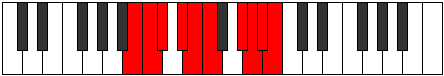

# Mode Katalygic

## Links

- [Documentation](index.md)
- [Scales Index](Scales.md)
- [Modes Index](Modes.md)
- [Chords Index](Chords.md)

## Parent Scale

[Loptygic](ScaleLoptygic.md)

## Number

[3703](https://ianring.com/musictheory/scales/3703)

## Perfection

- 7 Perfect notes
- 2 Perfect notes

## Interval Pattern

1, 1, 2, 1, 1, 3, 1, 1, 1

## Perfection Profile

[false false true true true true true true true]

## Permutations

| Tonic | Notes | Signature | Illustration | Audio |
|-------|-------|-----------|--------------|-------|
| [C](ModeCNaturalKatalygic.md) | **C**, **C#**, D, E, F, F#, A, A#, B, **C** | C |  | [midi](https://github.com/edipermadi/music/blob/main/docs/ModeCNaturalKatalygic.mid?raw=true) |
| [C#](ModeCSharpKatalygic.md) | **C#**, **D**, D#, F, F#, G, A#, B, C, **C#** | C |  | [midi](https://github.com/edipermadi/music/blob/main/docs/ModeCSharpKatalygic.mid?raw=true) |
| [Db](ModeDFlatKatalygic.md) | **Db**, **D**, Eb, F, Gb, G, Bb, B, C, **Db** | C |  | [midi](https://github.com/edipermadi/music/blob/main/docs/ModeDFlatKatalygic.mid?raw=true) |
| [D](ModeDNaturalKatalygic.md) | **D**, **D#**, E, F#, G, G#, B, C, C#, **D** | C |  | [midi](https://github.com/edipermadi/music/blob/main/docs/ModeDNaturalKatalygic.mid?raw=true) |
| [D#](ModeDSharpKatalygic.md) | **D#**, **E**, F, G, G#, A, C, C#, D, **D#** | C |  | [midi](https://github.com/edipermadi/music/blob/main/docs/ModeDSharpKatalygic.mid?raw=true) |
| [Eb](ModeEFlatKatalygic.md) | **Eb**, **E**, F, G, Ab, A, C, Db, D, **Eb** | C |  | [midi](https://github.com/edipermadi/music/blob/main/docs/ModeEFlatKatalygic.mid?raw=true) |
| [E](ModeENaturalKatalygic.md) | **E**, **F**, F#, G#, A, A#, C#, D, D#, **E** | C |  | [midi](https://github.com/edipermadi/music/blob/main/docs/ModeENaturalKatalygic.mid?raw=true) |
| [F](ModeFNaturalKatalygic.md) | **F**, **F#**, G, A, A#, B, D, D#, E, **F** | C |  | [midi](https://github.com/edipermadi/music/blob/main/docs/ModeFNaturalKatalygic.mid?raw=true) |
| [F#](ModeFSharpKatalygic.md) | **F#**, **G**, G#, A#, B, C, D#, E, F, **F#** | C |  | [midi](https://github.com/edipermadi/music/blob/main/docs/ModeFSharpKatalygic.mid?raw=true) |
| [Gb](ModeGFlatKatalygic.md) | **Gb**, **G**, Ab, Bb, B, C, Eb, E, F, **Gb** | C |  | [midi](https://github.com/edipermadi/music/blob/main/docs/ModeGFlatKatalygic.mid?raw=true) |
| [G](ModeGNaturalKatalygic.md) | **G**, **G#**, A, B, C, C#, E, F, F#, **G** | C |  | [midi](https://github.com/edipermadi/music/blob/main/docs/ModeGNaturalKatalygic.mid?raw=true) |
| [G#](ModeGSharpKatalygic.md) | **G#**, **A**, A#, C, C#, D, F, F#, G, **G#** | C |  | [midi](https://github.com/edipermadi/music/blob/main/docs/ModeGSharpKatalygic.mid?raw=true) |
| [Ab](ModeAFlatKatalygic.md) | **Ab**, **A**, Bb, C, Db, D, F, Gb, G, **Ab** | C |  | [midi](https://github.com/edipermadi/music/blob/main/docs/ModeAFlatKatalygic.mid?raw=true) |
| [A](ModeANaturalKatalygic.md) | **A**, **A#**, B, C#, D, D#, F#, G, G#, **A** | C |  | [midi](https://github.com/edipermadi/music/blob/main/docs/ModeANaturalKatalygic.mid?raw=true) |
| [A#](ModeASharpKatalygic.md) | **A#**, **B**, C, D, D#, E, G, G#, A, **A#** | C |  | [midi](https://github.com/edipermadi/music/blob/main/docs/ModeASharpKatalygic.mid?raw=true) |
| [Bb](ModeBFlatKatalygic.md) | **Bb**, **B**, C, D, Eb, E, G, Ab, A, **Bb** | C |  | [midi](https://github.com/edipermadi/music/blob/main/docs/ModeBFlatKatalygic.mid?raw=true) |
| [B](ModeBNaturalKatalygic.md) | **B**, **C**, C#, D#, E, F, G#, A, A#, **B** | C |  | [midi](https://github.com/edipermadi/music/blob/main/docs/ModeBNaturalKatalygic.mid?raw=true) |
