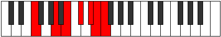

# Mode Katanimic

## Links

- [Documentation](README.md)
- [Scales Index](Scales.md)
- [Modes Index](Modes.md)
- [Chords Index](Chords.md)

## Parent Scale

[Katanimic](ScaleKatanimic.md)

## Number

[3409](https://ianring.com/musictheory/scales/3409)

## Luminosity

-1

## Transposition

4, 2, 2, 2, 1, 1

## Chord Pattern

II, IIIb5

## Perfection

- 2 Perfect notes
- 4 Perfect notes

## Perfection Profile

false, true, false, false, false, true

## Permutations

| Tonic | Notes | Signature | Illustration | Audio |
|-------|-------|-----------|--------------|-------|
| [C](ModeCNaturalKatanimic.md) | **C**, D##, **E##**, **F###**, **G###**, A##, **C** | C |  | [midi](https://github.com/edipermadi/music/blob/main/docs/ModeCNaturalKatanimic.mid?raw=true) |
| [C#](ModeCSharpKatanimic.md) | **C#**, D###, **E###**, **Cbbb**, **Dbbb**, Dbb, **C#** | C |  | [midi](https://github.com/edipermadi/music/blob/main/docs/ModeCSharpKatanimic.mid?raw=true) |
| [Db](ModeDFlatKatanimic.md) | **Db**, E#, **F##**, **G##**, **A##**, B#, **Db** | C |  | [midi](https://github.com/edipermadi/music/blob/main/docs/ModeDFlatKatanimic.mid?raw=true) |
| [D](ModeDNaturalKatanimic.md) | **D**, E##, **F###**, **G###**, **A###**, B##, **D** | C |  | [midi](https://github.com/edipermadi/music/blob/main/docs/ModeDNaturalKatanimic.mid?raw=true) |
| [D#](ModeDSharpKatanimic.md) | **D#**, E###, **Cbbb**, **Dbbb**, **Ebbb**, Fbbb, **D#** | C |  | [midi](https://github.com/edipermadi/music/blob/main/docs/ModeDSharpKatanimic.mid?raw=true) |
| [Eb](ModeEFlatKatanimic.md) | **Eb**, F##, **G##**, **A##**, **B##**, C##, **Eb** | C |  | [midi](https://github.com/edipermadi/music/blob/main/docs/ModeEFlatKatanimic.mid?raw=true) |
| [E](ModeENaturalKatanimic.md) | **E**, F###, **G###**, **A###**, **B###**, C###, **E** | C |  | [midi](https://github.com/edipermadi/music/blob/main/docs/ModeENaturalKatanimic.mid?raw=true) |
| [F](ModeFNaturalKatanimic.md) | **F**, G##, **A##**, **B##**, **C###**, D##, **F** | C |  | [midi](https://github.com/edipermadi/music/blob/main/docs/ModeFNaturalKatanimic.mid?raw=true) |
| [F#](ModeFSharpKatanimic.md) | **F#**, G###, **A###**, **B###**, **D##**, E#, **F#** | C |  | [midi](https://github.com/edipermadi/music/blob/main/docs/ModeFSharpKatanimic.mid?raw=true) |
| [Gb](ModeGFlatKatanimic.md) | **Gb**, A#, **B#**, **C##**, **D##**, E#, **Gb** | C |  | [midi](https://github.com/edipermadi/music/blob/main/docs/ModeGFlatKatanimic.mid?raw=true) |
| [G](ModeGNaturalKatanimic.md) | **G**, A##, **B##**, **C###**, **D###**, E##, **G** | C |  | [midi](https://github.com/edipermadi/music/blob/main/docs/ModeGNaturalKatanimic.mid?raw=true) |
| [G#](ModeGSharpKatanimic.md) | **G#**, A###, **B###**, **D##**, **E##**, F##, **G#** | C |  | [midi](https://github.com/edipermadi/music/blob/main/docs/ModeGSharpKatanimic.mid?raw=true) |
| [Ab](ModeAFlatKatanimic.md) | **Ab**, B#, **C##**, **D##**, **E##**, F##, **Ab** | C |  | [midi](https://github.com/edipermadi/music/blob/main/docs/ModeAFlatKatanimic.mid?raw=true) |
| [A](ModeANaturalKatanimic.md) | **A**, B##, **C###**, **D###**, **E###**, F###, **A** | C |  | [midi](https://github.com/edipermadi/music/blob/main/docs/ModeANaturalKatanimic.mid?raw=true) |
| [A#](ModeASharpKatanimic.md) | **A#**, B###, **D##**, **E##**, **F###**, G##, **A#** | C |  | [midi](https://github.com/edipermadi/music/blob/main/docs/ModeASharpKatanimic.mid?raw=true) |
| [Bb](ModeBFlatKatanimic.md) | **Bb**, C##, **D##**, **E##**, **F###**, G##, **Bb** | C |  | [midi](https://github.com/edipermadi/music/blob/main/docs/ModeBFlatKatanimic.mid?raw=true) |
| [B](ModeBNaturalKatanimic.md) | **B**, C###, **D###**, **E###**, **Cbbb**, Cbb, **B** | C |  | [midi](https://github.com/edipermadi/music/blob/main/docs/ModeBNaturalKatanimic.mid?raw=true) |
