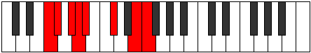

# Mode Kataptian

## Links

- [Documentation](index.md)
- [Scales Index](Scales.md)
- [Modes Index](Modes.md)
- [Chords Index](Chords.md)

## Parent Scale

[Stalian](ScaleStalian.md)

## Number

[2363](https://ianring.com/musictheory/scales/2363)

## Perfection

- 4 Perfect notes
- 3 Perfect notes

## Perfection Profile

[false true false true true true false]

## Permutations

| Tonic | Notes | Signature | Illustration | Audio |
|-------|-------|-----------|--------------|-------|
| [C](ModeCNaturalKataptian.md) | **C**, Db, **Eb**, Fb, Gbb, Ab, **B**, **C** | C |  | [midi](ModeCNaturalKataptian.mid) [ogg](ModeCNaturalKataptian.ogg) |
| [C#](ModeCSharpKataptian.md) | **C#**, D, **E**, F, Gb, A, **B#**, **C#** | C |  | [midi](ModeCSharpKataptian.mid) [ogg](ModeCSharpKataptian.ogg) |
| [Db](ModeDFlatKataptian.md) | **Db**, Ebb, **Fb**, Gbb, Abbb, Bbb, **C**, **Db** | C |  | [midi](ModeDFlatKataptian.mid) [ogg](ModeDFlatKataptian.ogg) |
| [D](ModeDNaturalKataptian.md) | **D**, Eb, **F**, Gb, Abb, Bb, **C#**, **D** | C |  | [midi](ModeDNaturalKataptian.mid) [ogg](ModeDNaturalKataptian.ogg) |
| [D#](ModeDSharpKataptian.md) | **D#**, E, **F#**, G, Ab, B, **C##**, **D#** | C |  | [midi](ModeDSharpKataptian.mid) [ogg](ModeDSharpKataptian.ogg) |
| [Eb](ModeEFlatKataptian.md) | **Eb**, Fb, **Gb**, Abb, Bbbb, Cb, **D**, **Eb** | C |  | [midi](ModeEFlatKataptian.mid) [ogg](ModeEFlatKataptian.ogg) |
| [E](ModeENaturalKataptian.md) | **E**, F, **G**, Ab, Bbb, C, **D#**, **E** | C |  | [midi](ModeENaturalKataptian.mid) [ogg](ModeENaturalKataptian.ogg) |
| [F](ModeFNaturalKataptian.md) | **F**, Gb, **Ab**, Bbb, Cbb, Db, **E**, **F** | C |  | [midi](ModeFNaturalKataptian.mid) [ogg](ModeFNaturalKataptian.ogg) |
| [F#](ModeFSharpKataptian.md) | **F#**, G, **A**, Bb, Cb, D, **E#**, **F#** | C |  | [midi](ModeFSharpKataptian.mid) [ogg](ModeFSharpKataptian.ogg) |
| [Gb](ModeGFlatKataptian.md) | **Gb**, Abb, **Bbb**, Cbb, Dbbb, Ebb, **F**, **Gb** | C |  | [midi](ModeGFlatKataptian.mid) [ogg](ModeGFlatKataptian.ogg) |
| [G](ModeGNaturalKataptian.md) | **G**, Ab, **Bb**, Cb, Dbb, Eb, **F#**, **G** | C |  | [midi](ModeGNaturalKataptian.mid) [ogg](ModeGNaturalKataptian.ogg) |
| [G#](ModeGSharpKataptian.md) | **G#**, A, **B**, C, Db, E, **F##**, **G#** | C |  | [midi](ModeGSharpKataptian.mid) [ogg](ModeGSharpKataptian.ogg) |
| [Ab](ModeAFlatKataptian.md) | **Ab**, Bbb, **Cb**, Dbb, Ebbb, Fb, **G**, **Ab** | C |  | [midi](ModeAFlatKataptian.mid) [ogg](ModeAFlatKataptian.ogg) |
| [A](ModeANaturalKataptian.md) | **A**, Bb, **C**, Db, Ebb, F, **G#**, **A** | C |  | [midi](ModeANaturalKataptian.mid) [ogg](ModeANaturalKataptian.ogg) |
| [A#](ModeASharpKataptian.md) | **A#**, B, **C#**, D, Eb, F#, **G##**, **A#** | C |  | [midi](ModeASharpKataptian.mid) [ogg](ModeASharpKataptian.ogg) |
| [Bb](ModeBFlatKataptian.md) | **Bb**, Cb, **Db**, Ebb, Fbb, Gb, **A**, **Bb** | C |  | [midi](ModeBFlatKataptian.mid) [ogg](ModeBFlatKataptian.ogg) |
| [B](ModeBNaturalKataptian.md) | **B**, C, **D**, Eb, Fb, G, **A#**, **B** | C |  | [midi](ModeBNaturalKataptian.mid) [ogg](ModeBNaturalKataptian.ogg) |
