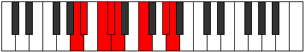

# Mode Kataptian

## Links

- [Documentation](README.md)
- [Scales Index](Scales.md)
- [Modes Index](Modes.md)
- [Chords Index](Chords.md)

## Parent Scale

[Stalian](ScaleStalian.md)

## Number

[2363](https://ianring.com/musictheory/scales/2363)

## Luminosity

-1

## Transposition

1, 2, 1, 1, 3, 3, 1

## Chord Pattern

ii, IV⁺, VI

## Perfection

- 4 Perfect notes
- 3 Perfect notes

## Perfection Profile

false, true, false, true, true, true, false

## Permutations

| Tonic | Notes | Signature | Illustration | Audio |
|-------|-------|-----------|--------------|-------|
| [C](ModeCNaturalKataptian.md) | **C**, Db, **Eb**, Fb, Gbb, Ab, **B**, **C** | C |  | [midi](https://github.com/edipermadi/music/blob/main/docs/ModeCNaturalKataptian.mid?raw=true) |
| [C#](ModeCSharpKataptian.md) | **C#**, D, **E**, F, Gb, A, **B#**, **C#** | C |  | [midi](https://github.com/edipermadi/music/blob/main/docs/ModeCSharpKataptian.mid?raw=true) |
| [Db](ModeDFlatKataptian.md) | **Db**, Ebb, **Fb**, Gbb, Abbb, Bbb, **C**, **Db** | C |  | [midi](https://github.com/edipermadi/music/blob/main/docs/ModeDFlatKataptian.mid?raw=true) |
| [D](ModeDNaturalKataptian.md) | **D**, Eb, **F**, Gb, Abb, Bb, **C#**, **D** | C |  | [midi](https://github.com/edipermadi/music/blob/main/docs/ModeDNaturalKataptian.mid?raw=true) |
| [D#](ModeDSharpKataptian.md) | **D#**, E, **F#**, G, Ab, B, **C##**, **D#** | C |  | [midi](https://github.com/edipermadi/music/blob/main/docs/ModeDSharpKataptian.mid?raw=true) |
| [Eb](ModeEFlatKataptian.md) | **Eb**, Fb, **Gb**, Abb, Bbbb, Cb, **D**, **Eb** | C |  | [midi](https://github.com/edipermadi/music/blob/main/docs/ModeEFlatKataptian.mid?raw=true) |
| [E](ModeENaturalKataptian.md) | **E**, F, **G**, Ab, Bbb, C, **D#**, **E** | C |  | [midi](https://github.com/edipermadi/music/blob/main/docs/ModeENaturalKataptian.mid?raw=true) |
| [F](ModeFNaturalKataptian.md) | **F**, Gb, **Ab**, Bbb, Cbb, Db, **E**, **F** | C |  | [midi](https://github.com/edipermadi/music/blob/main/docs/ModeFNaturalKataptian.mid?raw=true) |
| [F#](ModeFSharpKataptian.md) | **F#**, G, **A**, Bb, Cb, D, **E#**, **F#** | C |  | [midi](https://github.com/edipermadi/music/blob/main/docs/ModeFSharpKataptian.mid?raw=true) |
| [Gb](ModeGFlatKataptian.md) | **Gb**, Abb, **Bbb**, Cbb, Dbbb, Ebb, **F**, **Gb** | C |  | [midi](https://github.com/edipermadi/music/blob/main/docs/ModeGFlatKataptian.mid?raw=true) |
| [G](ModeGNaturalKataptian.md) | **G**, Ab, **Bb**, Cb, Dbb, Eb, **F#**, **G** | C |  | [midi](https://github.com/edipermadi/music/blob/main/docs/ModeGNaturalKataptian.mid?raw=true) |
| [G#](ModeGSharpKataptian.md) | **G#**, A, **B**, C, Db, E, **F##**, **G#** | C |  | [midi](https://github.com/edipermadi/music/blob/main/docs/ModeGSharpKataptian.mid?raw=true) |
| [Ab](ModeAFlatKataptian.md) | **Ab**, Bbb, **Cb**, Dbb, Ebbb, Fb, **G**, **Ab** | C |  | [midi](https://github.com/edipermadi/music/blob/main/docs/ModeAFlatKataptian.mid?raw=true) |
| [A](ModeANaturalKataptian.md) | **A**, Bb, **C**, Db, Ebb, F, **G#**, **A** | C |  | [midi](https://github.com/edipermadi/music/blob/main/docs/ModeANaturalKataptian.mid?raw=true) |
| [A#](ModeASharpKataptian.md) | **A#**, B, **C#**, D, Eb, F#, **G##**, **A#** | C |  | [midi](https://github.com/edipermadi/music/blob/main/docs/ModeASharpKataptian.mid?raw=true) |
| [Bb](ModeBFlatKataptian.md) | **Bb**, Cb, **Db**, Ebb, Fbb, Gb, **A**, **Bb** | C |  | [midi](https://github.com/edipermadi/music/blob/main/docs/ModeBFlatKataptian.mid?raw=true) |
| [B](ModeBNaturalKataptian.md) | **B**, C, **D**, Eb, Fb, G, **A#**, **B** | C |  | [midi](https://github.com/edipermadi/music/blob/main/docs/ModeBNaturalKataptian.mid?raw=true) |
