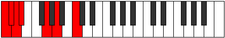
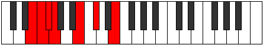

# Mode Kataptimic

## Links

- [Documentation](index.md)
- [Scales Index](Scales.md)
- [Modes Index](Modes.md)
- [Chords Index](Chords.md)

## Parent Scale

[Stalimic](ScaleStalimic.md)

## Number

[655](https://ianring.com/musictheory/scales/655)

## Perfection

- 3 Perfect notes
- 3 Perfect notes

## Perfection Profile

[true false true false true false]

## Permutations

| Tonic | Notes | Signature | Illustration | Audio |
|-------|-------|-----------|--------------|-------|
| [C](ModeCNaturalKataptimic.md) | C, **Db**, Ebb, **Fbb**, G, **A**, C | C |  | [midi](ModeCNaturalKataptimic.mid) [ogg](ModeCNaturalKataptimic.ogg) |
| [C#](ModeCSharpKataptimic.md) | C#, **D**, Eb, **Fb**, G#, **A#**, C# | C |  | [midi](ModeCSharpKataptimic.mid) [ogg](ModeCSharpKataptimic.ogg) |
| [Db](ModeDFlatKataptimic.md) | Db, **Ebb**, Fbb, **Gbbb**, Ab, **Bb**, Db | C |  | [midi](ModeDFlatKataptimic.mid) [ogg](ModeDFlatKataptimic.ogg) |
| [D](ModeDNaturalKataptimic.md) | D, **Eb**, Fb, **Gbb**, A, **B**, D | C |  | [midi](ModeDNaturalKataptimic.mid) [ogg](ModeDNaturalKataptimic.ogg) |
| [D#](ModeDSharpKataptimic.md) | D#, **E**, F, **Gb**, A#, **B#**, D# | C |  | [midi](ModeDSharpKataptimic.mid) [ogg](ModeDSharpKataptimic.ogg) |
| [Eb](ModeEFlatKataptimic.md) | Eb, **Fb**, Gbb, **Abbb**, Bb, **C**, Eb | C |  | [midi](ModeEFlatKataptimic.mid) [ogg](ModeEFlatKataptimic.ogg) |
| [E](ModeENaturalKataptimic.md) | E, **F**, Gb, **Abb**, B, **C#**, E | C |  | [midi](ModeENaturalKataptimic.mid) [ogg](ModeENaturalKataptimic.ogg) |
| [F](ModeFNaturalKataptimic.md) | F, **Gb**, Abb, **Bbbb**, C, **D**, F | C |  | [midi](ModeFNaturalKataptimic.mid) [ogg](ModeFNaturalKataptimic.ogg) |
| [F#](ModeFSharpKataptimic.md) | F#, **G**, Ab, **Bbb**, C#, **D#**, F# | C |  | [midi](ModeFSharpKataptimic.mid) [ogg](ModeFSharpKataptimic.ogg) |
| [Gb](ModeGFlatKataptimic.md) | Gb, **Abb**, Bbbb, **Cbbb**, Db, **Eb**, Gb | C |  | [midi](ModeGFlatKataptimic.mid) [ogg](ModeGFlatKataptimic.ogg) |
| [G](ModeGNaturalKataptimic.md) | G, **Ab**, Bbb, **Cbb**, D, **E**, G | C |  | [midi](ModeGNaturalKataptimic.mid) [ogg](ModeGNaturalKataptimic.ogg) |
| [G#](ModeGSharpKataptimic.md) | G#, **A**, Bb, **Cb**, D#, **E#**, G# | C |  | [midi](ModeGSharpKataptimic.mid) [ogg](ModeGSharpKataptimic.ogg) |
| [Ab](ModeAFlatKataptimic.md) | Ab, **Bbb**, Cbb, **Dbbb**, Eb, **F**, Ab | C |  | [midi](ModeAFlatKataptimic.mid) [ogg](ModeAFlatKataptimic.ogg) |
| [A](ModeANaturalKataptimic.md) | A, **Bb**, Cb, **Dbb**, E, **F#**, A | C |  | [midi](ModeANaturalKataptimic.mid) [ogg](ModeANaturalKataptimic.ogg) |
| [A#](ModeASharpKataptimic.md) | A#, **B**, C, **Db**, E#, **F##**, A# | C |  | [midi](ModeASharpKataptimic.mid) [ogg](ModeASharpKataptimic.ogg) |
| [Bb](ModeBFlatKataptimic.md) | Bb, **Cb**, Dbb, **Ebbb**, F, **G**, Bb | C |  | [midi](ModeBFlatKataptimic.mid) [ogg](ModeBFlatKataptimic.ogg) |
| [B](ModeBNaturalKataptimic.md) | B, **C**, Db, **Ebb**, F#, **G#**, B | C |  | [midi](ModeBNaturalKataptimic.mid) [ogg](ModeBNaturalKataptimic.ogg) |
