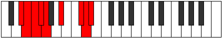

# Mode Kataptyllic

## Links

- [Documentation](README.md)
- [Scales Index](Scales.md)
- [Modes Index](Modes.md)
- [Chords Index](Chords.md)

## Parent Scale

[Zaryllic](ScaleZaryllic.md)

## Number

[3231](https://ianring.com/musictheory/scales/3231)

## Interval Pattern

1, 1, 1, 1, 3, 3, 1, 1

## Chord Pattern

ii⁰b3, IV⁺, VIb5

## Perfection

- 4 Perfect notes
- 4 Perfect notes

## Perfection Profile

[true false false true true true false false]

## Permutations

| Tonic | Notes | Signature | Illustration | Audio |
|-------|-------|-----------|--------------|-------|
| [C](ModeCNaturalKataptyllic.md) | C, **C#**, **D**, D#, E, G, **A#**, **B**, C | C |  | [midi](https://github.com/edipermadi/music/blob/main/docs/ModeCNaturalKataptyllic.mid?raw=true) |
| [C#](ModeCSharpKataptyllic.md) | C#, **D**, **D#**, E, F, G#, **B**, **C**, C# | C |  | [midi](https://github.com/edipermadi/music/blob/main/docs/ModeCSharpKataptyllic.mid?raw=true) |
| [Db](ModeDFlatKataptyllic.md) | Db, **D**, **Eb**, E, F, Ab, **B**, **C**, Db | C |  | [midi](https://github.com/edipermadi/music/blob/main/docs/ModeDFlatKataptyllic.mid?raw=true) |
| [D](ModeDNaturalKataptyllic.md) | D, **D#**, **E**, F, F#, A, **C**, **C#**, D | C |  | [midi](https://github.com/edipermadi/music/blob/main/docs/ModeDNaturalKataptyllic.mid?raw=true) |
| [D#](ModeDSharpKataptyllic.md) | D#, **E**, **F**, F#, G, A#, **C#**, **D**, D# | C |  | [midi](https://github.com/edipermadi/music/blob/main/docs/ModeDSharpKataptyllic.mid?raw=true) |
| [Eb](ModeEFlatKataptyllic.md) | Eb, **E**, **F**, Gb, G, Bb, **Db**, **D**, Eb | C |  | [midi](https://github.com/edipermadi/music/blob/main/docs/ModeEFlatKataptyllic.mid?raw=true) |
| [E](ModeENaturalKataptyllic.md) | E, **F**, **F#**, G, G#, B, **D**, **D#**, E | C |  | [midi](https://github.com/edipermadi/music/blob/main/docs/ModeENaturalKataptyllic.mid?raw=true) |
| [F](ModeFNaturalKataptyllic.md) | F, **F#**, **G**, G#, A, C, **D#**, **E**, F | C |  | [midi](https://github.com/edipermadi/music/blob/main/docs/ModeFNaturalKataptyllic.mid?raw=true) |
| [F#](ModeFSharpKataptyllic.md) | F#, **G**, **G#**, A, A#, C#, **E**, **F**, F# | C |  | [midi](https://github.com/edipermadi/music/blob/main/docs/ModeFSharpKataptyllic.mid?raw=true) |
| [Gb](ModeGFlatKataptyllic.md) | Gb, **G**, **Ab**, A, Bb, Db, **E**, **F**, Gb | C |  | [midi](https://github.com/edipermadi/music/blob/main/docs/ModeGFlatKataptyllic.mid?raw=true) |
| [G](ModeGNaturalKataptyllic.md) | G, **G#**, **A**, A#, B, D, **F**, **F#**, G | C |  | [midi](https://github.com/edipermadi/music/blob/main/docs/ModeGNaturalKataptyllic.mid?raw=true) |
| [G#](ModeGSharpKataptyllic.md) | G#, **A**, **A#**, B, C, D#, **F#**, **G**, G# | C |  | [midi](https://github.com/edipermadi/music/blob/main/docs/ModeGSharpKataptyllic.mid?raw=true) |
| [Ab](ModeAFlatKataptyllic.md) | Ab, **A**, **Bb**, B, C, Eb, **Gb**, **G**, Ab | C |  | [midi](https://github.com/edipermadi/music/blob/main/docs/ModeAFlatKataptyllic.mid?raw=true) |
| [A](ModeANaturalKataptyllic.md) | A, **A#**, **B**, C, C#, E, **G**, **G#**, A | C |  | [midi](https://github.com/edipermadi/music/blob/main/docs/ModeANaturalKataptyllic.mid?raw=true) |
| [A#](ModeASharpKataptyllic.md) | A#, **B**, **C**, C#, D, F, **G#**, **A**, A# | C |  | [midi](https://github.com/edipermadi/music/blob/main/docs/ModeASharpKataptyllic.mid?raw=true) |
| [Bb](ModeBFlatKataptyllic.md) | Bb, **B**, **C**, Db, D, F, **Ab**, **A**, Bb | C |  | [midi](https://github.com/edipermadi/music/blob/main/docs/ModeBFlatKataptyllic.mid?raw=true) |
| [B](ModeBNaturalKataptyllic.md) | B, **C**, **C#**, D, D#, F#, **A**, **A#**, B | C |  | [midi](https://github.com/edipermadi/music/blob/main/docs/ModeBNaturalKataptyllic.mid?raw=true) |
