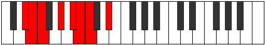

# Mode Katarian

## Links

- [Documentation](README.md)
- [Scales Index](Scales.md)
- [Modes Index](Modes.md)
- [Chords Index](Chords.md)

## Parent Scale

[Epathian](ScaleEpathian.md)

## Number

[935](https://ianring.com/musictheory/scales/935)

## Transposition

1, 1, 3, 2, 1, 1, 3

## Chord Pattern

II, iv, v⁰b3, VIb5, VII⁺

## Perfection

- 5 Perfect notes
- 2 Perfect notes

## Perfection Profile

true, true, true, true, true, false, false

## Permutations

| Tonic | Notes | Signature | Illustration | Audio |
|-------|-------|-----------|--------------|-------|
| [C](ModeCNaturalKatarian.md) | C, Db, Ebb, F, G, **Ab**, **Bbb**, C | C |  | [midi](https://github.com/edipermadi/music/blob/main/docs/ModeCNaturalKatarian.mid?raw=true) |
| [C#](ModeCSharpKatarian.md) | C#, D, Eb, F#, G#, **A**, **Bb**, C# | C |  | [midi](https://github.com/edipermadi/music/blob/main/docs/ModeCSharpKatarian.mid?raw=true) |
| [Db](ModeDFlatKatarian.md) | Db, Ebb, Fbb, Gb, Ab, **Bbb**, **Cbb**, Db | C |  | [midi](https://github.com/edipermadi/music/blob/main/docs/ModeDFlatKatarian.mid?raw=true) |
| [D](ModeDNaturalKatarian.md) | D, Eb, Fb, G, A, **Bb**, **Cb**, D | C |  | [midi](https://github.com/edipermadi/music/blob/main/docs/ModeDNaturalKatarian.mid?raw=true) |
| [D#](ModeDSharpKatarian.md) | D#, E, F, G#, A#, **B**, **C**, D# | C |  | [midi](https://github.com/edipermadi/music/blob/main/docs/ModeDSharpKatarian.mid?raw=true) |
| [Eb](ModeEFlatKatarian.md) | Eb, Fb, Gbb, Ab, Bb, **Cb**, **Dbb**, Eb | C |  | [midi](https://github.com/edipermadi/music/blob/main/docs/ModeEFlatKatarian.mid?raw=true) |
| [E](ModeENaturalKatarian.md) | E, F, Gb, A, B, **C**, **Db**, E | C |  | [midi](https://github.com/edipermadi/music/blob/main/docs/ModeENaturalKatarian.mid?raw=true) |
| [F](ModeFNaturalKatarian.md) | F, Gb, Abb, Bb, C, **Db**, **Ebb**, F | C |  | [midi](https://github.com/edipermadi/music/blob/main/docs/ModeFNaturalKatarian.mid?raw=true) |
| [F#](ModeFSharpKatarian.md) | F#, G, Ab, B, C#, **D**, **Eb**, F# | C |  | [midi](https://github.com/edipermadi/music/blob/main/docs/ModeFSharpKatarian.mid?raw=true) |
| [Gb](ModeGFlatKatarian.md) | Gb, Abb, Bbbb, Cb, Db, **Ebb**, **Fbb**, Gb | C |  | [midi](https://github.com/edipermadi/music/blob/main/docs/ModeGFlatKatarian.mid?raw=true) |
| [G](ModeGNaturalKatarian.md) | G, Ab, Bbb, C, D, **Eb**, **Fb**, G | C |  | [midi](https://github.com/edipermadi/music/blob/main/docs/ModeGNaturalKatarian.mid?raw=true) |
| [G#](ModeGSharpKatarian.md) | G#, A, Bb, C#, D#, **E**, **F**, G# | C |  | [midi](https://github.com/edipermadi/music/blob/main/docs/ModeGSharpKatarian.mid?raw=true) |
| [Ab](ModeAFlatKatarian.md) | Ab, Bbb, Cbb, Db, Eb, **Fb**, **Gbb**, Ab | C |  | [midi](https://github.com/edipermadi/music/blob/main/docs/ModeAFlatKatarian.mid?raw=true) |
| [A](ModeANaturalKatarian.md) | A, Bb, Cb, D, E, **F**, **Gb**, A | C |  | [midi](https://github.com/edipermadi/music/blob/main/docs/ModeANaturalKatarian.mid?raw=true) |
| [A#](ModeASharpKatarian.md) | A#, B, C, D#, E#, **F#**, **G**, A# | C |  | [midi](https://github.com/edipermadi/music/blob/main/docs/ModeASharpKatarian.mid?raw=true) |
| [Bb](ModeBFlatKatarian.md) | Bb, Cb, Dbb, Eb, F, **Gb**, **Abb**, Bb | C |  | [midi](https://github.com/edipermadi/music/blob/main/docs/ModeBFlatKatarian.mid?raw=true) |
| [B](ModeBNaturalKatarian.md) | B, C, Db, E, F#, **G**, **Ab**, B | C |  | [midi](https://github.com/edipermadi/music/blob/main/docs/ModeBNaturalKatarian.mid?raw=true) |
