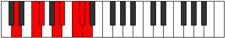

# Mode Katathian

## Links

- [Documentation](README.md)
- [Scales Index](Scales.md)
- [Modes Index](Modes.md)
- [Chords Index](Chords.md)

## Parent Scale

[Katathian](ScaleKatathian.md)

## Number

[3481](https://ianring.com/musictheory/scales/3481)

## Luminosity

7

## Transposition

3, 1, 3, 1, 2, 1, 1

## Chord Pattern

I⁺, II, III, v, vi⁰b3, VII⁺

## Perfection

- 4 Perfect notes
- 3 Perfect notes

## Perfection Profile

true, true, true, false, true, false, false

## Permutations

| Tonic | Notes | Signature | Illustration | Audio |
|-------|-------|-----------|--------------|-------|
| [C](ModeCNaturalKatathian.md) | C, D#, E, **F##**, G#, **A#**, **B**, C | C |  | [midi](https://github.com/edipermadi/music/blob/main/docs/ModeCNaturalKatathian.mid?raw=true) |
| [C#](ModeCSharpKatathian.md) | C#, D##, E#, **F###**, G##, **A##**, **B#**, C# | C |  | [midi](https://github.com/edipermadi/music/blob/main/docs/ModeCSharpKatathian.mid?raw=true) |
| [Db](ModeDFlatKatathian.md) | Db, E, F, **G#**, A, **B**, **C**, Db | C |  | [midi](https://github.com/edipermadi/music/blob/main/docs/ModeDFlatKatathian.mid?raw=true) |
| [D](ModeDNaturalKatathian.md) | D, E#, F#, **G##**, A#, **B#**, **C#**, D | C |  | [midi](https://github.com/edipermadi/music/blob/main/docs/ModeDNaturalKatathian.mid?raw=true) |
| [D#](ModeDSharpKatathian.md) | D#, E##, F##, **G###**, A##, **B##**, **C##**, D# | C |  | [midi](https://github.com/edipermadi/music/blob/main/docs/ModeDSharpKatathian.mid?raw=true) |
| [Eb](ModeEFlatKatathian.md) | Eb, F#, G, **A#**, B, **C#**, **D**, Eb | C |  | [midi](https://github.com/edipermadi/music/blob/main/docs/ModeEFlatKatathian.mid?raw=true) |
| [E](ModeENaturalKatathian.md) | E, F##, G#, **A##**, B#, **C##**, **D#**, E | C |  | [midi](https://github.com/edipermadi/music/blob/main/docs/ModeENaturalKatathian.mid?raw=true) |
| [F](ModeFNaturalKatathian.md) | F, G#, A, **B#**, C#, **D#**, **E**, F | C |  | [midi](https://github.com/edipermadi/music/blob/main/docs/ModeFNaturalKatathian.mid?raw=true) |
| [F#](ModeFSharpKatathian.md) | F#, G##, A#, **B##**, C##, **D##**, **E#**, F# | C |  | [midi](https://github.com/edipermadi/music/blob/main/docs/ModeFSharpKatathian.mid?raw=true) |
| [Gb](ModeGFlatKatathian.md) | Gb, A, Bb, **C#**, D, **E**, **F**, Gb | C |  | [midi](https://github.com/edipermadi/music/blob/main/docs/ModeGFlatKatathian.mid?raw=true) |
| [G](ModeGNaturalKatathian.md) | G, A#, B, **C##**, D#, **E#**, **F#**, G | C |  | [midi](https://github.com/edipermadi/music/blob/main/docs/ModeGNaturalKatathian.mid?raw=true) |
| [G#](ModeGSharpKatathian.md) | G#, A##, B#, **C###**, D##, **E##**, **F##**, G# | C |  | [midi](https://github.com/edipermadi/music/blob/main/docs/ModeGSharpKatathian.mid?raw=true) |
| [Ab](ModeAFlatKatathian.md) | Ab, B, C, **D#**, E, **F#**, **G**, Ab | C |  | [midi](https://github.com/edipermadi/music/blob/main/docs/ModeAFlatKatathian.mid?raw=true) |
| [A](ModeANaturalKatathian.md) | A, B#, C#, **D##**, E#, **F##**, **G#**, A | C |  | [midi](https://github.com/edipermadi/music/blob/main/docs/ModeANaturalKatathian.mid?raw=true) |
| [A#](ModeASharpKatathian.md) | A#, B##, C##, **D###**, E##, **F###**, **G##**, A# | C |  | [midi](https://github.com/edipermadi/music/blob/main/docs/ModeASharpKatathian.mid?raw=true) |
| [Bb](ModeBFlatKatathian.md) | Bb, C#, D, **E#**, F#, **G#**, **A**, Bb | C |  | [midi](https://github.com/edipermadi/music/blob/main/docs/ModeBFlatKatathian.mid?raw=true) |
| [B](ModeBNaturalKatathian.md) | B, C##, D#, **E##**, F##, **G##**, **A#**, B | C |  | [midi](https://github.com/edipermadi/music/blob/main/docs/ModeBNaturalKatathian.mid?raw=true) |
