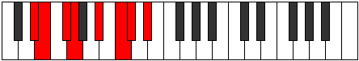

# Mode Kathian

## Links

- [Documentation](index.md)
- [Scales Index](Scales.md)
- [Modes Index](Modes.md)
- [Chords Index](Chords.md)

## Parent Scale

[Pogian](ScalePogian.md)

## Number

[1691](https://ianring.com/musictheory/scales/1691)

## Perfection

- 3 Perfect notes
- 4 Perfect notes

## Interval Pattern

1, 2, 1, 3, 2, 1, 2

## Perfection Profile

[true false true false false true false]

## Permutations

| Tonic | Notes | Signature | Illustration | Audio |
|-------|-------|-----------|--------------|-------|
| [C](ModeCNaturalKathian.md) | C, **Db**, Eb, **Fb**, **G**, A, **Bb**, C | C |  | [midi](https://github.com/edipermadi/music/blob/main/docs/ModeCNaturalKathian.mid?raw=true) |
| [C#](ModeCSharpKathian.md) | C#, **D**, E, **F**, **G#**, A#, **B**, C# | C |  | [midi](https://github.com/edipermadi/music/blob/main/docs/ModeCSharpKathian.mid?raw=true) |
| [Db](ModeDFlatKathian.md) | Db, **Ebb**, Fb, **Gbb**, **Ab**, Bb, **Cb**, Db | C |  | [midi](https://github.com/edipermadi/music/blob/main/docs/ModeDFlatKathian.mid?raw=true) |
| [D](ModeDNaturalKathian.md) | D, **Eb**, F, **Gb**, **A**, B, **C**, D | C |  | [midi](https://github.com/edipermadi/music/blob/main/docs/ModeDNaturalKathian.mid?raw=true) |
| [D#](ModeDSharpKathian.md) | D#, **E**, F#, **G**, **A#**, B#, **C#**, D# | C |  | [midi](https://github.com/edipermadi/music/blob/main/docs/ModeDSharpKathian.mid?raw=true) |
| [Eb](ModeEFlatKathian.md) | Eb, **Fb**, Gb, **Abb**, **Bb**, C, **Db**, Eb | C |  | [midi](https://github.com/edipermadi/music/blob/main/docs/ModeEFlatKathian.mid?raw=true) |
| [E](ModeENaturalKathian.md) | E, **F**, G, **Ab**, **B**, C#, **D**, E | C |  | [midi](https://github.com/edipermadi/music/blob/main/docs/ModeENaturalKathian.mid?raw=true) |
| [F](ModeFNaturalKathian.md) | F, **Gb**, Ab, **Bbb**, **C**, D, **Eb**, F | C |  | [midi](https://github.com/edipermadi/music/blob/main/docs/ModeFNaturalKathian.mid?raw=true) |
| [F#](ModeFSharpKathian.md) | F#, **G**, A, **Bb**, **C#**, D#, **E**, F# | C |  | [midi](https://github.com/edipermadi/music/blob/main/docs/ModeFSharpKathian.mid?raw=true) |
| [Gb](ModeGFlatKathian.md) | Gb, **Abb**, Bbb, **Cbb**, **Db**, Eb, **Fb**, Gb | C |  | [midi](https://github.com/edipermadi/music/blob/main/docs/ModeGFlatKathian.mid?raw=true) |
| [G](ModeGNaturalKathian.md) | G, **Ab**, Bb, **Cb**, **D**, E, **F**, G | C |  | [midi](https://github.com/edipermadi/music/blob/main/docs/ModeGNaturalKathian.mid?raw=true) |
| [G#](ModeGSharpKathian.md) | G#, **A**, B, **C**, **D#**, E#, **F#**, G# | C |  | [midi](https://github.com/edipermadi/music/blob/main/docs/ModeGSharpKathian.mid?raw=true) |
| [Ab](ModeAFlatKathian.md) | Ab, **Bbb**, Cb, **Dbb**, **Eb**, F, **Gb**, Ab | C |  | [midi](https://github.com/edipermadi/music/blob/main/docs/ModeAFlatKathian.mid?raw=true) |
| [A](ModeANaturalKathian.md) | A, **Bb**, C, **Db**, **E**, F#, **G**, A | C |  | [midi](https://github.com/edipermadi/music/blob/main/docs/ModeANaturalKathian.mid?raw=true) |
| [A#](ModeASharpKathian.md) | A#, **B**, C#, **D**, **E#**, F##, **G#**, A# | C |  | [midi](https://github.com/edipermadi/music/blob/main/docs/ModeASharpKathian.mid?raw=true) |
| [Bb](ModeBFlatKathian.md) | Bb, **Cb**, Db, **Ebb**, **F**, G, **Ab**, Bb | C |  | [midi](https://github.com/edipermadi/music/blob/main/docs/ModeBFlatKathian.mid?raw=true) |
| [B](ModeBNaturalKathian.md) | B, **C**, D, **Eb**, **F#**, G#, **A**, B | C |  | [midi](https://github.com/edipermadi/music/blob/main/docs/ModeBNaturalKathian.mid?raw=true) |
