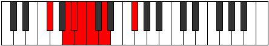

# Mode Kathimic

## Links

- [Documentation](index.md)
- [Scales Index](Scales.md)
- [Modes Index](Modes.md)
- [Chords Index](Chords.md)

## Parent Scale

[Galimic](ScaleGalimic.md)

## Number

[377](https://ianring.com/musictheory/scales/377)

## Perfection

- 2 Perfect notes
- 4 Perfect notes

## Interval Pattern

3, 1, 1, 1, 2, 4

## Perfection Profile

[false false false true false true]

## Permutations

| Tonic | Notes | Signature | Illustration | Audio |
|-------|-------|-----------|--------------|-------|
| [C](ModeCNaturalKathimic.md) | **C**, **D#**, **E**, F, **Gb**, Ab, **C** | C |  | [midi](https://github.com/edipermadi/music/blob/main/docs/ModeCNaturalKathimic.mid?raw=true) |
| [C#](ModeCSharpKathimic.md) | **C#**, **D##**, **E#**, F#, **G**, A, **C#** | C |  | [midi](https://github.com/edipermadi/music/blob/main/docs/ModeCSharpKathimic.mid?raw=true) |
| [Db](ModeDFlatKathimic.md) | **Db**, **E**, **F**, Gb, **Abb**, Bbb, **Db** | C |  | [midi](https://github.com/edipermadi/music/blob/main/docs/ModeDFlatKathimic.mid?raw=true) |
| [D](ModeDNaturalKathimic.md) | **D**, **E#**, **F#**, G, **Ab**, Bb, **D** | C |  | [midi](https://github.com/edipermadi/music/blob/main/docs/ModeDNaturalKathimic.mid?raw=true) |
| [D#](ModeDSharpKathimic.md) | **D#**, **E##**, **F##**, G#, **A**, B, **D#** | C |  | [midi](https://github.com/edipermadi/music/blob/main/docs/ModeDSharpKathimic.mid?raw=true) |
| [Eb](ModeEFlatKathimic.md) | **Eb**, **F#**, **G**, Ab, **Bbb**, Cb, **Eb** | C |  | [midi](https://github.com/edipermadi/music/blob/main/docs/ModeEFlatKathimic.mid?raw=true) |
| [E](ModeENaturalKathimic.md) | **E**, **F##**, **G#**, A, **Bb**, C, **E** | C |  | [midi](https://github.com/edipermadi/music/blob/main/docs/ModeENaturalKathimic.mid?raw=true) |
| [F](ModeFNaturalKathimic.md) | **F**, **G#**, **A**, Bb, **Cb**, Db, **F** | C |  | [midi](https://github.com/edipermadi/music/blob/main/docs/ModeFNaturalKathimic.mid?raw=true) |
| [F#](ModeFSharpKathimic.md) | **F#**, **G##**, **A#**, B, **C**, D, **F#** | C |  | [midi](https://github.com/edipermadi/music/blob/main/docs/ModeFSharpKathimic.mid?raw=true) |
| [Gb](ModeGFlatKathimic.md) | **Gb**, **A**, **Bb**, Cb, **Dbb**, Ebb, **Gb** | C |  | [midi](https://github.com/edipermadi/music/blob/main/docs/ModeGFlatKathimic.mid?raw=true) |
| [G](ModeGNaturalKathimic.md) | **G**, **A#**, **B**, C, **Db**, Eb, **G** | C |  | [midi](https://github.com/edipermadi/music/blob/main/docs/ModeGNaturalKathimic.mid?raw=true) |
| [G#](ModeGSharpKathimic.md) | **G#**, **A##**, **B#**, C#, **D**, E, **G#** | C |  | [midi](https://github.com/edipermadi/music/blob/main/docs/ModeGSharpKathimic.mid?raw=true) |
| [Ab](ModeAFlatKathimic.md) | **Ab**, **B**, **C**, Db, **Ebb**, Fb, **Ab** | C |  | [midi](https://github.com/edipermadi/music/blob/main/docs/ModeAFlatKathimic.mid?raw=true) |
| [A](ModeANaturalKathimic.md) | **A**, **B#**, **C#**, D, **Eb**, F, **A** | C |  | [midi](https://github.com/edipermadi/music/blob/main/docs/ModeANaturalKathimic.mid?raw=true) |
| [A#](ModeASharpKathimic.md) | **A#**, **B##**, **C##**, D#, **E**, F#, **A#** | C |  | [midi](https://github.com/edipermadi/music/blob/main/docs/ModeASharpKathimic.mid?raw=true) |
| [Bb](ModeBFlatKathimic.md) | **Bb**, **C#**, **D**, Eb, **Fb**, Gb, **Bb** | C |  | [midi](https://github.com/edipermadi/music/blob/main/docs/ModeBFlatKathimic.mid?raw=true) |
| [B](ModeBNaturalKathimic.md) | **B**, **C##**, **D#**, E, **F**, G, **B** | C |  | [midi](https://github.com/edipermadi/music/blob/main/docs/ModeBNaturalKathimic.mid?raw=true) |
