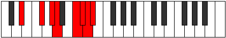

# Mode Katocrian

## Links

- [Documentation](index.md)
- [Scales Index](Scales.md)
- [Modes Index](Modes.md)
- [Chords Index](Chords.md)

## Parent Scale

[Katocrian](ScaleKatocrian.md)

## Number

[3689](https://ianring.com/musictheory/scales/3689)

## Perfection

- 4 Perfect notes
- 3 Perfect notes

## Perfection Profile

[false true true false false true true]

## Permutations

| Tonic | Notes | Signature | Illustration | Audio |
|-------|-------|-----------|--------------|-------|
| [C](ModeCNaturalKatocrian.md) | **C**, D#, E#, **F#**, **G##**, A#, B, **C** | C |  | [midi](ModeCNaturalKatocrian.mid) [ogg](ModeCNaturalKatocrian.ogg) |
| [C#](ModeCSharpKatocrian.md) | **C#**, D##, E##, **F##**, **G###**, A##, B#, **C#** | C |  | [midi](ModeCSharpKatocrian.mid) [ogg](ModeCSharpKatocrian.ogg) |
| [Db](ModeDFlatKatocrian.md) | **Db**, E, F#, **G**, **A#**, B, C, **Db** | C |  | [midi](ModeDFlatKatocrian.mid) [ogg](ModeDFlatKatocrian.ogg) |
| [D](ModeDNaturalKatocrian.md) | **D**, E#, F##, **G#**, **A##**, B#, C#, **D** | C |  | [midi](ModeDNaturalKatocrian.mid) [ogg](ModeDNaturalKatocrian.ogg) |
| [D#](ModeDSharpKatocrian.md) | **D#**, E##, F###, **G##**, **A###**, B##, C##, **D#** | C |  | [midi](ModeDSharpKatocrian.mid) [ogg](ModeDSharpKatocrian.ogg) |
| [Eb](ModeEFlatKatocrian.md) | **Eb**, F#, G#, **A**, **B#**, C#, D, **Eb** | C |  | [midi](ModeEFlatKatocrian.mid) [ogg](ModeEFlatKatocrian.ogg) |
| [E](ModeENaturalKatocrian.md) | **E**, F##, G##, **A#**, **B##**, C##, D#, **E** | C |  | [midi](ModeENaturalKatocrian.mid) [ogg](ModeENaturalKatocrian.ogg) |
| [F](ModeFNaturalKatocrian.md) | **F**, G#, A#, **B**, **C##**, D#, E, **F** | C |  | [midi](ModeFNaturalKatocrian.mid) [ogg](ModeFNaturalKatocrian.ogg) |
| [F#](ModeFSharpKatocrian.md) | **F#**, G##, A##, **B#**, **C###**, D##, E#, **F#** | C |  | [midi](ModeFSharpKatocrian.mid) [ogg](ModeFSharpKatocrian.ogg) |
| [Gb](ModeGFlatKatocrian.md) | **Gb**, A, B, **C**, **D#**, E, F, **Gb** | C |  | [midi](ModeGFlatKatocrian.mid) [ogg](ModeGFlatKatocrian.ogg) |
| [G](ModeGNaturalKatocrian.md) | **G**, A#, B#, **C#**, **D##**, E#, F#, **G** | C |  | [midi](ModeGNaturalKatocrian.mid) [ogg](ModeGNaturalKatocrian.ogg) |
| [G#](ModeGSharpKatocrian.md) | **G#**, A##, B##, **C##**, **D###**, E##, F##, **G#** | C |  | [midi](ModeGSharpKatocrian.mid) [ogg](ModeGSharpKatocrian.ogg) |
| [Ab](ModeAFlatKatocrian.md) | **Ab**, B, C#, **D**, **E#**, F#, G, **Ab** | C |  | [midi](ModeAFlatKatocrian.mid) [ogg](ModeAFlatKatocrian.ogg) |
| [A](ModeANaturalKatocrian.md) | **A**, B#, C##, **D#**, **E##**, F##, G#, **A** | C |  | [midi](ModeANaturalKatocrian.mid) [ogg](ModeANaturalKatocrian.ogg) |
| [A#](ModeASharpKatocrian.md) | **A#**, B##, C###, **D##**, **E###**, F###, G##, **A#** | C |  | [midi](ModeASharpKatocrian.mid) [ogg](ModeASharpKatocrian.ogg) |
| [Bb](ModeBFlatKatocrian.md) | **Bb**, C#, D#, **E**, **F##**, G#, A, **Bb** | C |  | [midi](ModeBFlatKatocrian.mid) [ogg](ModeBFlatKatocrian.ogg) |
| [B](ModeBNaturalKatocrian.md) | **B**, C##, D##, **E#**, **F###**, G##, A#, **B** | C |  | [midi](ModeBNaturalKatocrian.mid) [ogg](ModeBNaturalKatocrian.ogg) |
