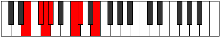

# Mode Katocrimic

## Links

- [Documentation](index.md)
- [Scales Index](Scales.md)
- [Modes Index](Modes.md)
- [Chords Index](Chords.md)

## Parent Scale

[Phralimic](ScalePhralimic.md)

## Number

[797](https://ianring.com/musictheory/scales/797)

## Perfection

- 3 Perfect notes
- 3 Perfect notes

## Perfection Profile

[false true false false true true]

## Permutations

| Tonic | Notes | Signature | Illustration | Audio |
|-------|-------|-----------|--------------|-------|
| [C](ModeCNaturalKatocrimic.md) | **C**, D, **Eb**, **Fb**, G#, A, **C** | C |  | [midi](ModeCNaturalKatocrimic.mid) [ogg](ModeCNaturalKatocrimic.ogg) |
| [C#](ModeCSharpKatocrimic.md) | **C#**, D#, **E**, **F**, G##, A#, **C#** | C |  | [midi](ModeCSharpKatocrimic.mid) [ogg](ModeCSharpKatocrimic.ogg) |
| [Db](ModeDFlatKatocrimic.md) | **Db**, Eb, **Fb**, **Gbb**, A, Bb, **Db** | C |  | [midi](ModeDFlatKatocrimic.mid) [ogg](ModeDFlatKatocrimic.ogg) |
| [D](ModeDNaturalKatocrimic.md) | **D**, E, **F**, **Gb**, A#, B, **D** | C |  | [midi](ModeDNaturalKatocrimic.mid) [ogg](ModeDNaturalKatocrimic.ogg) |
| [D#](ModeDSharpKatocrimic.md) | **D#**, E#, **F#**, **G**, A##, B#, **D#** | C |  | [midi](ModeDSharpKatocrimic.mid) [ogg](ModeDSharpKatocrimic.ogg) |
| [Eb](ModeEFlatKatocrimic.md) | **Eb**, F, **Gb**, **Abb**, B, C, **Eb** | C |  | [midi](ModeEFlatKatocrimic.mid) [ogg](ModeEFlatKatocrimic.ogg) |
| [E](ModeENaturalKatocrimic.md) | **E**, F#, **G**, **Ab**, B#, C#, **E** | C |  | [midi](ModeENaturalKatocrimic.mid) [ogg](ModeENaturalKatocrimic.ogg) |
| [F](ModeFNaturalKatocrimic.md) | **F**, G, **Ab**, **Bbb**, C#, D, **F** | C |  | [midi](ModeFNaturalKatocrimic.mid) [ogg](ModeFNaturalKatocrimic.ogg) |
| [F#](ModeFSharpKatocrimic.md) | **F#**, G#, **A**, **Bb**, C##, D#, **F#** | C |  | [midi](ModeFSharpKatocrimic.mid) [ogg](ModeFSharpKatocrimic.ogg) |
| [Gb](ModeGFlatKatocrimic.md) | **Gb**, Ab, **Bbb**, **Cbb**, D, Eb, **Gb** | C |  | [midi](ModeGFlatKatocrimic.mid) [ogg](ModeGFlatKatocrimic.ogg) |
| [G](ModeGNaturalKatocrimic.md) | **G**, A, **Bb**, **Cb**, D#, E, **G** | C |  | [midi](ModeGNaturalKatocrimic.mid) [ogg](ModeGNaturalKatocrimic.ogg) |
| [G#](ModeGSharpKatocrimic.md) | **G#**, A#, **B**, **C**, D##, E#, **G#** | C |  | [midi](ModeGSharpKatocrimic.mid) [ogg](ModeGSharpKatocrimic.ogg) |
| [Ab](ModeAFlatKatocrimic.md) | **Ab**, Bb, **Cb**, **Dbb**, E, F, **Ab** | C |  | [midi](ModeAFlatKatocrimic.mid) [ogg](ModeAFlatKatocrimic.ogg) |
| [A](ModeANaturalKatocrimic.md) | **A**, B, **C**, **Db**, E#, F#, **A** | C |  | [midi](ModeANaturalKatocrimic.mid) [ogg](ModeANaturalKatocrimic.ogg) |
| [A#](ModeASharpKatocrimic.md) | **A#**, B#, **C#**, **D**, E##, F##, **A#** | C |  | [midi](ModeASharpKatocrimic.mid) [ogg](ModeASharpKatocrimic.ogg) |
| [Bb](ModeBFlatKatocrimic.md) | **Bb**, C, **Db**, **Ebb**, F#, G, **Bb** | C |  | [midi](ModeBFlatKatocrimic.mid) [ogg](ModeBFlatKatocrimic.ogg) |
| [B](ModeBNaturalKatocrimic.md) | **B**, C#, **D**, **Eb**, F##, G#, **B** | C |  | [midi](ModeBNaturalKatocrimic.mid) [ogg](ModeBNaturalKatocrimic.ogg) |
