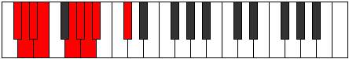

# Mode Katogyllic

## Links

- [Documentation](index.md)
- [Scales Index](Scales.md)
- [Modes Index](Modes.md)
- [Chords Index](Chords.md)

## Parent Scale

[Sydyllic](ScaleSydyllic.md)

## Number

[975](https://ianring.com/musictheory/scales/975)

## Interval Pattern

1, 1, 1, 3, 1, 1, 1, 3

## Chord Pattern

i⁰, i, III, iv⁰, v⁰, v, VII, viii⁰

## Perfection

- 6 Perfect notes
- 2 Perfect notes

## Perfection Profile

[true true true false true true true false]

## Permutations

| Tonic | Notes | Signature | Illustration | Audio |
|-------|-------|-----------|--------------|-------|
| [C](ModeCNaturalKatogyllic.md) | C, C#, D, **D#**, F#, G, G#, **A**, C | C |  | [midi](https://github.com/edipermadi/music/blob/main/docs/ModeCNaturalKatogyllic.mid?raw=true) |
| [C#](ModeCSharpKatogyllic.md) | C#, D, D#, **E**, G, G#, A, **A#**, C# | C |  | [midi](https://github.com/edipermadi/music/blob/main/docs/ModeCSharpKatogyllic.mid?raw=true) |
| [Db](ModeDFlatKatogyllic.md) | Db, D, Eb, **E**, G, Ab, A, **Bb**, Db | C |  | [midi](https://github.com/edipermadi/music/blob/main/docs/ModeDFlatKatogyllic.mid?raw=true) |
| [D](ModeDNaturalKatogyllic.md) | D, D#, E, **F**, G#, A, A#, **B**, D | C |  | [midi](https://github.com/edipermadi/music/blob/main/docs/ModeDNaturalKatogyllic.mid?raw=true) |
| [D#](ModeDSharpKatogyllic.md) | D#, E, F, **F#**, A, A#, B, **C**, D# | C |  | [midi](https://github.com/edipermadi/music/blob/main/docs/ModeDSharpKatogyllic.mid?raw=true) |
| [Eb](ModeEFlatKatogyllic.md) | Eb, E, F, **Gb**, A, Bb, B, **C**, Eb | C |  | [midi](https://github.com/edipermadi/music/blob/main/docs/ModeEFlatKatogyllic.mid?raw=true) |
| [E](ModeENaturalKatogyllic.md) | E, F, F#, **G**, A#, B, C, **C#**, E | C |  | [midi](https://github.com/edipermadi/music/blob/main/docs/ModeENaturalKatogyllic.mid?raw=true) |
| [F](ModeFNaturalKatogyllic.md) | F, F#, G, **G#**, B, C, C#, **D**, F | C |  | [midi](https://github.com/edipermadi/music/blob/main/docs/ModeFNaturalKatogyllic.mid?raw=true) |
| [F#](ModeFSharpKatogyllic.md) | F#, G, G#, **A**, C, C#, D, **D#**, F# | C |  | [midi](https://github.com/edipermadi/music/blob/main/docs/ModeFSharpKatogyllic.mid?raw=true) |
| [Gb](ModeGFlatKatogyllic.md) | Gb, G, Ab, **A**, C, Db, D, **Eb**, Gb | C |  | [midi](https://github.com/edipermadi/music/blob/main/docs/ModeGFlatKatogyllic.mid?raw=true) |
| [G](ModeGNaturalKatogyllic.md) | G, G#, A, **A#**, C#, D, D#, **E**, G | C |  | [midi](https://github.com/edipermadi/music/blob/main/docs/ModeGNaturalKatogyllic.mid?raw=true) |
| [G#](ModeGSharpKatogyllic.md) | G#, A, A#, **B**, D, D#, E, **F**, G# | C |  | [midi](https://github.com/edipermadi/music/blob/main/docs/ModeGSharpKatogyllic.mid?raw=true) |
| [Ab](ModeAFlatKatogyllic.md) | Ab, A, Bb, **B**, D, Eb, E, **F**, Ab | C |  | [midi](https://github.com/edipermadi/music/blob/main/docs/ModeAFlatKatogyllic.mid?raw=true) |
| [A](ModeANaturalKatogyllic.md) | A, A#, B, **C**, D#, E, F, **F#**, A | C |  | [midi](https://github.com/edipermadi/music/blob/main/docs/ModeANaturalKatogyllic.mid?raw=true) |
| [A#](ModeASharpKatogyllic.md) | A#, B, C, **C#**, E, F, F#, **G**, A# | C |  | [midi](https://github.com/edipermadi/music/blob/main/docs/ModeASharpKatogyllic.mid?raw=true) |
| [Bb](ModeBFlatKatogyllic.md) | Bb, B, C, **Db**, E, F, Gb, **G**, Bb | C |  | [midi](https://github.com/edipermadi/music/blob/main/docs/ModeBFlatKatogyllic.mid?raw=true) |
| [B](ModeBNaturalKatogyllic.md) | B, C, C#, **D**, F, F#, G, **G#**, B | C |  | [midi](https://github.com/edipermadi/music/blob/main/docs/ModeBNaturalKatogyllic.mid?raw=true) |
