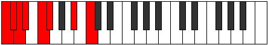
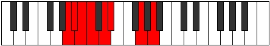

# Mode Katolian

## Links

- [Documentation](README.md)
- [Scales Index](Scales.md)
- [Modes Index](Modes.md)
- [Chords Index](Chords.md)

## Parent Scale

[Epycrian](ScaleEpycrian.md)

## Number

[1135](https://ianring.com/musictheory/scales/1135)

## Transposition

1, 1, 1, 2, 1, 4, 2

## Chord Pattern

## Perfection

- 4 Perfect notes
- 3 Perfect notes

## Perfection Profile

[false false false true true true true]

## Permutations

| Tonic | Notes | Signature | Illustration | Audio |
|-------|-------|-----------|--------------|-------|
| [C](ModeCNaturalKatolian.md) | **C**, **Db**, **Ebb**, Fbb, Gbb, Abbb, Bb, **C** | C |  | [midi](https://github.com/edipermadi/music/blob/main/docs/ModeCNaturalKatolian.mid?raw=true) |
| [C#](ModeCSharpKatolian.md) | **C#**, **D**, **Eb**, Fb, Gb, Abb, B, **C#** | C |  | [midi](https://github.com/edipermadi/music/blob/main/docs/ModeCSharpKatolian.mid?raw=true) |
| [Db](ModeDFlatKatolian.md) | **Db**, **Ebb**, **Fbb**, Gbbb, Abbb, E###, Cb, **Db** | C |  | [midi](https://github.com/edipermadi/music/blob/main/docs/ModeDFlatKatolian.mid?raw=true) |
| [D](ModeDNaturalKatolian.md) | **D**, **Eb**, **Fb**, Gbb, Abb, Bbbb, C, **D** | C |  | [midi](https://github.com/edipermadi/music/blob/main/docs/ModeDNaturalKatolian.mid?raw=true) |
| [D#](ModeDSharpKatolian.md) | **D#**, **E**, **F**, Gb, Ab, Bbb, C#, **D#** | C |  | [midi](https://github.com/edipermadi/music/blob/main/docs/ModeDSharpKatolian.mid?raw=true) |
| [Eb](ModeEFlatKatolian.md) | **Eb**, **Fb**, **Gbb**, Abbb, Bbbb, Cbbb, Db, **Eb** | C |  | [midi](https://github.com/edipermadi/music/blob/main/docs/ModeEFlatKatolian.mid?raw=true) |
| [E](ModeENaturalKatolian.md) | **E**, **F**, **Gb**, Abb, Bbb, Cbb, D, **E** | C |  | [midi](https://github.com/edipermadi/music/blob/main/docs/ModeENaturalKatolian.mid?raw=true) |
| [F](ModeFNaturalKatolian.md) | **F**, **Gb**, **Abb**, Bbbb, Cbb, Dbbb, Eb, **F** | C |  | [midi](https://github.com/edipermadi/music/blob/main/docs/ModeFNaturalKatolian.mid?raw=true) |
| [F#](ModeFSharpKatolian.md) | **F#**, **G**, **Ab**, Bbb, Cb, Dbb, E, **F#** | C |  | [midi](https://github.com/edipermadi/music/blob/main/docs/ModeFSharpKatolian.mid?raw=true) |
| [Gb](ModeGFlatKatolian.md) | **Gb**, **Abb**, **Bbbb**, Cbbb, Dbbb, Dbb, E, **Gb** | C |  | [midi](https://github.com/edipermadi/music/blob/main/docs/ModeGFlatKatolian.mid?raw=true) |
| [G](ModeGNaturalKatolian.md) | **G**, **Ab**, **Bbb**, Cbb, Dbb, Ebbb, F, **G** | C |  | [midi](https://github.com/edipermadi/music/blob/main/docs/ModeGNaturalKatolian.mid?raw=true) |
| [G#](ModeGSharpKatolian.md) | **G#**, **A**, **Bb**, Cb, Db, Ebb, F#, **G#** | C |  | [midi](https://github.com/edipermadi/music/blob/main/docs/ModeGSharpKatolian.mid?raw=true) |
| [Ab](ModeAFlatKatolian.md) | **Ab**, **Bbb**, **Cbb**, Dbbb, Ebbb, Fbbb, Gb, **Ab** | C |  | [midi](https://github.com/edipermadi/music/blob/main/docs/ModeAFlatKatolian.mid?raw=true) |
| [A](ModeANaturalKatolian.md) | **A**, **Bb**, **Cb**, Dbb, Ebb, Fbb, G, **A** | C |  | [midi](https://github.com/edipermadi/music/blob/main/docs/ModeANaturalKatolian.mid?raw=true) |
| [A#](ModeASharpKatolian.md) | **A#**, **B**, **C**, Db, Eb, Fb, G#, **A#** | C |  | [midi](https://github.com/edipermadi/music/blob/main/docs/ModeASharpKatolian.mid?raw=true) |
| [Bb](ModeBFlatKatolian.md) | **Bb**, **Cb**, **Dbb**, Ebbb, Fbb, Gbbb, Ab, **Bb** | C |  | [midi](https://github.com/edipermadi/music/blob/main/docs/ModeBFlatKatolian.mid?raw=true) |
| [B](ModeBNaturalKatolian.md) | **B**, **C**, **Db**, Ebb, Fb, Gbb, A, **B** | C |  | [midi](https://github.com/edipermadi/music/blob/main/docs/ModeBNaturalKatolian.mid?raw=true) |
