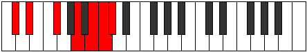
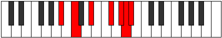

# Mode Katolimic

## Links

- [Documentation](README.md)
- [Scales Index](Scales.md)
- [Modes Index](Modes.md)
- [Chords Index](Chords.md)

## Parent Scale

[Thagimic](ScaleThagimic.md)

## Number

[3365](https://ianring.com/musictheory/scales/3365)

## Transposition

2, 3, 3, 2, 1, 1

## Chord Pattern

iv⁰

## Perfection

- 2 Perfect notes
- 4 Perfect notes

## Perfection Profile

[false false true false true false]

## Permutations

| Tonic | Notes | Signature | Illustration | Audio |
|-------|-------|-----------|--------------|-------|
| [C](ModeCNaturalKatolimic.md) | **C**, **D**, E#, **F###**, G###, **A##**, **C** | C |  | [midi](https://github.com/edipermadi/music/blob/main/docs/ModeCNaturalKatolimic.mid?raw=true) |
| [C#](ModeCSharpKatolimic.md) | **C#**, **D#**, E##, **Cbbb**, Dbbb, **Dbb**, **C#** | C |  | [midi](https://github.com/edipermadi/music/blob/main/docs/ModeCSharpKatolimic.mid?raw=true) |
| [Db](ModeDFlatKatolimic.md) | **Db**, **Eb**, F#, **G##**, A##, **B#**, **Db** | C |  | [midi](https://github.com/edipermadi/music/blob/main/docs/ModeDFlatKatolimic.mid?raw=true) |
| [D](ModeDNaturalKatolimic.md) | **D**, **E**, F##, **G###**, A###, **B##**, **D** | C |  | [midi](https://github.com/edipermadi/music/blob/main/docs/ModeDNaturalKatolimic.mid?raw=true) |
| [D#](ModeDSharpKatolimic.md) | **D#**, **E#**, F###, **Cb**, Db, **Ebb**, **D#** | C |  | [midi](https://github.com/edipermadi/music/blob/main/docs/ModeDSharpKatolimic.mid?raw=true) |
| [Eb](ModeEFlatKatolimic.md) | **Eb**, **F**, G#, **A##**, B##, **C##**, **Eb** | C |  | [midi](https://github.com/edipermadi/music/blob/main/docs/ModeEFlatKatolimic.mid?raw=true) |
| [E](ModeENaturalKatolimic.md) | **E**, **F#**, G##, **A###**, B###, **C###**, **E** | C |  | [midi](https://github.com/edipermadi/music/blob/main/docs/ModeENaturalKatolimic.mid?raw=true) |
| [F](ModeFNaturalKatolimic.md) | **F**, **G**, A#, **B##**, C###, **D##**, **F** | C |  | [midi](https://github.com/edipermadi/music/blob/main/docs/ModeFNaturalKatolimic.mid?raw=true) |
| [F#](ModeFSharpKatolimic.md) | **F#**, **G#**, A##, **B###**, D##, **E#**, **F#** | C |  | [midi](https://github.com/edipermadi/music/blob/main/docs/ModeFSharpKatolimic.mid?raw=true) |
| [Gb](ModeGFlatKatolimic.md) | **Gb**, **Ab**, B, **C##**, D##, **E#**, **Gb** | C |  | [midi](https://github.com/edipermadi/music/blob/main/docs/ModeGFlatKatolimic.mid?raw=true) |
| [G](ModeGNaturalKatolimic.md) | **G**, **A**, B#, **C###**, D###, **E##**, **G** | C |  | [midi](https://github.com/edipermadi/music/blob/main/docs/ModeGNaturalKatolimic.mid?raw=true) |
| [G#](ModeGSharpKatolimic.md) | **G#**, **A#**, B##, **D##**, E##, **F##**, **G#** | C |  | [midi](https://github.com/edipermadi/music/blob/main/docs/ModeGSharpKatolimic.mid?raw=true) |
| [Ab](ModeAFlatKatolimic.md) | **Ab**, **Bb**, C#, **D##**, E##, **F##**, **Ab** | C |  | [midi](https://github.com/edipermadi/music/blob/main/docs/ModeAFlatKatolimic.mid?raw=true) |
| [A](ModeANaturalKatolimic.md) | **A**, **B**, C##, **D###**, E###, **F###**, **A** | C |  | [midi](https://github.com/edipermadi/music/blob/main/docs/ModeANaturalKatolimic.mid?raw=true) |
| [A#](ModeASharpKatolimic.md) | **A#**, **B#**, C###, **E##**, F###, **G##**, **A#** | C |  | [midi](https://github.com/edipermadi/music/blob/main/docs/ModeASharpKatolimic.mid?raw=true) |
| [Bb](ModeBFlatKatolimic.md) | **Bb**, **C**, D#, **E##**, F###, **G##**, **Bb** | C |  | [midi](https://github.com/edipermadi/music/blob/main/docs/ModeBFlatKatolimic.mid?raw=true) |
| [B](ModeBNaturalKatolimic.md) | **B**, **C#**, D##, **E###**, Cbbb, **Cbb**, **B** | C |  | [midi](https://github.com/edipermadi/music/blob/main/docs/ModeBNaturalKatolimic.mid?raw=true) |
