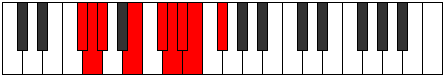

# Mode Katolyllic

## Links

- [Documentation](README.md)
- [Scales Index](Scales.md)
- [Modes Index](Modes.md)
- [Chords Index](Chords.md)

## Parent Scale

[Pothyllic](ScalePothyllic.md)

## Number

[1959](https://ianring.com/musictheory/scales/1959)

## Transposition

1, 1, 3, 2, 1, 1, 1, 2

## Chord Pattern

II, viii

## Perfection

- 6 Perfect notes
- 2 Perfect notes

## Perfection Profile

[true true true true true false false true]

## Permutations

| Tonic | Notes | Signature | Illustration | Audio |
|-------|-------|-----------|--------------|-------|
| [C](ModeCNaturalKatolyllic.md) | C, C#, D, F, G, **G#**, **A**, A#, C | C |  | [midi](https://github.com/edipermadi/music/blob/main/docs/ModeCNaturalKatolyllic.mid?raw=true) |
| [C#](ModeCSharpKatolyllic.md) | C#, D, D#, F#, G#, **A**, **A#**, B, C# | C |  | [midi](https://github.com/edipermadi/music/blob/main/docs/ModeCSharpKatolyllic.mid?raw=true) |
| [Db](ModeDFlatKatolyllic.md) | Db, D, Eb, Gb, Ab, **A**, **Bb**, B, Db | C |  | [midi](https://github.com/edipermadi/music/blob/main/docs/ModeDFlatKatolyllic.mid?raw=true) |
| [D](ModeDNaturalKatolyllic.md) | D, D#, E, G, A, **A#**, **B**, C, D | C |  | [midi](https://github.com/edipermadi/music/blob/main/docs/ModeDNaturalKatolyllic.mid?raw=true) |
| [D#](ModeDSharpKatolyllic.md) | D#, E, F, G#, A#, **B**, **C**, C#, D# | C |  | [midi](https://github.com/edipermadi/music/blob/main/docs/ModeDSharpKatolyllic.mid?raw=true) |
| [Eb](ModeEFlatKatolyllic.md) | Eb, E, F, Ab, Bb, **B**, **C**, Db, Eb | C |  | [midi](https://github.com/edipermadi/music/blob/main/docs/ModeEFlatKatolyllic.mid?raw=true) |
| [E](ModeENaturalKatolyllic.md) | E, F, F#, A, B, **C**, **C#**, D, E | C |  | [midi](https://github.com/edipermadi/music/blob/main/docs/ModeENaturalKatolyllic.mid?raw=true) |
| [F](ModeFNaturalKatolyllic.md) | F, F#, G, A#, C, **C#**, **D**, D#, F | C |  | [midi](https://github.com/edipermadi/music/blob/main/docs/ModeFNaturalKatolyllic.mid?raw=true) |
| [F#](ModeFSharpKatolyllic.md) | F#, G, G#, B, C#, **D**, **D#**, E, F# | C |  | [midi](https://github.com/edipermadi/music/blob/main/docs/ModeFSharpKatolyllic.mid?raw=true) |
| [Gb](ModeGFlatKatolyllic.md) | Gb, G, Ab, B, Db, **D**, **Eb**, E, Gb | C |  | [midi](https://github.com/edipermadi/music/blob/main/docs/ModeGFlatKatolyllic.mid?raw=true) |
| [G](ModeGNaturalKatolyllic.md) | G, G#, A, C, D, **D#**, **E**, F, G | C |  | [midi](https://github.com/edipermadi/music/blob/main/docs/ModeGNaturalKatolyllic.mid?raw=true) |
| [G#](ModeGSharpKatolyllic.md) | G#, A, A#, C#, D#, **E**, **F**, F#, G# | C |  | [midi](https://github.com/edipermadi/music/blob/main/docs/ModeGSharpKatolyllic.mid?raw=true) |
| [Ab](ModeAFlatKatolyllic.md) | Ab, A, Bb, Db, Eb, **E**, **F**, Gb, Ab | C |  | [midi](https://github.com/edipermadi/music/blob/main/docs/ModeAFlatKatolyllic.mid?raw=true) |
| [A](ModeANaturalKatolyllic.md) | A, A#, B, D, E, **F**, **F#**, G, A | C |  | [midi](https://github.com/edipermadi/music/blob/main/docs/ModeANaturalKatolyllic.mid?raw=true) |
| [A#](ModeASharpKatolyllic.md) | A#, B, C, D#, F, **F#**, **G**, G#, A# | C |  | [midi](https://github.com/edipermadi/music/blob/main/docs/ModeASharpKatolyllic.mid?raw=true) |
| [Bb](ModeBFlatKatolyllic.md) | Bb, B, C, Eb, F, **Gb**, **G**, Ab, Bb | C |  | [midi](https://github.com/edipermadi/music/blob/main/docs/ModeBFlatKatolyllic.mid?raw=true) |
| [B](ModeBNaturalKatolyllic.md) | B, C, C#, E, F#, **G**, **G#**, A, B | C |  | [midi](https://github.com/edipermadi/music/blob/main/docs/ModeBNaturalKatolyllic.mid?raw=true) |
