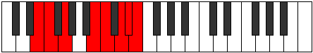

# Mode Katonian

## Links

- [Documentation](index.md)
- [Scales Index](Scales.md)
- [Modes Index](Modes.md)
- [Chords Index](Chords.md)

## Parent Scale

[Zorian](ScaleZorian.md)

## Number

[3467](https://ianring.com/musictheory/scales/3467)

## Perfection

- 4 Perfect notes
- 3 Perfect notes

## Perfection Profile

[true true true false true false false]

## Permutations

| Tonic | Notes | Signature | Illustration | Audio |
|-------|-------|-----------|--------------|-------|
| [C](ModeCNaturalKatonian.md) | C, Db, Eb, **F##**, G#, **A#**, **B**, C | C |  | [midi](ModeCNaturalKatonian.mid) [ogg](ModeCNaturalKatonian.ogg) |
| [C#](ModeCSharpKatonian.md) | C#, D, E, **F###**, G##, **A##**, **B#**, C# | C |  | [midi](ModeCSharpKatonian.mid) [ogg](ModeCSharpKatonian.ogg) |
| [Db](ModeDFlatKatonian.md) | Db, Ebb, Fb, **G#**, A, **B**, **C**, Db | C |  | [midi](ModeDFlatKatonian.mid) [ogg](ModeDFlatKatonian.ogg) |
| [D](ModeDNaturalKatonian.md) | D, Eb, F, **G##**, A#, **B#**, **C#**, D | C |  | [midi](ModeDNaturalKatonian.mid) [ogg](ModeDNaturalKatonian.ogg) |
| [D#](ModeDSharpKatonian.md) | D#, E, F#, **G###**, A##, **B##**, **C##**, D# | C |  | [midi](ModeDSharpKatonian.mid) [ogg](ModeDSharpKatonian.ogg) |
| [Eb](ModeEFlatKatonian.md) | Eb, Fb, Gb, **A#**, B, **C#**, **D**, Eb | C |  | [midi](ModeEFlatKatonian.mid) [ogg](ModeEFlatKatonian.ogg) |
| [E](ModeENaturalKatonian.md) | E, F, G, **A##**, B#, **C##**, **D#**, E | C |  | [midi](ModeENaturalKatonian.mid) [ogg](ModeENaturalKatonian.ogg) |
| [F](ModeFNaturalKatonian.md) | F, Gb, Ab, **B#**, C#, **D#**, **E**, F | C |  | [midi](ModeFNaturalKatonian.mid) [ogg](ModeFNaturalKatonian.ogg) |
| [F#](ModeFSharpKatonian.md) | F#, G, A, **B##**, C##, **D##**, **E#**, F# | C |  | [midi](ModeFSharpKatonian.mid) [ogg](ModeFSharpKatonian.ogg) |
| [Gb](ModeGFlatKatonian.md) | Gb, Abb, Bbb, **C#**, D, **E**, **F**, Gb | C |  | [midi](ModeGFlatKatonian.mid) [ogg](ModeGFlatKatonian.ogg) |
| [G](ModeGNaturalKatonian.md) | G, Ab, Bb, **C##**, D#, **E#**, **F#**, G | C |  | [midi](ModeGNaturalKatonian.mid) [ogg](ModeGNaturalKatonian.ogg) |
| [G#](ModeGSharpKatonian.md) | G#, A, B, **C###**, D##, **E##**, **F##**, G# | C |  | [midi](ModeGSharpKatonian.mid) [ogg](ModeGSharpKatonian.ogg) |
| [Ab](ModeAFlatKatonian.md) | Ab, Bbb, Cb, **D#**, E, **F#**, **G**, Ab | C |  | [midi](ModeAFlatKatonian.mid) [ogg](ModeAFlatKatonian.ogg) |
| [A](ModeANaturalKatonian.md) | A, Bb, C, **D##**, E#, **F##**, **G#**, A | C |  | [midi](ModeANaturalKatonian.mid) [ogg](ModeANaturalKatonian.ogg) |
| [A#](ModeASharpKatonian.md) | A#, B, C#, **D###**, E##, **F###**, **G##**, A# | C |  | [midi](ModeASharpKatonian.mid) [ogg](ModeASharpKatonian.ogg) |
| [Bb](ModeBFlatKatonian.md) | Bb, Cb, Db, **E#**, F#, **G#**, **A**, Bb | C |  | [midi](ModeBFlatKatonian.mid) [ogg](ModeBFlatKatonian.ogg) |
| [B](ModeBNaturalKatonian.md) | B, C, D, **E##**, F##, **G##**, **A#**, B | C |  | [midi](ModeBNaturalKatonian.mid) [ogg](ModeBNaturalKatonian.ogg) |
