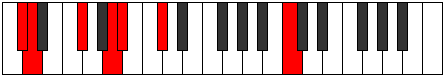
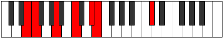
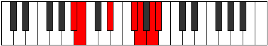

# Mode Katoptimic

## Links

- [Documentation](README.md)
- [Scales Index](Scales.md)
- [Modes Index](Modes.md)
- [Chords Index](Chords.md)

## Parent Scale

[Lathimic](ScaleLathimic.md)

## Number

[2851](https://ianring.com/musictheory/scales/2851)

## Interval Pattern

1, 4, 3, 1, 2, 1

## Chord Pattern

III

## Perfection

- 2 Perfect notes
- 4 Perfect notes

## Perfection Profile

[false true true false false false]

## Permutations

| Tonic | Notes | Signature | Illustration | Audio |
|-------|-------|-----------|--------------|-------|
| [C](ModeCNaturalKatoptimic.md) | **C**, Db, E#, **F###**, **G##**, **A##**, **C** | C |  | [midi](https://github.com/edipermadi/music/blob/main/docs/ModeCNaturalKatoptimic.mid?raw=true) |
| [C#](ModeCSharpKatoptimic.md) | **C#**, D, E##, **Cbbb**, **Cbb**, **Dbb**, **C#** | C |  | [midi](https://github.com/edipermadi/music/blob/main/docs/ModeCSharpKatoptimic.mid?raw=true) |
| [Db](ModeDFlatKatoptimic.md) | **Db**, Ebb, F#, **G##**, **A#**, **B#**, **Db** | C |  | [midi](https://github.com/edipermadi/music/blob/main/docs/ModeDFlatKatoptimic.mid?raw=true) |
| [D](ModeDNaturalKatoptimic.md) | **D**, Eb, F##, **G###**, **A##**, **B##**, **D** | C |  | [midi](https://github.com/edipermadi/music/blob/main/docs/ModeDNaturalKatoptimic.mid?raw=true) |
| [D#](ModeDSharpKatoptimic.md) | **D#**, E, F###, **Cb**, **Dbb**, **Ebb**, **D#** | C |  | [midi](https://github.com/edipermadi/music/blob/main/docs/ModeDSharpKatoptimic.mid?raw=true) |
| [Eb](ModeEFlatKatoptimic.md) | **Eb**, Fb, G#, **A##**, **B#**, **C##**, **Eb** | C |  | [midi](https://github.com/edipermadi/music/blob/main/docs/ModeEFlatKatoptimic.mid?raw=true) |
| [E](ModeENaturalKatoptimic.md) | **E**, F, G##, **A###**, **B##**, **C###**, **E** | C |  | [midi](https://github.com/edipermadi/music/blob/main/docs/ModeENaturalKatoptimic.mid?raw=true) |
| [F](ModeFNaturalKatoptimic.md) | **F**, Gb, A#, **B##**, **C##**, **D##**, **F** | C |  | [midi](https://github.com/edipermadi/music/blob/main/docs/ModeFNaturalKatoptimic.mid?raw=true) |
| [F#](ModeFSharpKatoptimic.md) | **F#**, G, A##, **B###**, **C###**, **D###**, **F#** | C |  | [midi](https://github.com/edipermadi/music/blob/main/docs/ModeFSharpKatoptimic.mid?raw=true) |
| [Gb](ModeGFlatKatoptimic.md) | **Gb**, Abb, B, **C##**, **D#**, **E#**, **Gb** | C |  | [midi](https://github.com/edipermadi/music/blob/main/docs/ModeGFlatKatoptimic.mid?raw=true) |
| [G](ModeGNaturalKatoptimic.md) | **G**, Ab, B#, **C###**, **D##**, **E##**, **G** | C |  | [midi](https://github.com/edipermadi/music/blob/main/docs/ModeGNaturalKatoptimic.mid?raw=true) |
| [G#](ModeGSharpKatoptimic.md) | **G#**, A, B##, **D##**, **E#**, **F##**, **G#** | C |  | [midi](https://github.com/edipermadi/music/blob/main/docs/ModeGSharpKatoptimic.mid?raw=true) |
| [Ab](ModeAFlatKatoptimic.md) | **Ab**, Bbb, C#, **D##**, **E#**, **F##**, **Ab** | C |  | [midi](https://github.com/edipermadi/music/blob/main/docs/ModeAFlatKatoptimic.mid?raw=true) |
| [A](ModeANaturalKatoptimic.md) | **A**, Bb, C##, **D###**, **E##**, **F###**, **A** | C |  | [midi](https://github.com/edipermadi/music/blob/main/docs/ModeANaturalKatoptimic.mid?raw=true) |
| [A#](ModeASharpKatoptimic.md) | **A#**, B, C###, **E##**, **F##**, **G##**, **A#** | C |  | [midi](https://github.com/edipermadi/music/blob/main/docs/ModeASharpKatoptimic.mid?raw=true) |
| [Bb](ModeBFlatKatoptimic.md) | **Bb**, Cb, D#, **E##**, **F##**, **G##**, **Bb** | C |  | [midi](https://github.com/edipermadi/music/blob/main/docs/ModeBFlatKatoptimic.mid?raw=true) |
| [B](ModeBNaturalKatoptimic.md) | **B**, C, D##, **E###**, **F###**, **G###**, **B** | C |  | [midi](https://github.com/edipermadi/music/blob/main/docs/ModeBNaturalKatoptimic.mid?raw=true) |
