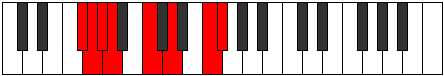

# Mode Katorian

## Links

- [Documentation](index.md)
- [Scales Index](Scales.md)
- [Modes Index](Modes.md)
- [Chords Index](Chords.md)

## Parent Scale

[Morian](ScaleMorian.md)

## Number

[2383](https://ianring.com/musictheory/scales/2383)

## Perfection

- 4 Perfect notes
- 3 Perfect notes

## Perfection Profile

[false true false false true true true]

## Permutations

| Tonic | Notes | Signature | Illustration | Audio |
|-------|-------|-----------|--------------|-------|
| [C](ModeCNaturalKatorian.md) | **C**, Db, **Ebb**, **Fbb**, Gb, Ab, B, **C** | C |  | [midi](https://github.com/edipermadi/music/blob/main/docs/ModeCNaturalKatorian.mid?raw=true) |
| [C#](ModeCSharpKatorian.md) | **C#**, D, **Eb**, **Fb**, G, A, B#, **C#** | C |  | [midi](https://github.com/edipermadi/music/blob/main/docs/ModeCSharpKatorian.mid?raw=true) |
| [Db](ModeDFlatKatorian.md) | **Db**, Ebb, **Fbb**, **Gbbb**, Abb, Bbb, C, **Db** | C |  | [midi](https://github.com/edipermadi/music/blob/main/docs/ModeDFlatKatorian.mid?raw=true) |
| [D](ModeDNaturalKatorian.md) | **D**, Eb, **Fb**, **Gbb**, Ab, Bb, C#, **D** | C |  | [midi](https://github.com/edipermadi/music/blob/main/docs/ModeDNaturalKatorian.mid?raw=true) |
| [D#](ModeDSharpKatorian.md) | **D#**, E, **F**, **Gb**, A, B, C##, **D#** | C |  | [midi](https://github.com/edipermadi/music/blob/main/docs/ModeDSharpKatorian.mid?raw=true) |
| [Eb](ModeEFlatKatorian.md) | **Eb**, Fb, **Gbb**, **Abbb**, Bbb, Cb, D, **Eb** | C |  | [midi](https://github.com/edipermadi/music/blob/main/docs/ModeEFlatKatorian.mid?raw=true) |
| [E](ModeENaturalKatorian.md) | **E**, F, **Gb**, **Abb**, Bb, C, D#, **E** | C |  | [midi](https://github.com/edipermadi/music/blob/main/docs/ModeENaturalKatorian.mid?raw=true) |
| [F](ModeFNaturalKatorian.md) | **F**, Gb, **Abb**, **Bbbb**, Cb, Db, E, **F** | C |  | [midi](https://github.com/edipermadi/music/blob/main/docs/ModeFNaturalKatorian.mid?raw=true) |
| [F#](ModeFSharpKatorian.md) | **F#**, G, **Ab**, **Bbb**, C, D, E#, **F#** | C |  | [midi](https://github.com/edipermadi/music/blob/main/docs/ModeFSharpKatorian.mid?raw=true) |
| [Gb](ModeGFlatKatorian.md) | **Gb**, Abb, **Bbbb**, **Cbbb**, Dbb, Ebb, F, **Gb** | C |  | [midi](https://github.com/edipermadi/music/blob/main/docs/ModeGFlatKatorian.mid?raw=true) |
| [G](ModeGNaturalKatorian.md) | **G**, Ab, **Bbb**, **Cbb**, Db, Eb, F#, **G** | C |  | [midi](https://github.com/edipermadi/music/blob/main/docs/ModeGNaturalKatorian.mid?raw=true) |
| [G#](ModeGSharpKatorian.md) | **G#**, A, **Bb**, **Cb**, D, E, F##, **G#** | C |  | [midi](https://github.com/edipermadi/music/blob/main/docs/ModeGSharpKatorian.mid?raw=true) |
| [Ab](ModeAFlatKatorian.md) | **Ab**, Bbb, **Cbb**, **Dbbb**, Ebb, Fb, G, **Ab** | C |  | [midi](https://github.com/edipermadi/music/blob/main/docs/ModeAFlatKatorian.mid?raw=true) |
| [A](ModeANaturalKatorian.md) | **A**, Bb, **Cb**, **Dbb**, Eb, F, G#, **A** | C |  | [midi](https://github.com/edipermadi/music/blob/main/docs/ModeANaturalKatorian.mid?raw=true) |
| [A#](ModeASharpKatorian.md) | **A#**, B, **C**, **Db**, E, F#, G##, **A#** | C |  | [midi](https://github.com/edipermadi/music/blob/main/docs/ModeASharpKatorian.mid?raw=true) |
| [Bb](ModeBFlatKatorian.md) | **Bb**, Cb, **Dbb**, **Ebbb**, Fb, Gb, A, **Bb** | C |  | [midi](https://github.com/edipermadi/music/blob/main/docs/ModeBFlatKatorian.mid?raw=true) |
| [B](ModeBNaturalKatorian.md) | **B**, C, **Db**, **Ebb**, F, G, A#, **B** | C |  | [midi](https://github.com/edipermadi/music/blob/main/docs/ModeBNaturalKatorian.mid?raw=true) |
